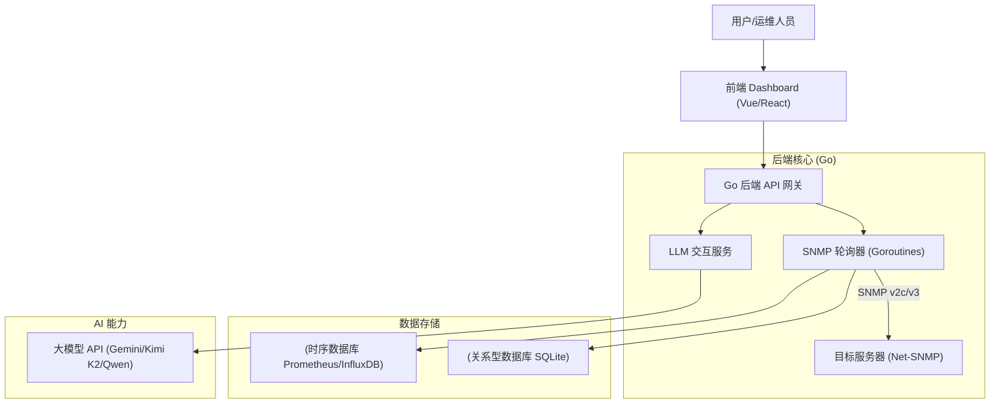

[[toc]]

## Hello SNMP Agent
#### 官方示例
```go
// Copyright 2012 The GoSNMP Authors. All rights reserved.  Use of this  
// source code is governed by a BSD-style license that can be found in the  
// LICENSE file.  
  
package main  
  
import (  
    "fmt"  
    "log"  
    g "github.com/gosnmp/gosnmp"  
)  
  
func main() {  
    // Default is a pointer to a GoSNMP struct that contains sensible defaults  
    // eg port 161, community public, etc    g.Default.Target = "192.168.100.133"  
    err := g.Default.Connect()  
    if err != nil {  
       log.Fatalf("Connect() err: %v", err)  
    }  
    defer g.Default.Conn.Close()  
  
    oids := []string{"1.3.6.1.2.1.1.4.0", "1.3.6.1.2.1.1.7.0"}  
    result, err2 := g.Default.Get(oids) // Get() accepts up to g.MAX_OIDS  
    if err2 != nil {  
       log.Fatalf("Get() err: %v", err2)  
    }  
  
    for i, variable := range result.Variables {  
       fmt.Printf("%d: oid: %s ", i, variable.Name)  
  
       // the Value of each variable returned by Get() implements  
       // interface{}. You could do a type switch...       switch variable.Type {  
       case g.OctetString:  
          fmt.Printf("string: %s\n", string(variable.Value.([]byte)))  
       default:  
          // ... or often you're just interested in numeric values.  
          // ToBigInt() will return the Value as a BigInt, for plugging          // into your calculations.          fmt.Printf("number: %d\n", g.ToBigInt(variable.Value))  
       }  
    }  
}
```
### 创建连接
官方给的示例里的团体名是`public`，但我用来测试的环境的团体名并不是这个，因此需要创建新的gosnmp配置结构体

*来自`gosnmp.go`*：
```go
var Default = &GoSNMP{  
    Port:               161,  
    Transport:          udp,  
    Community:          "public",  
    Version:            Version2c,  
    Timeout:            time.Duration(2) * time.Second,  
    Retries:            3,  
    ExponentialTimeout: true,  
    MaxOids:            MaxOids,  
}
```
这当然不是`GoSNMP`结构体的定义，但可以作为自定义Agent的样板：
```go
MySNMPAgent := &g.GoSNMP{  
    Target: "192.168.100.133", // IP地址 // 不写的话默认为空字符串  
    Port: 161,  
    Transport: "udp", // const udp string = "udp"  
    Community: "SyYhunfhds",  
    Version: g.Version2c,  
    Timeout: 2 * time.Second,  
    Retries: 3,  
    ExponentialTimeout: true, // 启用指数退避机制  
    MaxOids: g.MaxOids, // 最大OID数目为60  
}
```

然后调用`GoSNMP.connect`方法创建Socket连接——当然，UDP本质上是无状态的，不发包的话永远不会知道接收方是否存活

### 查询OID
接下来可以调用`Get`方法获取OID结点值，`Get`接收一个字符串数组，返回与字符串数组长度等长的`SnmpPacket`切片：

`sysDescr`和`sysUptime`的OID键是用MIB Browser拿的：
```go
const (  
    SysDescr = "1.3.6.1.2.1.1.1.0"  
    SysUpTime = "1.3.6.1.2.1.1.3.0"  
)
```
由于MIB解析不太友好，这里采用预定义常量，在不引入MIB依赖地狱的前提下提升开发体验

```go
 &gosnmp.SnmpPacket{Version:0x1, MsgFlags:0x0, SecurityModel:0x0, SecurityParameters:gosnmp.SnmpV3SecurityParameters(nil), ContextEngineID:"", ContextName:"", Community:"SyYhunfhds", PDUType:0xa2, MsgID:0x0, RequestID:0x68e24df8, MsgMaxSize:0x0, Error:0x0, ErrorIndex:0x0, NonRepeaters:0x0, MaxRepetitions:0x0, Variables:[]gosnmp.SnmpPDU{gosnmp.SnmpPDU{Value:[]uint8{0x4c, 0x69, 0x6e, 0x75, 0x78, 0x20, 0x6b, 0x61, 0x6c, 0x69, 0x20, 0x36, 0x2e, 0x38, 0x2e, 0x31, 0x31, 0x2d, 0x61, 0x6d, 0x64, 0x36, 0x34, 0x20, 0x23, 0x31, 0x20, 0x53, 0x4d, 0x50, 0x20, 0x50, 0x52, 0x45, 0x45, 0x4d, 0x50, 0x54, 0x5f, 0x44, 0x59, 0x4e, 0x41, 0x4d, 0x49, 0x43, 0x20, 0x4b, 0x61, 0x6c, 0x69, 0x20, 0x36, 0x2e, 0x38, 0x2e, 0x31, 0x31, 0x2d, 0x31, 0x6b, 0x61, 0x6c, 0x69, 0x32, 0x20, 0x28, 0x32, 0x30, 0x32, 0x34, 0x2d, 0x30, 0x35, 0x2d, 0x33, 0x30, 0x29, 0x20, 0x78, 0x38, 0x36, 0x5f, 0x36, 0x34}, Name:".1.3.6.1.2.1.1.1.0", Type:0x4}, gosnmp.SnmpPDU{Value:0x60e41, Name:".1.3.6.1.2.1.1.3.0", Type:0x43}}, Logger:gosnmp.Logger{logger:gosnmp.LoggerInterface(nil)}, SnmpTrap:gosnmp.SnmpTrap{Variables:[]gosnmp.SnmpPDU(nil), IsInform:false, Enterprise:"", AgentAddress:"", GenericTrap:0, SpecificTrap:0, Timestamp:0x0}}
```
从这里可以看出gosnmp很好地暴露了底层细节
```go
// SnmpPacket struct represents the entire SNMP Message or Sequence at the// application layer.  
type SnmpPacket struct {  
    Version            SnmpVersion  
    MsgFlags           SnmpV3MsgFlags  
    SecurityModel      SnmpV3SecurityModel  
    SecurityParameters SnmpV3SecurityParameters // interface  
    ContextEngineID    string  
    ContextName        string  
    Community          string  
    PDUType            PDUType  
    MsgID              uint32  
    RequestID          uint32  
    MsgMaxSize         uint32  
    Error              SNMPError  
    ErrorIndex         uint8  
    NonRepeaters       uint8  
    MaxRepetitions     uint32  
    Variables          []SnmpPDU  
    Logger             Logger  
  
    // v1 traps have a very different format from v2c and v3 traps.  
    //    // These fields are set via the SnmpTrap parameter to SendTrap().    SnmpTrap  
}
```

发送时OID的值置空，监控设备填充OID的值后原样发回来：


但是SNMP包里显然有很多字段是我们不需要的，这里直接看`Variables`字段即可：
```go
log.Printf("SNMP Agent 获取数据成功: %#v", result.Variables)  
/*  
result.Variables是一个snmpPDU的切片，里面存储了多个OID的值  
每个snmpPDU的字段如下:  
value any  
Name string // 就是那个OID  
Type g.Asn1BER // value在SNMP里的类型  
*/  
for idx, v := range result.Variables {  
    fmt.Printf(  
       "[%v] %v\n", idx + 1, v,  
       )  
}
```
SNMP响应疑似是`any`类型，真实类型由`Type`字段表示——而这又是一番类型转换了……
```go
type Asn1BER byte  
  
// Asn1BER's - http://www.ietf.org/rfc/rfc1442.txt  
const (  
    EndOfContents     Asn1BER = 0x00  
    UnknownType       Asn1BER = 0x00  
    Boolean           Asn1BER = 0x01  
    Integer           Asn1BER = 0x02  
    BitString         Asn1BER = 0x03  
    OctetString       Asn1BER = 0x04  // sysDescr就是这种类型
    Null              Asn1BER = 0x05  
    ObjectIdentifier  Asn1BER = 0x06  
    ObjectDescription Asn1BER = 0x07  
    IPAddress         Asn1BER = 0x40  
    Counter32         Asn1BER = 0x41  
    Gauge32           Asn1BER = 0x42  
    TimeTicks         Asn1BER = 0x43  // sysUptime是这种类型
    Opaque            Asn1BER = 0x44  
    NsapAddress       Asn1BER = 0x45  
    Counter64         Asn1BER = 0x46  
    Uinteger32        Asn1BER = 0x47  
    OpaqueFloat       Asn1BER = 0x78  
    OpaqueDouble      Asn1BER = 0x79  
    NoSuchObject      Asn1BER = 0x80  
    NoSuchInstance    Asn1BER = 0x81  
    EndOfMibView      Asn1BER = 0x82  
)
```

幸好官方Demo给了一个简单的类型处理示例：
```go
// the Value of each variable returned by Get() implements
		// interface{}. You could do a type switch...
		switch variable.Type {
		case g.OctetString:
			fmt.Printf("string: %s\n", string(variable.Value.([]byte)))
		default:
			// ... or often you're just interested in numeric values.
			// ToBigInt() will return the Value as a BigInt, for plugging
			// into your calculations.
			fmt.Printf("number: %d\n", g.ToBigInt(variable.Value))
		}
```

直接搬过来：
```go
for _, v := range result.Variables {  
    switch v.Type {  
    case g.OctetString:  
       fmt.Printf("OID: %s, Value: %s\n", v.Name, string(v.Value.([]byte)))  
    default:  
       fmt.Printf("OID: %s, Value: %v\n", v.Name, v.Value)  
    }  
}
```

```output
PS F:\GolangWorkspace\计网课设\backend\scratch> go run main.go
OID: .1.3.6.1.2.1.1.1.0, Value: Linux kali 6.8.11-amd64 #1 SMP PREEMPT_DYNAMIC Kali 6.8.11-1kali2 (2024-05-30) x86_64
OID: .1.3.6.1.2.1.1.3.0, Value: 471340
```


### 设置OID结点的值

首先需要注意的是：gosnmp的`Community`字段不区分`rwcommunity`和`rocommunity`，所以不管是Set还是Get，用的都是同样的团体名称

在实际开发中，为了安全，通常不会一直使用可读可写团体——而是会采用**双实例模式**或**动态切换逻辑**：
```go
package main
// 动态切换

import (
	"fmt"
	"log"
	"github.com/gosnmp/gosnmp"
)

func main() {
	// 1. 默认使用只读密码 (RO)
	client := &gosnmp.GoSNMP{
		Target:    "192.168.100.133",
		Port:      161,
		Community: "public", // 你的 rocommunity
		Version:   gosnmp.Version2c,
	}
	client.Connect()
	defer client.Conn.Close()

	// 2. 执行读取操作 (使用 public)
	_, err := client.Get([]string{".1.3.6.1.2.1.1.1.0"})
	if err != nil {
		log.Printf("读取失败: %v", err)
	} else {
		fmt.Println("读取成功 (使用 public)")
	}

	// 3. 准备执行写入操作，切换到读写密码 (RW)
	// 假设你的 Kali 配置了 rwcommunity 为 "private_admin"
	client.Community = "private_admin" 
	
	// 构造 Set 请求 (例如修改 sysLocation)
	pdu := gosnmp.SnmpPDU{
		Name:  ".1.3.6.1.2.1.1.6.0", // sysLocation
		Type:  gosnmp.OctetString,
		Value: "Server Room A",
	}
	
	_, err = client.Set([]gosnmp.SnmpPDU{pdu})
	if err != nil {
		log.Printf("写入失败 (可能密码不对或没有RW权限): %v", err)
	} else {
		fmt.Println("写入成功 (使用 private_admin)")
	}
}
```
## Hello SNMP V3
#### 官方示例
```go
// Copyright 2012 The GoSNMP Authors. All rights reserved.  Use of this
// source code is governed by a BSD-style license that can be found in the
// LICENSE file.

package main

import (
	"fmt"
	"log"
	"time"

	g "github.com/gosnmp/gosnmp"
)

func main() {
	// build our own GoSNMP struct, rather than using g.Default
	params := &g.GoSNMP{
		Target:        "192.168.91.20",
		Port:          161,
		Version:       g.Version3,
		SecurityModel: g.UserSecurityModel,
		MsgFlags:      g.AuthPriv,
		Timeout:       time.Duration(30) * time.Second,
		SecurityParameters: &g.UsmSecurityParameters{UserName: "user",
			AuthenticationProtocol:   g.SHA,
			AuthenticationPassphrase: "password",
			PrivacyProtocol:          g.DES,
			PrivacyPassphrase:        "password",
		},
	}
	err := params.Connect()
	if err != nil {
		log.Fatalf("Connect() err: %v", err)
	}
	defer params.Conn.Close()

	oids := []string{"1.3.6.1.2.1.1.4.0", "1.3.6.1.2.1.1.7.0"}
	result, err2 := params.Get(oids) // Get() accepts up to g.MAX_OIDS
	if err2 != nil {
		log.Fatalf("Get() err: %v", err2)
	}

	for i, variable := range result.Variables {
		fmt.Printf("%d: oid: %s ", i, variable.Name)

		// the Value of each variable returned by Get() implements
		// interface{}. You could do a type switch...
		switch variable.Type {
		case g.OctetString:
			fmt.Printf("string: %s\n", string(variable.Value.([]byte)))
		default:
			// ... or often you're just interested in numeric values.
			// ToBigInt() will return the Value as a BigInt, for plugging
			// into your calculations.
			fmt.Printf("number: %d\n", g.ToBigInt(variable.Value))
		}
	}
}
```
### I Snmp Get

莫得问题

### I Snmp Set
```go
oids = []string{std.SysContact}  
result, err = MySNMPAgent.Get(oids)  
if err != nil {  
    log.Fatalf("SNMP Agent 获取数据失败: %v", err)  
    return  
}  
for _, v := range result.Variables {  
    switch v.Type {  
    case g.OctetString:  
       fmt.Printf("OID: %s, Value: %s\n", v.Name, string(v.Value.([]byte)))  
    default:  
       fmt.Printf("OID: %s, Value: %v\n", v.Name, v.Value)  
    }  
}  
newSysContactPDU := []g.SnmpPDU{  
    {  
       Name: result.Variables[0].Name,  
       Type: result.Variables[0].Type,  
       Value: []byte("New SysContact"),  
    },  
}  
if result, err = MySNMPAgent.Set(newSysContactPDU); err != nil {  
    log.Fatalf("SNMP Agent 设置数据失败: %v", err)  
    return  
}  
for _, v := range result.Variables {  
    switch v.Type {  
    case g.OctetString:  
       fmt.Printf("OID: %s, Value: %s\n", v.Name, string(v.Value.([]byte)))  
    default:  
       fmt.Printf("OID: %s, Value: %v\n", v.Name, v.Value)  
    }  
}
```

```
OID: .1.3.6.1.2.1.1.1.0, Value: Linux kali 6.8.11-amd64 #1 SMP PREEMPT_DYNAMIC Kali 6.8.11-1kali2 (2024-05-30) x86_64
OID: .1.3.6.1.2.1.1.3.0, Value: 156362
OID: .1.3.6.1.2.1.1.4.0, Value: SyYhunfhds syyhunfhdsmemoryseer@gmail.com
OID: .1.3.6.1.2.1.1.4.0, Value: New SysContac
```




***
# 页面底部


