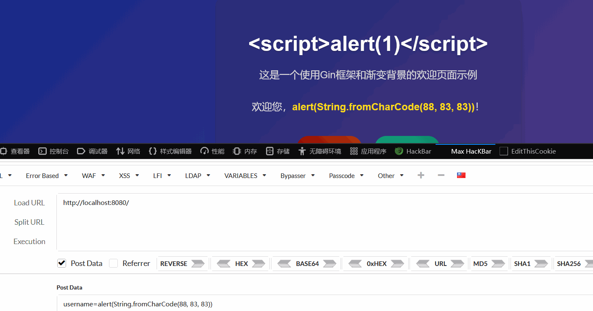

## 测试demo
### 动态加载页面
```go
package api  
  
import (  
    "net/http"  
    "path/filepath"    "strings"  
    "github.com/gin-gonic/gin")  
  
// 动态加载templates下的页面  
func searchHTMLTemplates() map[string]bool {  
    matches, _ := filepath.Glob("templates/*.html")  
    htmlBaseFilename := make(map[string]bool, len(matches))  
    for _, path := range matches {  
       filename := filepath.Base(path)  
       baseFilename := strings.Split(filename, ".")[0]  
       htmlBaseFilename[baseFilename] = true  
    }  
    return htmlBaseFilename  
}  
  
func LoadHTMLFiles(c *gin.Context) {  
    baseFilename := c.DefaultQuery("file", "index")                 // 获取GET参数  
    baseFilename = strings.TrimSpace(strings.ToLower(baseFilename)) // 转小写并去除空白字符  
  
    validBaseFilename := searchHTMLTemplates()  
    ignoreInvalidTemplate := c.DefaultQuery("ignore", "true") == "true"  
    if !validBaseFilename[baseFilename] && !ignoreInvalidTemplate {  
       c.JSON(http.StatusNotFound, gin.H{  
          "error": "模板文件不存在",  
       })  
       return  
    }  
  
    filename := strings.Join([]string{baseFilename, ".html"}, "") // 动态渲染模板页面  
  
    c.HTML(http.StatusOK, filename, gin.H{})  
}
```

[[toc]]

## `text/template`模板语法
Gin框架模板也是以`{{}}`包裹模板语句
### 变量声明
- 变量名需以`$`开头，如`$variable`
- 采用与Go一致的**变量声明**语法：
	- 即变量声明时使用`:=`，而修改和访问变量时使用`=`；如`{{$avr := "abc"}}`
	- 变量必须**先声明再使用**
	- 访问变量时也以`$`开头，如`{{$var}}`
```html
<p>{{$var := "abc"}}<p>  
<p>定义并渲染一个变量: {{$var}}</p><br>
```

#### 模板字面量
> 自己脑补大括号
- **字符串**：`"abc"`
	
- **字节**：`'a'`（渲染为码点，即`97`）
	
- **原始字符串**： `a` 不会转义（用**反引号**包裹，这里是没法用反引号包裹反引号）
	
	
- **`nil`类型**：`print nil`
	
	**只有`nil`会报错：**
	
	（在日志里报错）
### 上下文
- `.` 访问当前位置的上下文
- `$` 引用当前模板根级的上下文
- `$.` 引用模板中的根级上下文

这里的**上下文**指的是`c.HTML`的第三个参数所传入的**键值对**或**结构体实例**，而`.`号所访问的就是这个实例本身
### 控制结构
#### `if-else`条件结构
**语法**：
```html
{{if eq .Number 1}}
    数字等于1
{{else if eq .Number 2}}
    数字等于2
{{else if gt .Number 2}}
    数字大于2
{{else}}
    其他情况
{{end}}
```
**常用模板函数**：（顺便了解一下）
- `eq`: 等于
- `ne`: 不等于
- `lt`: 小于
- `le`: 小于等于
- `gt`: 大于
- `ge`: 大于等于
> 由于Gin没有数学运算符，所以要想进行数学运算，需通过管道符` | `和函数来实现，例：
```
{{range $key, $value := .Numbers}}
    {{if $value}}
        <p>数字 {{$key}} 是偶数</p>
    {{else if eq ($key|mod 2) 1}}
        <p>数字 {{$key}} 是奇数</p>
    {{else}}
        <p>数字 {{$key}} 的其他情况</p>
    {{end}}
{{end}}
```


**示例：**
```go
func IfElseDemo(c *gin.Context) {  
    dataLenInQuery := c.DefaultQuery("num", "16")  
    // 转换为整型  
    dataLen, _ := strconv.Atoi(dataLenInQuery)  
    data := make(map[int]bool, dataLen)  
    for i := 0; i < dataLen; i++ {  
       num := rand.Int() % 10  
       data[num] = (num % 2) == 0  
    }  
  
    c.HTML(http.StatusOK, "if-else.html", gin.H{  
       "Numbers": data,  
    })  
}
```
```html
<!DOCTYPE html>  
<html lang="en">  
<head>  
    <meta charset="UTF-8">  
    <title>if-else分支结构(奇偶判断)</title>  
</head>  
<body>  
<h1>if-else分支结构(奇偶判断)</h1>  
{{range $num, $isEven := .Numbers}}  
{{if $isEven}}  
<p>{{$num}}是偶数</p>  
{{else}}  
<p>{{$num}}是奇数</p>  
{{end}}  
{{end}} <!-- 结束循环域 -->  
</body>  
</html>
```
因为还不懂具体的`else if`怎么写，所以只能先用键值对代替

#### `range`遍历结构
语法和Go类似，但是`range`被置于变量前面：
```go
// 自行脑补括号
{{range $index, $value := .Slice}} // 只要确保:=符号后面的复合结构是数组或切片即可
<p>{{$index}}索引的值为{{$value}}</p>
{{end}} // 记得结束作用域

// 键值对
{{range $key, $value := .Map}}
<p>{{$key}}键的值为{{$value}}</p>
{{end}}

// 通道
{{range .Channel}}
    {{.}}
{{end}}
```
##### `range-else`结构
> 转载自[网络](https://www.cnblogs.com/shenjianping/p/16142358.html)
`range`也支持`else`，当被`range`的数据长度为0时，执行`else`
```go
{{/*range...else...*/}}
{{range .arr_num}}
        {{.}}
    {{else}}
        {{0}} {{/*当.arr_num长度为0时，执行else*/}}
{{end}}
```
#### `with`重定向结构
当传入模板的结构体或键值对含有多个字段时，老是打字段的前缀（键值对的一级键）会很烦。可以用`with...end`结构重定向` . `的上下文

**示例**：
```html
<!-- 回到slice.html-->
<!-- 示例2：遍历产品列表 -->  
<div class="section">  
    <div class="section-title">产品信息列表</div>  
    {{with .Products}}  <!-- 这里换成with -->
    {{range .}}  
    <div class="item-card">  
        <div class="item-title">产品详情</div>  
        {{range $key, $value := .}}  
        <div class="key-value-pair">  
            <span class="key">{{$key}}:</span>  
            <span class="value">{{$value}}</span>  
        </div>  
        {{end}}  
    </div>  
    {{end}}  
    {{end}} <!-- 结束with域 -->  
</div>
```
```go
// API传入的实例不变
```

##### `with-else`结构
`with`也有`else`分支，遍历到没数据后就进入`else`分支了：（实例转载自网络）
```go
{{/*with else方式*/}}
{{with .user_data}}
        {{.Name}}
        {{.Age}}
    {{else}}
        <p>无数据</p>
{{end}}
```
#### `range`和`with`结构隐式改变上下文
在 range 和 with 结构内部，. 的含义会改变。
- 在 `{{range .Items}}` 循环内部，. 就变成了 `Items` 中的单个元素。
- 在 `{{with .User}}` 结构内部，. 就变成了 `.User` 对象。  
    此时，如果想访问最外层传进来的数据，就需要使用之前提到的根级上下文 `$`。
### `template`语句
```go
{{template "模板名" pipeline}}
// 示例如下: 
{{template "base.html" .}}
```

**示例**：
外层HTML：`outer.html`
```html
<!DOCTYPE html>  
<html lang="en">  
<head>  
    <meta charset="UTF-8">  
    <title>外层HTML页面，传入对象并传给内层HTML页面</title>  
</head>  
<body>  
<h2>外层HTML页面，传入对象并传给内层HTML页面</h2>  
{{template "inner.html" .Message}}  
</body>  
</html>
```
内层HTML：`inner.html`
```html
<!DOCTYPE html>  
<html lang="en">  
<head>  
    <meta charset="UTF-8">  
    <title>内层HTML页面</title>  
</head>  
<body>  
{{.}}  
</body>  
</html>
```
API：
```go
package api  
  
import "github.com/gin-gonic/gin"  
  
func IncludeTemplateDemo(c *gin.Context) {  
    message := "Hello World"  
    c.HTML(200, "outer.html", gin.H{  
       "Message": message,  
    })  
}
```

### 模板函数 （AI）
#### 管道符` | `
在 Go 模板中，管道符 `|` 用于将一个命令的输出作为另一个命令的输入，类似于 Unix shell 中的管道概念。
```go-template
{{ expression | function }}
```

##### 单个函数管道
```go-template
{{ .Name | upper }}  <!-- 将 .Name 传递给 upper 函数 -->
{{ .Price | printf "$%.2f" }}  <!-- 格式化价格 -->
```
##### 链式管道
```go-template
{{ .Name | lower | title }}  <!-- 先转小写再首字母大写 -->
{{ .Description | truncate 50 | html }}  <!-- 截取50字符后转HTML -->
```
##### 与条件语句结合
```go-template
{{ if .Count | gt 0 }}
    有 {{ .Count }} 个项目
{{ end }}
```
##### 参数传递
```go-template
{{ .Name | printf "Hello, %s!" }}  <!-- 将 .Name 作为 printf 的第二个参数 -->
{{ .Items | len | printf "Total: %d items" }}
```
#####  在 range 中使用
```go-template
{{ range .Items }}
    <li>{{ . | upper }}</li>
{{ end }}
```


管道符让模板代码更加简洁和易读，避免嵌套调用的复杂性。
#### `print`系列
Go 模板中的 `print`、`printf` 和 `println` 函数是内置函数，用于格式化输出：
##### 1. `print` 函数
- **用途**：格式化参数并返回字符串，不添加空格或换行
- **语法**：`{{print arg1 arg2 ...}}`
- **示例**：
```go-template
{{print "Hello" "World"}}  <!-- 输出: HelloWorld -->
{{print .Name " is " .Age " years old"}}  <!-- 输出: Alice is 25 years old -->
```
##### 2. `printf` 函数
- **用途**：根据格式字符串格式化参数，类似于 C 语言的 `printf`
- **语法**：`{{printf format arg1 arg2 ...}}`
- **示例**：
```go-template
{{printf "%s is %d years old" .Name .Age}}  <!-- 输出: Alice is 25 years old -->
{{printf "Price: $%.2f" .Price}}  <!-- 输出: Price: $12.34 -->
```
##### 3. `println` 函数
- **用途**：格式化参数并在末尾添加换行符
- **语法**：`{{println arg1 arg2 ...}}`
- **示例**：
```go-template
{{println "Hello" "World"}}  <!-- 输出: Hello World\n -->
{{println .Name .Age}}  <!-- 输出: Alice 25\n -->
```

#### `and`、`or`、`not`函数
- `and`: 从左到右，返回**第一个为“空”**`（false, 0, nil, "", 空集合）`的参数值；如果所有参数都**不为空**，则返回**最后一个**参数的值。
- `or`: 从左到右，返回**第一个为“不为空”**的参数值；如果所有参数都**为空**，则返回**最后一个**参数的值。  
- `not` 返回输入参数的否定值
也可以用来实现逻辑判断，但其返回值不一定是 `true` 或 `false`，

**示例（转载自网络）：**
```go
...
func BoolFunc(ctx *gin.Context) {

    data := map[string]interface{}{
        "arr": [3]int{1, 2, 3},
        "a":   "hello",
    }

    ctx.HTML(http.StatusOK, "and_or_not_func.html", data)

}
...
```

```
...
{{/* and的用法 [1 2 3] */}}
{{and .a .arr}}

{{/* or的用法 hello */}}
{{or .a .arr}}

{{/* not的用法 false */}}
{{not .arr}}
...
```
#### `index`、`len`
- `index` 读取指定类型对应下标的值，支持 map、slice、array、string类型
	```go
	index 索引 复合结构
	```
- `len` 返回对应类型的长度，支持map、slice、array、string、chan类型
	```go
	len 复合结构
	```
。
**示例：**
```html
<!DOCTYPE html>  
<html lang="en">  
<head>  
    <meta charset="UTF-8">  
    <title>Index、Len函数Demo</title>  
</head>  
<body>  
<h2>Index、Len函数Demo</h2>  
{{range $firstKey, $valueMap := . }}  
<h3>{{$firstKey}}键值对的长度为{{len $valueMap}}</h3>  
{{range $secondKey, $value := $valueMap}}  
<p>{{$secondKey}}:{{index $valueMap $secondKey}}</p>  
{{end}}  
{{end}}  
</body>  
</html>
```
```go
package api  
  
import (  
    "net/http"  
  
    "github.com/gin-gonic/gin")  
  
func LenIndexDemo(c *gin.Context) {  
    data := namedProducts // 来自slice.go的map数据  
  
    c.HTML(http.StatusOK, "len-index.html", data)  
}
```

#### 逻辑判断运算符
- `eq` 等于
- `ne` 不等于
- `lt` 小于
- `le` 小于等于
- `gt` 大于
- `ge` 大于等于

**示例：**
```html
<!DOCTYPE html>  
<html lang="en">  
<head>  
    <meta charset="UTF-8">  
    <title>eq等运算符演示Demo</title>  
</head>  
<body>  
<h2>eq等运算符演示Demo</h2>  
{{range $name, $age := .Persons}}  
    {{if le $age 18}}  
        <p>{{$name}}是青年人</p>  
    {{else if and (gt $age 18)  (le $age 50)}}  
        <p>{{$name}}是中年人</p>  
    {{else}}  
        <p>{{$name}}是老年人</p>  
    {{end}}  
{{end}}  
</body>  
</html>
```

#### `Format`
这就是Go的函数，不是模板的函数……是在Go里用的，不是在模板里用的

**示例（转载自网络）：**
```go
...
func FormatFunc(ctx *gin.Context) {
    now_time := time.Now().Format("2006-01-02 15:04:05")
    ctx.HTML(http.StatusOK, "time_format_func.html", now_time)
}
...
```
```html
...
{{.}}
...
```
### 自定义模板函数
- **定义函数：**
```go
func add(a int, b int) int {
    return a + b
}
```
- **加入路由实例中：**
```go
...
func main() {

    router := gin.Default()
    router.SetFuncMap(template.FuncMap{
        "Add": add, // 字符串名称前端使用
    })

    router.LoadHTMLGlob("template/*")

    router.GET("/define_func", DefineFunc)

    router.Run(":8080")

}
...
```
- **前端使用：**
```html
...
{{Add 1 2}}
...
```
## `text/template`补充
### `text/template` VS `html/template`
- **`html/template` 会自动进行上下文感知的内容转义，以防止 XSS (跨站脚本) 攻击。**
- `text/template`没有上述的特性，对于后端传入的XSS字符串，会原样输出，触发XSS漏洞
……
不过我测不出来


有必要时可以*无视风险强行渲染* ：
```go
// Go 端
import "html/template"

c.HTML(http.StatusOK, "index.html", gin.H{
    // 告诉模板，这段 HTML 是安全的，请不要转义
    "safeHTML": template.HTML("<p>This is a trusted paragraph.</p>"),
})

// 模板端
{{.safeHTML}} // 这段内容将作为原生 HTML 被渲染
```
### 模板继承与组合
- `{{template "模板名" pipeline }}`：加载其他模板
- `{{define "模板名"}}...{{end}}`：定义一个可被引用的模板片段。
- `{{block "模板名" pipeline}}...{{end}} `(更推荐)：定义一个可被**子模板覆盖**的模板块。

**示例：**
**layouts/base.html (父模板)**
```html
<!DOCTYPE html>
<html>
<head>
    <title>{{block "title" .}}Default Title{{end}}</title>
</head>
<body>
    <header>My Website Header</header>
    <main>
        {{block "content" .}}Default Content{{end}}
    </main>
    <footer>My Website Footer</footer>
</body>
</html>
```
**index.html (子模板)**
```go
{{/* 继承 base.html 布局 */}}
{{template "layouts/base.html" .}}

{{/* 定义/覆盖 title 块 */}}
{{define "title"}}Home Page{{end}}

{{/* 定义/覆盖 content 块 */}}
{{define "content"}}
    <h1>Welcome to the Home Page!</h1>
    <p>This is specific content for the index page.</p>
{{end}}
```
### 移除多余换行字符
在前面的很多demo中都出现了源于`range`和`if`语句的多余空白行，影响最终 HTML 的整洁度。Go 模板提供了简单的语法来控制：
- `{{-` ：在 `{{` 后加一个 `-`，表示**移除**此标签**前面**的空白字符（包括换行）。
- `-}}`：在 `}}` 前加一个 `-`，表示**移除**此标签**后面**的空白字符。

### 模板注释
Go 模板的注释语法是 `{{/* 注释内容 */}}`。这些注释在模板执行时会被完全忽略，不会输出到最终结果中。
```html
{{/* 这是一个模板注释，不会显示在 HTML 中 */}}
<p>Hello</p>
```

***
# 页面尾部