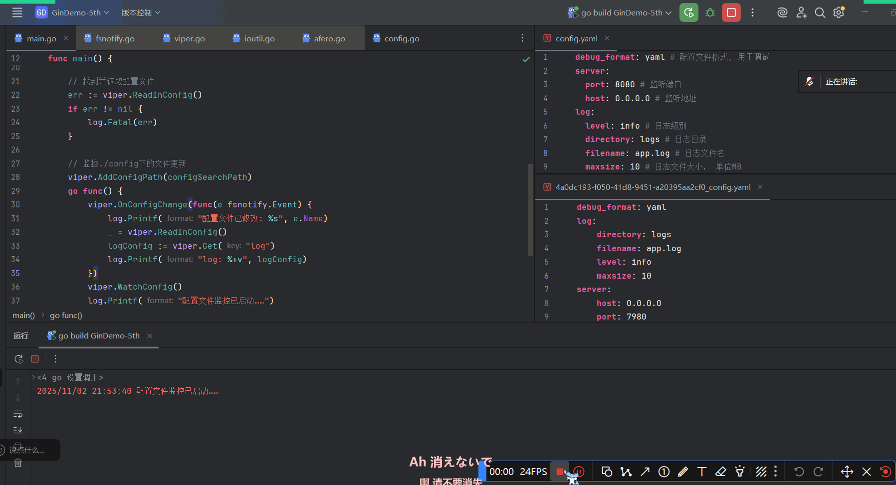
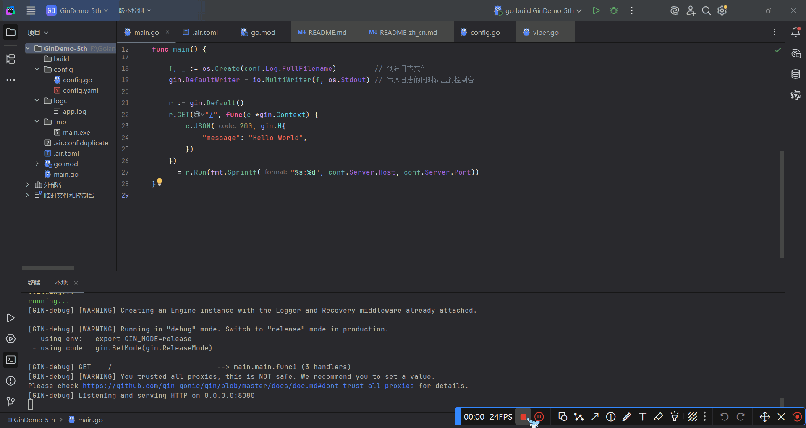

[[toc]]
## 参数验证（补充）
> [前情提要](https://syyhunfhds.github.io/Golang/Gin%E6%A1%86%E6%9E%B6/%E5%AD%A6%E4%B9%A0%E7%AC%94%E8%AE%B0%EF%BC%88%E4%BA%8C%EF%BC%89.html#%E6%95%B0%E6%8D%AE%E7%BB%91%E5%AE%9A%E4%B8%8E%E8%A7%A3%E6%9E%90)
### 国际化翻译验证消息
## 【AI】配置加载第三方库（总览）
### **王者之选 (All-in-One King)**

#### **1. Viper**
如果需要一个能“统治”所有配置的终极解决方案，那么 **Viper** 就是不二之选。它是 Go 后端社区的**事实标准 (de facto standard)**。
*   **一句话概括**：一个功能极其全面的配置解决方案，可以处理几乎所有你能想到的配置来源和格式。
*   **支持的格式**：
    *   **文件**: YAML, JSON, TOML, INI, HCL
    *   **环境变量 (env)**: 可以完美地集成并覆盖文件配置。
    *   **远程 K/V 存储**: Consul, etcd (需要扩展)
    *   命令行标志 (pflag)
    *   ...等等
*   **核心优势**：
    1.  **优先级覆盖**：这是 Viper 最强大的地方。你可以定义一套优先级规则，比如：`命令行参数` > `环境变量` > `配置文件` > `默认值`。这使得应用的配置在不同环境（开发、测试、生产）下极其灵活。
    2.  **热加载 (Live Reload)**：可以监控配置文件的变化，并在不重启应用的情况下自动重新加载配置。
    3.  **强类型读取**：可以将配置直接反序列化（Unmarshal）到一个 Go `struct` 中，代码更整洁、更安全。
    4.  **设置默认值**：可以为配置项提供一个默认值，避免配置缺失导致程序崩溃。

*   **代码示例**：
    **`config.yaml` 文件:**
    ```yaml
    server:
      port: 8080
    database:
      host: "localhost"
      user: "root"
      password: "password"
    ```

    **`main.go` 文件:**
    ```go
    package main

    import (
    	"fmt"
    	"github.com/fsnotify/fsnotify"
    	"github.com/spf13/viper"
    )

    func main() {
    	// 1. 设置默认值
    	viper.SetDefault("server.port", 8000)

    	// 2. 设置配置文件
    	viper.SetConfigName("config") // 文件名 (不带扩展名)
    	viper.SetConfigType("yaml")   // 文件类型
    	viper.AddConfigPath(".")      // 在当前目录查找

    	// 3. 读取配置文件
    	if err := viper.ReadInConfig(); err != nil {
    		panic(fmt.Errorf("Fatal error config file: %s \n", err))
    	}
        
        // 4. 绑定环境变量 (可选但推荐)
        // 允许你用 `DATABASE_HOST=db.prod.com go run .` 来覆盖配置
        viper.SetEnvPrefix("MYAPP") // e.g. MYAPP_DATABASE_HOST
        viper.AutomaticEnv()

    	// 5. 监控配置文件变化 (可选)
    	viper.OnConfigChange(func(e fsnotify.Event) {
    		fmt.Println("Config file changed:", e.Name)
    	})
    	viper.WatchConfig()

    	// 6. 读取配置
    	port := viper.GetInt("server.port")
    	dbHost := viper.GetString("database.host")
    	
    	fmt.Printf("Server running on port: %d\n", port)
    	fmt.Printf("Database host: %s\n", dbHost)

    	// ... 启动你的 Gin 服务 ...
    	// router.Run(fmt.Sprintf(":%d", port))
    }
    ```

---

### **轻量级专精 (Focused Specialists)**

#### **2. `godotenv`**

*   **一句话概括**：只做一件事，并且做得很好——从 `.env` 文件加载环境变量。
*   **核心优势**：极简、无依赖。它不解析任何复杂的格式，只是读取 `.env` 文件，然后调用 Go 标准库的 `os.Setenv` 把它们设置到当前进程的环境变量中。
*   **适用场景**：
    *   在本地开发环境中，优雅地管理密码、API Key 等敏感信息，而不用把它们提交到 Git。
    *   作为 Viper 的**完美搭档**。你可以用 `godotenv` 先加载 `.env`，然后 Viper 的 `AutomaticEnv()` 就可以无缝地读取到这些变量了。

*   **代码示例**：
    **`.env` 文件:**
    ```
    DB_PASSWORD="a_super_secret_password"
    ```
    **`main.go` 文件:**
    ```go
    import (
    	"fmt"
    	"github.com/joho/godotenv"
    	"os"
    )

    func main() {
    	// 在程序最开始加载 .env 文件
    	err := godotenv.Load()
    	if err != nil {
    		fmt.Println("Error loading .env file, using system env vars")
    	}

    	// 现在就可以用标准库来读取了
    	password := os.Getenv("DB_PASSWORD")
    	fmt.Println("DB Password:", password)
    }
    ```

#### **3. `kelseyhightower/envconfig`**

*   **一句话概括**：将环境变量直接反序列化到 `struct` 中，非常 Go-idiomatic。
*   **核心优势**：代码极其整洁。你只需要定义一个带 `envconfig` 标签的 `struct`，它会自动帮你完成所有的加载、类型转换和校验。
*   **适用场景**：云原生应用（如跑在 Kubernetes 中），这类应用的所有配置**都**通过环境变量来传递。

*   **代码示例**：
    ```go
    package main

    import (
    	"fmt"
    	"github.com/kelseyhightower/envconfig"
    	"log"
    )

    type Specification struct {
    	Debug      bool   `envconfig:"DEBUG"`
    	Port       int    `envconfig:"PORT" default:"8080"`
    	DBPassword string `envconfig:"DB_PASSWORD" required:"true"`
    }

    func main() {
    	var s Specification
    	// 确保你已经设置了环境变量: export DB_PASSWORD="secret"
    	err := envconfig.Process("myapp", &s)
    	if err != nil {
    		log.Fatal(err.Error())
    	}
    	fmt.Printf("Port: %d\n", s.Port)
    	fmt.Printf("DB Password set: %v\n", s.DBPassword != "")
    }
    ```

---

### **总结与建议**

| 库 | 核心特性 | 支持格式 | 最适合的场景 |
| :--- | :--- | :--- | :--- |
| **Viper** | **全功能、优先级覆盖** | **几乎所有** (YAML, JSON, INI, env...) | 需要灵活配置、多环境部署的**绝大多数生产级应用** |
| **godotenv** | **极简、只加载 `.env`** | env | 本地开发，管理敏感信息，与 Viper 等库搭配使用 |
| **envconfig** | **环境变量直达 `struct`** | env | 云原生、容器化应用，完全依赖环境变量进行配置 |

**给开发者的学习路径建议：**
1.  **首选 `Viper`**：对于购物网站这类标准后端应用，直接学习并使用 `Viper` 是最明智的选择。它能一步到位，让你学会生产级的配置管理方式。
2.  **搭配 `godotenv`**：在你的 `main` 函数最开始，先用 `godotenv.Load()` 加载 `.env` 文件，然后再初始化 Viper。这样你就可以在 `.env` 文件里存放本地数据库密码等信息，同时享受 Viper 的强大功能，这是非常经典的组合。
3.  **了解 `envconfig` 的思想**：当你未来接触更多云原生和 Docker/K8s 部署时，`envconfig` 这种完全依赖环境变量的“十二要素应用”思想会变得非常重要。
## 配置加载：熟悉Viper
#### 安装和导入
```sh
go get github.com/spf13/viper
import "github.com/spf13/viper"
```

### 读取配置文件并访问
**Viper**支持下面这些日志格式：
- JSON
- TOML
- YAML
- INI
- env
- Java Propeties

一个Viper实例只能加载一个配置文件，但是可以自己起一个viper实例：
```go
x := viper.New()
y := viper.New()

x.SetDefault("ContentDir", "content")
y.SetDefault("ContentDir", "foobar")
```
**可以添加多个搜索路径 **

下面是**用Viper搜索并加载配置文件**的示例：
```go
package main
import (  
    "log"  
    "path/filepath"  
    "github.com/spf13/viper")
func main() {  
    // 设置配置文件名称为config  
    viper.SetConfigName("config")  
	viper.SetConfigType("yaml") // 没必要加, 因为Viper大部分情况下都会根据拓展名使用合适的序列化方法
  
    // 添加配置文件搜索路径  
    configSearchPath, _ := filepath.Abs("./config/")  
    viper.AddConfigPath(configSearchPath)  
    // 可以一次性添加多个搜索路径
    viper.AddConfigPath(".")
  
    // 找到并读取配置文件  
    err := viper.ReadInConfig()  
  
    if err != nil {  
       log.Fatal(err)  
    }  
}
```
`viper.ReadInConfig`的调用链如下：
1. `viper.ReadInConfig`
2. `v.getConfigFile`、`afero.ReadFile`与`v.unmarshalReader`
	- `afero.ReadFile`
			1. `fs.Open`与`f.Stat`
因此，该方法会报的一个错就是`fileLookupError`，可以使用下面的示例来捕获这一报错（官方示例）：
```go
var fileLookupError viper.FileLookupError
if err := viper.ReadInConfig(); err != nil {
    if errors.As(err, &fileLookupError) {
        // 显式表明没有指定搜索路径 (比如说
        // 在使用 `viper.SetConfigFile` 时) 或没有在任何指定目录下搜索到配置文件
        //  (比如在使用 `viper.AddConfigPath` 时)
    } else {
        // 报错了但是不知道报的什么错
    }
}

// 成功找到并解析配置文件
```
:::info
**Viper 1.6+** 允许手动设置配置文件拓展名（使用`viper.SetConfigType`），这对于一些没有拓展名或非常规拓展名的文件来说很有帮助（比如Shell配置`.bashrc`）

目前的版本是**viper 1.21.0**
:::
读取配置文件后使用`viper.Get()`方法获得配置参数：（相对地使用`viper.Set`方法更新配置）
```go
serverConfig := viper.Get("server")  
fmt.Printf("读取服务器配置得到: %#v\n", serverConfig)  
// map[string]interface {}{"host":"0.0.0.0", "port":8080}
// 访问次级配置
serverPort := viper.Get("server.port")
fmt.Printf("读取服务器端口配置得到: %#v\n", serverConfig)  
```


*注意到* `config/`目录下同时存在JSON和YAML配置文件，那么viper会加载哪个呢？
**显然是JSON**……


即便显式设置配置类型为`yaml`也不行……只有移除JSON文件（或在文件资源管理器中修改文件拓展名）后才能加载到YAML配置


### 写入配置文件
Viper知道你可能会有将运行时保存配置修改的需求，因此贴心地提供了配置持久化的方法：
```go
// Writes current config to the path set by `AddConfigPath` and `SetConfigName`
viper.WriteConfig()
// 无参写入，文件名由前面对viper.AddConfigPath和viper.SetConfigName的调用决定
viper.SafeWriteConfig() // Like the above, but will error if the config file exists
// Safe的意思就是不会覆盖文件

// Writes current config to a specific place
viper.WriteConfigAs("/path/to/my/.config")

// Will error since it has already been written
viper.SafeWriteConfigAs("/path/to/my/.config")

viper.SafeWriteConfigAs("/path/to/my/.other_config")
```

现在让我们来试一下：

*UUID是用来防止覆盖原始配置的*

### 配置热更新
Viper只需几行代码就可以实现对配置目录的监控：
```go
// 在调用`WatchConfig()`前必须将你所有想要监控的目录加上去
viper.AddConfigPath("$HOME/.appname")

viper.OnConfigChange(func(e fsnotify.Event) {
	fmt.Println("Config file changed:", e.Name)
})

viper.WatchConfig()
```
- `fsnotify.Event`结构体包含两个字段：
	1. string类型 发生修改的文件的文件名
	2. Op类型 表示文件操作的**位掩码**
这里只演示`.Name`字段大概是因为另一个字段的格式化不好写


*必要时要手动保存*
### 从`io.Reader`中读取配置
```go
viper.SetConfigType("yaml") // 必须手动设置配置格式了

var yamlExample = []byte(`
hacker: true
hobbies:
- skateboarding
- snowboarding
- go
name: steve
`)

viper.ReadConfig(bytes.NewBuffer(yamlExample))

viper.Get("name") // "steve"
```
### 默认配置
> 出色的配置系统应该支持默认配置，以防遗漏配置项

```go
viper.SetDefault("ContentDir", "content")
viper.SetDefault("LayoutDir", "layouts")
viper.SetDefault("Taxonomies", map[string]string{"tag": "tags", "category": "categories"})
```
嗯，还能设置复合类型，就挺好的
### 配置覆盖/配置二次设置
```go
viper.Set("verbose", true)
viper.Set("host.port", 5899) // Set an embedded key
```

- 如果已存在配置项，就使用`Set`
- 不存在配置项，就用`SetDefautl`
- 完事记得`SafeWriteAsConfig`
### 配置别名
Viper允许用多个键引用同一个值
```go
viper.RegisterAlias("loud", "Verbose")

viper.Set("verbose", true) // Same result as next line
viper.Set("loud", true)    // Same result as prior line

viper.GetBool("loud")    // true
viper.GetBool("verbose") // true
```
### 适配环境变量
```go
// Tells Viper to use this prefix when reading environment variables
viper.SetEnvPrefix("spf")

// Viper will look for "SPF_ID", automatically uppercasing the prefix and key
viper.BindEnv("id")

// Alternatively, we can search for any environment variable prefixed and load
// them in
viper.AutomaticEnv()

os.Setenv("SPF_ID", "13")

id := viper.Get("id") // 13
```
- 环境变量这里是大小写敏感的——其他配置源都是大小写不敏感的
- 默认情况下空环境变量会被忽略，除非启用`AllowEmptyEnv`
- Viper不会缓存环境变量，所以每次使用环境变量都会重新从环境中读取
- `SetEnvKeyReplacer`和`EnvKeyReplacer`允许用户修改环境变量的键，非常适合用来把从其他配置源读取到的**驼_峰_变_量_名**`SCREAMING_SNAKE_CASE`改成**短-横-线-全-拼-命-名**
### 适配flag
> 没看懂，留个[传送门](https://github.com/spf13/viper#working-with-flags)先

### 云端配置存储 && 加密存储
> [传送门](https://github.com/spf13/viper#remote-keyvalue-store-support)

### 从Viper实例中访问配置
对于下面的map结构：
```go
{
    "datastore": {
        "metric": {
            "host": "127.0.0.1",
            "ports": [
                5799,
                6029
            ]
        }
    }
}

```
可以这样访问：
```go
metricInDatastore := viper.Get("datatstore.metric")
// 如果需要特定类型的配置，可以：
GetString("datastore.metric.host") // "127.0.0.1"
GetInt("host.ports.1") // 6029
```
- 访问不存在的键会返回零值
- 请使用`IsSet`检查指定键是否存在

```json
{
    "datastore.metric.host": "0.0.0.0",
    "datastore": {
        "metric": {
            "host": "127.0.0.1"
        }
    }
}
```
另外，对于这样拥有同名键与次级键的配置，Viper会优先访问拥有次级键结构的配置：
```go
GetString("datastore.metric.host") // "0.0.0.0"
```
### 配置子集
*应该是为了兼容配置文件中的列表格式：*
```yaml
cache:
  cache1:
    item-size: 64
    max-items: 100
  cache2:
    item-size: 80
    max-items: 200
```

```go
func NewCache(v *Viper) *Cache {
	return &Cache{
		ItemSize: v.GetInt("item-size"),
		MaxItems: v.GetInt("max-items"),
	}
}

cache1Config := viper.Sub("cache.cache1")

if cache1Config == nil {
    // Sub returns nil if the key cannot be found
	panic("cache configuration not found")
}

cache1 := NewCache(cache1Config)
```
### 反序列化
```go
type config struct {
	Port int
	Name string
	PathMap string `mapstructure:"path_map"`
}

var C config

err := viper.Unmarshal(&C)
if err != nil {
	t.Fatalf("unable to decode into struct, %v", err)
}
```
对应的配置可为：（以YAML格式为例）
```yaml
config: # 不可以为conf, 必须统一
	port: 8080
	name: http
	pathMap: web.xml
```

如果配置键包含点号` . `，那么需要手动修改变量名分隔符（*delimeter*）：
```go
v := viper.NewWithOptions(viper.KeyDelimiter("::"))

v.SetDefault("chart::values", map[string]any{
	"ingress": map[string]any{
		"annotations": map[string]any{
			"traefik.frontend.rule.type":                 "PathPrefix",
			"traefik.ingress.kubernetes.io/ssl-redirect": "true",
		},
	},
})

type config struct {
	Chart struct{
		Values map[string]any
	}
}

var C config

v.Unmarshal(&C)
```

**可以反序列化为嵌套结构体：**
```go
/*
Example config:

module:
    enabled: true
    token: 89h3f98hbwf987h3f98wenf89ehf
*/
type config struct {
	Module struct {
		Enabled bool

		moduleConfig `mapstructure:",squash"`
	}
}

type moduleConfig struct {
	Token string
}

var C config

err := viper.Unmarshal(&C)
if err != nil {
	t.Fatalf("unable to decode into struct, %v", err)
}
```
### 序列化为字符串
> You may need to marshal all the settings held in Viper into a string. You can use your favorite format's marshaller with the config returned by `AllSettings`.

```go
import (
	yaml "go.yaml.in/yaml/v3"
)

func yamlStringSettings() string {
	c := viper.AllSettings()
	bs, err := yaml.Marshal(c)
	if err != nil {
		log.Fatalf("unable to marshal config to YAML: %v", err)
	}
	return string(bs)
}
```
## 日志
### 使用`io`标准库实现日志持久化
```go
func main() {  
    conf := config.Conf  
  
    // 关闭有色日志, 以免在日志文件里看到乱糟糟的ANSI转义序列  
    gin.DisableConsoleColor()  
  
    f, _ := os.Create(conf.Log.FullFilename)         // 创建日志文件  
    gin.DefaultWriter = io.MultiWriter(f, os.Stdout) // 写入日志的同时输出到控制台  
  
    r := gin.Default()  
    r.GET("/", func(c *gin.Context) {  
       c.JSON(200, gin.H{  
          "message": "Hello World",  
       })  
    })  
    _ = r.Run(fmt.Sprintf("%s:%d", conf.Server.Host, conf.Server.Port))  
}
```
- `conf.Log.FullFilename`的值为`string{"logs/app.log"}`


## Air热部署
#### 安装
```sh
go install github.com/air-verse/air@latest
```
- 【2025年11月3日 12:38:48】最新版air要求Go 1.25.3
#### 使用
```sh
# 优先在当前路径查找 `.air.toml` 后缀的文件，如果没有找到，则使用默认的
air -c .air.toml
```

也可以自定义配置：
```sh
# 将具有默认设置的 `.air.toml` 配置文件初始化到当前目录
air init
# 在这之后，你只需执行 `air` 命令，无需额外参数，它就能使用 `.air.toml` 文件中的配置了
air
```
- air本身是跨平台的
	- Topgoer文档给出的配置文件示例适用于UNIX
	- 官方用`air init`初始化的配置文件才适用于不同平台（一个平台一种配置）

Air还支持给构建好的EXE传递指令和参数，不过这就是后话了


运行效果如下：



## Gin验证码
### `github.com/dchest/captcha`库
```sh
go get -v -u "github.com/dchest/captcha"
import "github.com/dchest/captcha"
```

文档里的代码怕是文档作者没有好好跑过

绷不住了自己都测不出来……
### `mojocn/base64Captcha`库

***
# 页面尾部