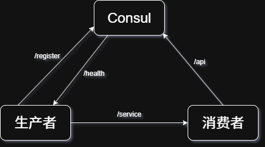

[[toc]]
:::tip 参考资料来源
- 《Go语言高并发与微服务实战》书籍
	实体书成书于20年之前，可能是在18年左右开始编写的
	彼时Go的版本为1.12.x，尚未添加泛型，PRC和Protobuf协议的一些细节也与现在不同，因此理论部分仅供参考
:::
***
## 服务注册与发现

### 服务注册与发现的原理
顾名思义，服务注册与发现主要包含两部分：
- **服务注册**
	- 是指服务实例启动时将自身信息注册到服务注册与发现中心，并在运行时通过心跳等方式向服务注册与发现中心汇报自身服务状态
- **服务发现**
	- 是指服务实例向服务注册与发现中心获取其他服务实例信息，用于进行随后的远程调用

#### 服务注册与发现中心的职责
:::note 业务架构发展路线
1. **单体架构 (Monolithic Architecture)**

- **特征**：所有的业务功能代码都集中在一个代码仓库中，最终编译成一个部署包（如 WAR、JAR、EXE）。通常共享一个数据库。
    
- **优点**：开发、测试、部署简单；早期性能高（本地调用）。
    
- **缺点**：随着业务增长，代码量巨大，难以维护；扩展性差（只能全量扩展）；技术栈受限（全量统一）；部署频率低（改一点动全身）。
    

2. **分层架构 (Layered Architecture)**

- **特征**：在单体内部进行逻辑拆分，典型的如 **MVC 模式**（表现层、业务逻辑层、数据访问层）。
    
- **意义**：虽然物理上仍是一个整体，但在代码结构上实现了关注点分离，是迈向模块化的第一步。
    

3. **面向服务架构 (SOA - Service-Oriented Architecture)**

- **特征**：为了解决企业内部不同系统间的“信息孤岛”问题，将功能封装为可重用的“服务”。引入了 **ESB（企业服务总线）** 作为中枢，负责协议转换、消息路由。
    
- **核心理念**：重用（Reuse）和互操作（Interoperability）。
    
- **缺点**：ESB 过于厚重，容易成为性能瓶颈；标准（如 SOAP/XML）复杂且笨重。
    

4. **微服务架构 (Microservices Architecture)**

- **出现背景**：随着互联网大爆发，SOA 的厚重模式无法适应快速迭代。2014 年 Martin Fowler 正式定义了微服务。
    
- **特征**：
    
    - **原子性**：一个服务只做一件事（通常按业务边界拆分）。
        
    - **独立性**：独立开发、独立部署、独立数据库。
        
    - **去中心化**：不再使用重型的 ESB，倡导“聪明的终端，愚笨的管道”（如 RESTful API、轻量级 MQ）。
        
    - **技术多样性**：不同服务可以使用不同的语言和数据库。
        
- **驱动力**：容器化技术（Docker、K8s）的成熟让管理大量微服务成为可能。
    

5. **云原生与服务网格 (Cloud Native & Service Mesh)**

- **微服务的进化**：微服务虽然解耦了业务，但带来了治理难题（限流、熔断、链路追踪等）。
    
- **服务网格（Service Mesh）**：通过 Sidecar（边车）模式，将服务治理逻辑从业务代码中剥离，交给基础设施层（如 Istio）。
    
- **Serverless（无服务器）**：微服务的进一步极致拆分，开发者只需编写函数（FaaS），完全无需关心底层服务器。

:::

随着应用架构向微服务架构迁移，微服务数量的增加和动态部署扩展的特性，使得服务地址和端口在运行时是随时可变的。对此，我们需要额外的中心化组件统一管理动态部署的微服务应用的服务实例元数据，一般称它为**服务注册与发现中心**。**服务注册与发现中心**主要有以下职责：
1. 管理当前注册到服务注册与发现中心的微服务实例元数据信息，包括服务实例的**服务名**、**IP地址**、**端口号**、**服务状态**和服务描述等。
2. 与注册到服务注册与发现中心的微服务实例维持心跳，定期检查注册表中的服务实例是否在线，并剔除无效服务实例信息。
3. 提供服务发现能力，为调用方提供服务提供方的服务实例元数据
通过**服务注册与发现中心**，可以很方便地管理系统中动态变化的服务实例信息。正是这样的关键地位，让它也可能成为系统的瓶颈和故障点。因为服务之间的调用信息来自于服务注册与发现中心，当它不可用时，服务之间的调用可能无法正常进行。因此**服务注册与发现中心**一般会多例部署，保证其高可用性和高稳定性

#### 服务实例注册服务信息
仅有服务注册与发现中心是不够的，还需要各个服务实例的鼎力配合：只有这样，整个服务注册与发现体系才能良好运作。一个服务实例需要完成以下的事情：
1. **在服务启动阶段**，提交自身服务实例元数据到服务注册与发现中心，完成服务注册
2. **在服务运行阶段**，定期和服务注册与发现中心维持心跳，保证自身在线状态。如果可能，还会检测自身元数据变化，发生变化时重新提交数据到服务注册与发现中心
3. **在服务关闭时**，向服务注册与发现中心发出下线请求，注销自身在注册表中的服务实例元数据

#### CAP原理
在本质上来讲，微服务应用属于分布式系统的一种落地实践，而分布式系统最大的难点是处理各个节点之间数据状态的一致性。即使是倡导无状态的HTTP RESTful API请求，在处理多服务实例情况下的修改数据状态请求时，也是需要通过数据库或者分布式缓存等外部系统维护数据的一致性。**CAP原理**是描述分布式系统下节点数据同步的基本定理。
**CAP定理**由加州大学的Eric Brewer教授提出，它们分别指**Consistency/一致性**、**Availability/可用性**和**Partition tolerance/分区容忍性**。Eric Brewer认为，以上三个指标不可能同时满足。下面让我们来分析一下这三个指标：
1. 数据**一致性**：系统的数据信息（包括备份数据）在同一时刻都是一致的。在分布式系统下，同一份数据可能存在于多个不同的实例中，在数据强一致性的要求下，对其中一份数据的修改必须同步到它的所有备份中。在数据同步的任何时候，都需要保证所有对该份数据的请求将返回同样的状态
2. 服务**可用性**：服务在接收到客户端请求后，都能够给出响应。服务可用性考量的是系统的可用性，要求系统在高并发与部分节点宕机的情况下，系统整体依然能够响应客户端的请求
3. **分区容忍性**：分布式系统中，不同节点之间通过网络进行通信。基于网络的不可靠性，位于不同网络分区的服务节点可能会通信失败，如果系统能够容忍这种情况，说明它是满足分区容忍性特性的。如果系统不能够容忍这种情况，那么将会限制分布式系统的扩展性，即服务节点的部署数量和地区将会受限，违背了分布式系统设计的初衷，所以一般来讲分布式系统都会满足分区容忍性

在满足了分区容忍性的前提下，分布式系统就不能同时满足数据一致性和服务可用性。假设服务A现在有两个实例A1和A2，它们之间的网络通信出现了异常，基于分区容忍性，这并不会影响A1和A2独立的正常运行。若此时客户端请求A1，请求将数据B从B1状态修改为B2，由于网络的不可用，数据B的修改并不能通知到实例A2。如果此时另一个客户端向A2请求数据B，如果A2返回数据B1，将满足服务可用性，但并不能满足数据一致性：如果A2需要等待A1的通知之后才能够返回数据B的正确状态，虽然满足了数据一致性，但无法响应客户端请求，违背了服务可用性的指标。
基于分布式系统的基本特质，分区容忍性是必须要满足的，接下来需要考虑满足数据一致性还是服务可用性，这要取决于具体的应用场景。在类似银行对金额数据要求强一致性的系统中，要优先考虑满足数据一致性；而类似大众网页的系统，用户对网页版本的新旧不会有特别的要求，在这种场景下服务可用性高于数据一致性。
### 常用的服务注册与发现框架
:::note 26年服务注册与发现框架的市场格局

|**组件**|**现代地位**|**核心应用场景**|
|---|---|---|
|**Etcd**|**绝对霸主 (底层)**|**K8s 的灵魂**。现代微服务基本都跑在 Kubernetes 上，而 K8s 所有的状态和服务发现都靠 Etcd。你可能不会直接给它写代码，但它无处不在。|
|**Consul**|**全能选手 (中层)**|**HashiCorp 生态的核心**。如果你不用 K8s，或者需要跨云、跨数据中心的服务治理，Consul 是首选。它的健康检查和 Service Mesh（Consul Connect）非常强大。|
|**Zookeeper**|**经典遗老 (历史)**|**大数据/Java 生态**。现在新上马的 Go 项目几乎不会选 ZK。它主要存在于 Kafka、Hadoop 等老牌重量级系统的依赖中。|

:::


#### 基于Raft算法的开箱即用服务发现组件Consul
Consul由HashiCorp开源，是支持多个平台的分布式高可用系统。Consul使用Go语言实现，主要用于实现分布式系统的服务发现与配置，满足CP特性。Consul是**分布式**、**高可用**、**可横向扩展**的，提供以下主要特性：
1. **服务发现**：可以使用HTTP或者DNS的方式将服务实例的元数据注册到Consul，并通过Consul发现所依赖服务的元数据列表
2. **健康检查**：Consul提供定时的健康检查机制，定时请求注册到Consul中的服务实例提供的健康检查接口，将异常返回的服务实例标记为不健康
3. **Key/Value**：Consul提供了Key/Value 存储功能，可以通过简单的HTTP接口进行使用
4. **多数据中心**：Consul使用[Raft算法](http://thesecretlivesofdata.com/raft/)来保证数据一致性，提供了开箱即用的多数据中心功能



通过Consul实现服务注册与发现中心的调用过程如下：
1. Producer 在启动之初会通过`/register`接口将自己的服务实例元数据注册到 Consul 中
2. Consul 通过 Producer 提供的健康检查接口`/health`定时检查 Producer 的服务实例状态
3. Consumer 请求 Consul 获取 Producer 服务的元数据
4. Consumer从 Consul 中返回的 Producer 服务实例元数据列表中选择合适服务实例的IP和端口发起服务间调用

Consul是一个高可用的分布式系统，支持多数据中心部署。一个Consul集群由部署和运行了ConsulAgent的节点组成。Consul集群中存在两种角色：Server和Client。每个Consul Agent负责对本地的服务进行监控检查，并将查询请求转发到Server中进行处理


Consul主要由Consul Client和Consul Server组成，它们的具体作用如下：
1. **Consul Client**：只维护自身的状态，它是无状态的，会把HTTP和DNS接口请求转发给同一数据中心的ConsulServer处理
2. **Consul Server**：它是数据存储和复制的地方。通过多个Server部署高可用集群（官方建议3个或者3个以上）。多个Server之间通过Raft协议选举一个Leader。在*上图* 中存在两个数据中心，分别为DataCenter1和DataCenter2。同一数据中心中的Server保持数据强一致性，当出现跨数据中心服务发现或配置请求时，本地Server会将请求转发到远程数据中心处理。不同数据中心的Server之间的数据不会发生同步

Consul 使用[ Gossip 协议](https://en.wikipedia.org/wiki/Gossip_protocol)来管理成员和广播消息到集群。Consul 中包括如下两种Gossip池：
1. **Lan池**：每个数据中心都有一个Lan池，用于管理本数据中心所有的Server和Client。它提供的成员关系可以使Client自动发现Server，将故障检测分担到集群中，并提供可靠和快速事件广播用于Leader选举等事件通知。
2. **Wan**池：它管理着所有数据中心的Server，是全局唯一的。它提供的成员关系允许Server执行跨数据中心的请求

Consul作为一个开箱即用、高可用分布式服务发现和配置系统，可以很方便地为微服务的服务治理提供强有力的支持

#### 基于HTTP协议的分布式Key/Value存储组件Etcd
Etcd是由CoreOS开源，采用Go语言编写的分布式、高可用的Key/Value存储系统，主要用于服务发现和配置共享。Etcd经典的应用场景有
1. **Key/Value存储**：Etcd支持HTTP RESTfulAPI，提供强一致性、高可用的数据存储能力
2. **服务注册与发现**：通过在Etcd中注册某个服务的目录，服务实例连接Etcd并在目录下发布对应的IP和Port，以供调用方使用，可以有效地实现服务注册与发现功能
3. **消息发布与订阅**：通过Etcd的Watcher机制，可以使订阅者订阅他们关心的目录。当消息发布者修改被监控的目录内容时，可以将变化实时通知给订阅者


*Etcd集群基本架构*

Ecd集群中的节点提供两种模式，分别为**Proxy**和**Peer**：
- **Proxy**：该模式下的Etcd节点会作为一个反向代理，把客户端的请求转发给可用的Etcd Peer集群。Proxy并没有加入到Etcd的一致性集群中，不会降低集群的写入性能
- **Peer**：Peer模式下的节点提供数据存储和同步的能力。Peer之间通过Raft协议进行Leader选举和保持数据强一致性，通常建议部署奇数个节点提供高可用的集群能力

相对于其他的组件来讲，Etcd更为轻量级，部署简单，支持HTTP接口。它可以为服务发现提供一个稳定高可用的服务实例信息注册仓库，为微服务协同工作提供了有力的支持。

#### 重量级一致性服务组件Zookeeper
Zookeeper作为 Hadoop 和 Hbase 的重要组件，是一个开源的分布式应用协调服务，目前由 Apache基金会维护，采用Java语言开发。Zookeeper 致力于为分布式应用提供一致性服务，它的设计目标是将分布式系统中那些复杂且容易出错的操作封装为简单高效的接口以供开发人员使用

Zookeeper底层只提供了两个功能：管理客户端提交的数据和为客户端程序提供数据节点的监听服务。它是一个典型的分布式数据一致性解决方案，基于 Zookeeper 可以实现服务注册与发现、消息发布与订阅、分布式协调与通知、分布式锁、Master选举、集群管理和分布式队列等诸多功能。

Zookeeper集群中存在3种角色，分别为**Leader**、**Follower**和**Observer**


1. **Leader**：Zookeeper集群使用ZAB协议通过Leader选举从集群中选定一个节点作为Leader。Leader服务进行投票的发起和决议，更新系统状态，它会响应客户端的读写请求
2. **Follower**：只提供数据的读服务，会将来自客户端的写请求转发到Leader中。在Leader选举的过程中参与投票，并与Leader维持数据同步
3. **Observer**：与Follower的区别是Observer不参与Leader的选举过程，也不参与写过程的“过半写成功”策略，主要作用是为了在不影响写性能的前提下提高集群的读能力

Zookeeper通过[ZAB(Zookeeper Atomic Broadcast)](https://en.wikipedia.org/wiki/Atomic_broadcast)协议来保证其数据一致性。ZAB协议不是一种通用的分布式一致性算法，它是在[Paxos算法](https://zh.wikipedia.org/wiki/Paxos%E7%AE%97%E6%B3%95)的基础上，为 Zookeeper 特别设计的崩溃可恢复的原子消息广播协议。ZAB协议主要包含两种基本模式：**崩溃恢复**和**消息广播**
1. **崩溃恢复模式**：在服务启动或者 Leader 服务器崩溃时，ZAB协议就会进入崩溃恢复模式，在所有的 Follower 中选举出 Leader。当选举出新的 Leader 后，等集群中有半数与新的 Leader 完成状态同步后就会退出恢复模式，进入到消息广播模式。
2. **消息广播模式**：ZAB协议消息广播过程使用的是一个原子广播协议，类似于一个二阶段提交，但是又有所不同，并非所有 Follower 节点都返回 Ack 才进行一致性事务完成，而是只需要半数以上即可提交完成一个事务广播

Zookeeper 为分布式系统提供协调服务，能够有效地支持微服务架构的服务注册和发现机制；同时Zookeeper 中提供的其他数据一致性解决方案，能够有力支撑微服务中分布式业务的开发。

#### 服务注册与发现组件的对比与选型

| **功能点**         | **Consul** | **Etcd**  | **Zookeeper** |
| --------------- | ---------- | --------- | ------------- |
| **CAP原理**       | CP         | CP        | CP            |
| **Key/Value存储** | 支持         | 支持        | 支持            |
| **多数据中心**       | 支持         | 支持        | 支持            |
| **一致性协议**       | Raft       | Raft      | ZAB           |
| **访问协议**        | HTTP/DNS   | HTTP/gRPC | RPC客户端        |
| **Watch机制**     | 支持         | 支持        | 支持            |
| **安全机制**        | ACL/HTTPS  | HTTPS     | ACL           |
| **健康检查**        | 健康检查       | 长连接       | 连接心跳          |

从**软件的生态**出发，Consul 是以服务发现和配置作为主要功能目标，附带提供了Key/Value存储，相对于 Etcd 和 Zookeeper 来讲业务范围较小，更适合于服务注册与发现。

Etcd 和 Zookeeper 属于通用的分布式一致性存储系统，被应用于分布式系统的协调工作中，使用范围抽象，具体的业务场景需要开发人员自主实现，如服务注册与发现、分布式锁等。Zookeeper 具备广大的周边生态，在分布式系统中得到了广泛的使用；而Etcd则以简单易用的特性吸引了大量开发人员，在目前火热的 Kubernetes 中也有应用。

仅从服务注册与发现组件的需求来看，选择 Consul 作为服务注册与发现中心能够取
得更好的效果；如果系统存在其他分布式一致性协作需求，选择 Etcd 和 Zookeeper 反而能够提供更多的服务支持。

### Consul安装、部署与接口定义
#### 安装
- [下载页面](https://developer.hashicorp.com/consul/install)

- **Linux: Ubuntu/Debian**：
```sh
wget -O - https://apt.releases.hashicorp.com/gpg | sudo gpg --dearmor -o /usr/share/keyrings/hashicorp-archive-keyring.gpg
echo "deb [arch=$(dpkg --print-architecture) signed-by=/usr/share/keyrings/hashicorp-archive-keyring.gpg] https://apt.releases.hashicorp.com $(grep -oP '(?<=UBUNTU_CODENAME=).*' /etc/os-release || lsb_release -cs) main" | sudo tee /etc/apt/sources.list.d/hashicorp.list
sudo apt update && sudo apt install consul
```
如果用的是非主流Debian/Ubuntu版本，可以尝试下载二进制版本：
```sh
# 下载最新版 Consul（请自行检查官网获取最新版本号）
CONSUL_VERSION="1.22.3"
wget https://releases.hashicorp.com/consul/${CONSUL_VERSION}/consul_${CONSUL_VERSION}_linux_amd64.zip

# 解压并安装
sudo apt install unzip  # 如果没有 unzip
unzip consul_${CONSUL_VERSION}_linux_amd64.zip
sudo mv consul /usr/local/bin/
sudo chmod +x /usr/local/bin/consul

# 验证
consul version
```

- [**Windows x86_64 二进制可执行文件下载链接**](https://releases.hashicorp.com/consul/1.22.3/consul_1.22.3_windows_386.zip) 

#### 启动
```sh
# 启动Consul
consul agent -dev
```
- `-dev`：以开发模式启动；该模式下会快速部署一个单节点的 Consul 服务，部署好的节点既是Server 也是 Leader。开发模式启动的 Consul 不会持久化任何数据，数据仅存在于内存中，Consul 关闭时保存在 Consul 的数据将会丢失。在生产环境建议使用`-server`模式启动Consul，保证至少一台正式的 ConsulServer 用于维持集群数据的一致性和持久化。

```
tcp        0      0 127.0.0.1:8600          0.0.0.0:*               LISTEN      12903/consul        
tcp        0      0 127.0.0.1:8500          0.0.0.0:*               LISTEN      12903/consul        
tcp        0      0 127.0.0.1:8502          0.0.0.0:*               LISTEN      12903/consul        
tcp        0      0 127.0.0.1:8503          0.0.0.0:*               LISTEN      12903/consul        
tcp        0      0 127.0.0.1:8300          0.0.0.0:*               LISTEN      12903/consul        
tcp        0      0 127.0.0.1:8301          0.0.0.0:*               LISTEN      12903/consul        
tcp        0      0 127.0.0.1:8302          0.0.0.0:*               LISTEN      12903/consul     
```

##### 使用配置文件启动
Consul默认监听本地回环地址。需要修改配置文件的话请参照下面的指令：
```sh
# 创建主配置文件
sudo mkdir -p /etc/consul.d
sudo nano /etc/consul.d/consul.hcl
```

:::tip
Consul默认使用的配置文件格式是JSON或HCL。下面的代码块为了高亮语法，把代码块语言换成了TOML
:::

*基础配置：*
```toml
# 添加网络监听配置
# 绑定到所有网络接口
bind_addr = "0.0.0.0"

# 客户端监听地址（HTTP API、DNS、UI）
client_addr = "0.0.0.0"

# 通告地址（让其他节点知道如何连接你）
advertise_addr = "192.168.1.100"  # 改成你的实际 IP

# 服务端监听端口（如果是 Server 模式）
# 默认已包含，一般无需额外配置

# 数据中心名称（可选）
datacenter = "dc1"

# 数据目录
data_dir = "/var/lib/consul"

# 启用 UI
ui = true
```
*生产环境Server配置：*
```toml
# 节点名称
node_name = "consul-server-1"

# 绑定到所有网卡
bind_addr = "0.0.0.0"

# 客户端接口监听所有网卡（HTTP API / DNS / UI）
client_addr = "0.0.0.0"

# 数据目录
data_dir = "/var/lib/consul"

# 数据中心
datacenter = "dc1"

# 以 Server 模式运行
server = true

# 启动引导期望（bootstrap-expect）- 集群中 Server 数量
bootstrap_expect = 3

# 启用 UI
ui = true

# 日志级别
log_level = "INFO"

# 加密通信（生产环境必须配置）
# encrypt = "your-gossip-encryption-key"

# ACL 配置（生产环境建议启用）
# acl {
#   enabled = true
#   default_policy = "deny"
#   enable_token_persistence = true
# }
```

| 配置项           | 作用                    | 默认值         |
| ------------- | --------------------- | ----------- |
| `bind_addr`   | Serf 通信绑定的 IP（集群内部通信） | `0.0.0.0`   |
| `client_addr` | HTTP API、DNS、UI 监听的地址 | `127.0.0.1` |
| `ports.http`  | HTTP API 端口           | `8500`      |
| `ports.dns`   | DNS 服务端口              | `8600`      |


使用配置文件启动：
```sh
# 前台运行（测试）
sudo consul agent -config-dir=/etc/consul.d/

# 或指定具体配置文件
sudo consul agent -config-file=/etc/consul.d/consul.hcl
```
- 不要使用`-dev`：`-dev`配置优先级高于配置文件，可能会覆盖一些参数

或使用`systemd`启动（生产环境）：
```sh
# 创建服务文件
sudo nano /etc/systemd/system/consul.service
```
```ini
# 添加配置内容
[Unit]
Description=Consul Service Discovery Agent
Documentation=https://www.consul.io/
After=network-online.target
Wants=network-online.target

[Service]
Type=simple
User=consul
Group=consul
ExecStart=/usr/local/bin/consul agent -config-dir=/etc/consul.d/
ExecReload=/bin/kill -HUP $MAINPID
KillMode=process
KillSignal=SIGTERM
Restart=on-failure
LimitNOFILE=65536

[Install]
WantedBy=multi-user.target
```
```sh
# 启动服务
# 创建 consul 用户（如果不存在）
sudo useradd --system --home /var/lib/consul --shell /bin/false consul
sudo mkdir -p /var/lib/consul
sudo chown -R consul:consul /var/lib/consul /etc/consul.d

# 启动
sudo systemctl daemon-reload
sudo systemctl enable consul
sudo systemctl start consul
sudo systemctl status consul
```

测试配置：
```sh
# 查看监听端口
sudo netstat -tlnp | grep consul
# 或
sudo ss -tlnp | grep consul

# 测试 HTTP API（从其他机器）
curl http://<your-server-ip>:8500/v1/status/leader

# 访问 Web UI
# http://<your-server-ip>:8500/ui
```


##### 单机调试启动
上面的方法要求先存在一个Server节点，否则会报错 *No Known Server*

:::tip
Consul 的这个报错其实是在教你分布式系统的第一个真理：**“共识（Consensus）”**。

- 没有 Leader 的分布式系统是不对外提供服务的（为了防止数据不一致）。
    
- `bootstrap-expect` 就是人为干预这个过程，让单机也能自愈。
:::

```sh
consul agent -server -bootstrap-expect=1 -data-dir=/tmp/consul -node=node1 -bind=0.0.0.0 -client=0.0.0.0 -advertise=xx.xx.xx.xx -ui
```
- **`-server`**: 告诉它你是服务端。
- **`-bootstrap-expect=1`**: 最关键的一点。告诉 Consul：“在这个集群里，只要有 1 台服务器在线，就可以选举自己为 Leader 并在 HTTP 端口提供服务”。
- **`-client=0.0.0.0`**: 允许外部（你的宿主机）通过浏览器访问 UI。
- `-advertise=xx.xx.xx.xx`：外部主机可以通过什么IP访问该节点（通常是本机IP）
- **`-ui`**: 明确开启界面。


#### Go-Kit 简介（略）
Go-Kit项目的主要结构分为以下三层：
1. **Transport**层：指定项目提供的服务方式
2. **Endpoint**层：用于接受请求并返回响应，通常使用一个抽象的Endpoint来表示
每个服务提供的方法，我们项目实例中提供的服务接口将由Endpoint表示，Endpoint将调用service层方法来实现具体的业务逻辑，并组装为合适的response返回
3. **Service**层：业务代码实现层


你说得对，但这就是我们Gopher自己的注解


service定义，嗯，是gRPC的味道 `func(ctx context.Context, req any) returns (resp any)`


吓哭了，一个接口四个参数


仿佛看到了早期Java Web手撕Reponse Writer


***
# 页面底部