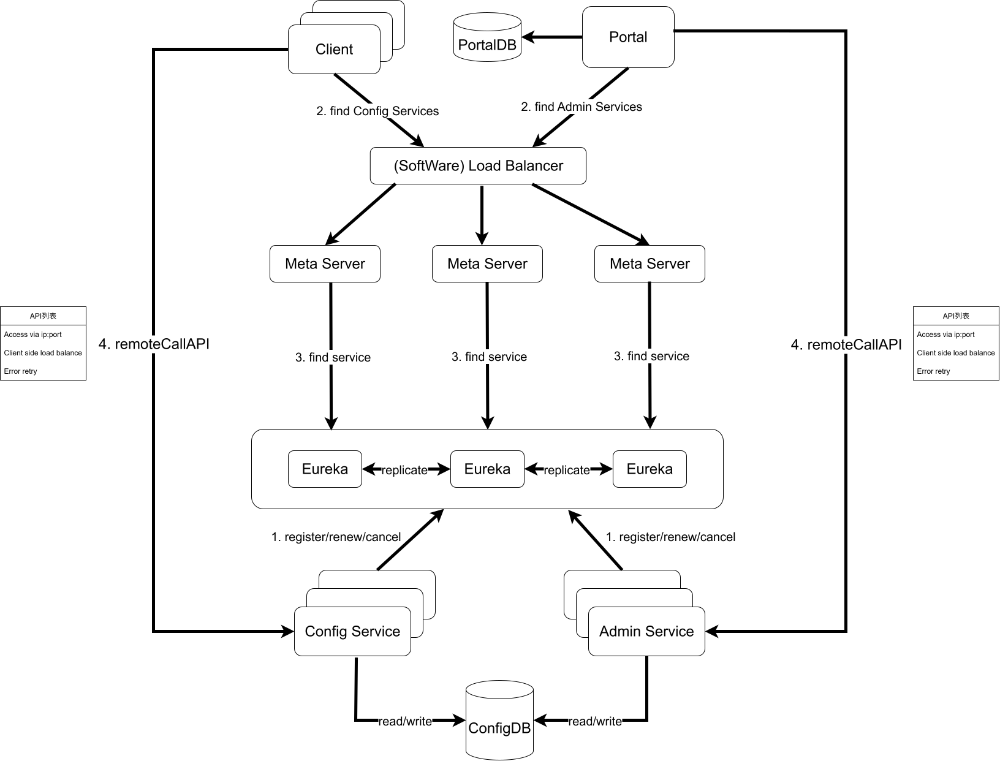

[[toc]]
:::important 参考资料来源
- 《Go语言高并发与微服务实战》一书；由于此书出版于2020年，因此笔记中的理论语料也存在过时的可能
- [博客园 - Docker部署Consul KV](https://www.cnblogs.com/1285026182YUAN/p/19189386)
:::
***
## 理论部分
### 前言
在微服务架构中，**分布式配置中心**（Distributed Configuration Center）是==一种用于统一管理、下发和监控应用程序配置的服务==。它解决了在成百上千个微服务实例中手动维护本地配置文件（如 `.yaml` 或 `.properties`）带来的更新难、易出错和不一致等问题

#### 核心功能
- **集中式管理**：将不同环境（开发、测试、生产）和不同集群的配置存储在中心化平台。
- **动态推送（热更新）**：在不重启服务的情况下，实时将配置变更推送到各运行实例。
- **版本控制与审计**：记录配置修改历史，支持回滚操作，并能审计谁在何时修改了什么。
- **灰度发布**：支持仅对部分实例下发新配置，以验证其正确性。

#### 主流产品
|服务名称|开发者|特点|适用场景|
|---|---|---|---|
|**Nacos**|阿里巴巴|集配置管理与服务发现于一体，支持动态刷新，易于上手。|国内 Java 生态，尤其是 Spring Cloud 体系。|
|**[Apollo](https://github.com/apolloconfig/apollo)**|携程|功能极度丰富，具备完善的权限管理和多环境隔离。|企业级大规模微服务集群，对治理要求高的场景。|
|**[Spring Cloud Config](https://spring.io/projects/spring-cloud-config/)**|Spring 团队|默认使用 Git 存储，天然集成 Spring 生态，支持版本控制。|标准 Spring Boot/Cloud 项目。|
|**Consul**|HashiCorp|使用 KV 存储实现配置管理，具备高可用性和跨数据中心支持。|混合云或多语言架构环境。|
|**Etcd**|CNCF|高可靠的分布式 KV 存储，Kubernetes 的核心存储组件。|云原生及底层基础架构配置。|

#### 云托管服务
- **AWS AppConfig**：AWS 提供的持续配置管理服务。
- **Azure App Configuration**：微软 Azure 提供的集中管理应用设置和功能标志的服务。
- **华为云 CSE**：微服务引擎，内置高可用的配置中心。

### 常见分布式配置中心方案
#### Spring Cloud Config
**Spring Cloud Config**是**Spring Cloud**提供的分布式配置中心组件，基于Java语言实现。通过*Config Server*，我们就可以集中管理不同环境下各种应用的配置信息。**Spring Cloud Config客户端**和**服务端**匹配到 Spring 中对应 *Environment* 和 *Property Source* 的概念，所以**Spring Cloud Config**不仅适用于所有的Spring应用，而且对于任意语言的应用都能够适用。一个应用可能有多个环境，从开发到测试，再到生产环境，我们可以管理这些不同环境下的配置，而且能够确保应用在环境迁移后有完整的配置能够正常运行。

**Config服务端**默认的存储实现是**Git**，这能够很容易地支持配置环境的标签版本，而且有各种工具方便地管理这些配置内容。除了Git，ConfigServer配置服务还支持多种仓库的实现方式，如**文件系统**、**SVN**和**Vault**等。

**Spring Cloud Config**官方提供了 Java 的客户端，社区有很多其他语言实现的客户端版本。**Spring Cloud Config**与**消息队列**（通常与** Spring Cloud Bus**）配合使用，实现配置的动态更新，其原理如下图所示。

我们来梳理一下图中的内容，**应用服务**上线之前将**配置**提交到**配置仓库**，**客户端应**
**用**启动时从**配置仓库**拉取相对应的配置文件信息，并订阅**消息总线指定的topic**。当配置新提交时，触发**配置仓库**的 **WebHook**，或者手动调用 *Config Server* 更新事件的端点`/bus/refresh`，发送**更新事件**到**消息队列**，客户端服务根据收到的更新事件决定是否更新本地的配置。

可以看出，**Spring Cloud Config**原生支持 **Java 客户端**，而 Go语言客户端 需要进行部分自定义改造，我们将会在后续小节具体介绍
#### Apollo
**Apollo（阿波罗）** 是**携程框架部门**研发的**开源配置管理中心**，能够集中化管理应用不
同环境、不同集群的配置，配置修改后能够实时推送到应用端，并且具备规范的权限控制、流程治理等特性。

下图为**Apollo**使用的流程图。用户在**Portal**操作配置发布：*Portal* 调用 *Admin Service* 的接口操作发布；*Admin Service*发布配置后，发送*Release Message* 给各个*Config Service*; *Config Service* 收到*Release Message*后，通知对应的客户端。



*Apollo原理图*

为了更清晰地弄明白Apollo的设计原理，我们可以从下往上看：
1. *Config Service*提供配置的**读取、推送**等功能，服务对象是**Apollo客户端**
2. *Admin Service*提供配置的**修改、发布**等功能，服务对象是**Apollo Portal（管理界面）**。
3. *Config Service*和*Admin Service*都是**多实例、无状态部署**，所以需要将自己注册
到**Eureka**中并保持心跳
4. 在**Eureka**之上构建了一层*Meta Server*，用于封装**Eureka**的**服务发现接口**
5. **Client**通过域名访问*Meta Server*获取**Config Service服务列表（IP+Port）**，而后
直接通过`IP+Port`访问服务，同时在**Client侧**会**负载均衡**和**错误重试**
6. **Portal**通过域名访问*Meta Server* 获取**Admin Service服务列表（IP+Port）**，而后
直接通过`IP+Port`访问服务，同时在**Portal侧**会做**负载均衡**和**错误重试**
7. 为了简化部署，实际使用中会把*Config Service*、**Eureka**和*Meta Server*这3个逻
辑角色部署在同一个JVM进程中

学习完Apollo的各个层次，轮廓就清晰多了，我们了解Apollo拥有7个模块，其中
4个模块是和**配置功能相关的核心模块**：*Config Service*、*Admin Service*、*Client* 和 *Portal*，另外3个模块是**辅助服务发现的模块**：**Eureka**、*Meta Server* 和 **NginxLB**。欲了解这7个模块的细节，读者可以参照[该项目的源码](https://github.com/Netflix/eureka)

在应用的配置方面，Apollo支持4个维度管理**Key-Value格式**的配置：
1. **application/应用**：这个很好理解，就是实际使用配置的应用，**Apollo客户端**在运行时需要知道当前应用是谁，从而可以去获取对应的配置；每个应用都需要有唯一的身份标识appID，应用默认的身份是跟着代码走的，所以需要在代码中配置。
2. **environment/环境**：配置对应的环境，Apollo客户端在运行时需要知道当前应用处于哪个环境，从而可以去获取应用的配置；环境和代码无关，同一份代码部署在不同的环境就应该能够获取到不同环境的配置：所以环境默认是通过读取机器上的配置（`server.properties`中的`env`属性）指定的，不过为了开发方便，同时也支持运行时通过*System Property* 来指定
3. **cluster/集群**：一个应用下不同实例的分组，比如典型的可以按照数据中心来分，把上海机房的应用实例分为一个集群，把北京机房的应用实例分为另一个集群。对不同的cluster，同一个配置可以有不一样的值，如*zookeeper地址* 。集群默认是通过读取机器上的配置（`server.properties`中的`idc属性`）指定的，不过也支持运行时通过*System Property* 来指定
4. **namespace/命名空间**：一个应用下不同配置的分组，可以简单地把namespace类比为文件，不同类型的配置存放在不同的文件中，如数据库配置文件、RPC配置文件、应用自身的配置文件等；应用可以直接读取到公共组件的配置namespace，如DAL，RPC等；应用也可以通过继承公共组件的配置namespace来对公共组件的配置做调整，如DAL的初始数据库连接数
我们可以根据具体的业务场景，创建对应的维度来管理应用的配置信息
#### ~~Disconf~~
**Disconf**由百度内部使用之后开源，是一套完整的**基于Zookeeper的分布式配置统一解决方案**

Disconf简单，用户体验良好，实现了同构系统的配置发布统一化，提供了配置服务Server，该服务可以对配置进行持久化管理并对外提供RESTful接口。在此基础上，基于Zookeeper实现对配置更改的实时推送，并且提供了稳定有效的容灾方案，以及用户体验良好的编程模型和Web用户管理界面

其次，Disconf实现了**异构系统的配置包管理**，提出**基于Zookeeper的全局分布式一致性锁**来实现**主备统一部署**、**系统异常**时的**主备自主切换**
#### 对比
前面3节讲述的3种分布式配置中心的开源组件，都是相对成熟且经过大范围使用。下面我们从具体的方面对比这3个组件，包括**动态配置管理**、**配置管理界面**、**用户权限管理**、**授权和审计**、**配置版本管理**、**灰度发布**、**多环境**和**多点容灾**等，如下表所示

| 功能点        | Spring Cloud Config | Apollo           | Disconf          |
| ---------- | ------------------- | ---------------- | ---------------- |
| **动态配置管理** | 支持                  | 支持               | 支持               |
| **配置管理界面** | 不支持                 | 支持               | 支持               |
| **用户权限管理** | 需Git                | 支持               | 支持               |
| **授权审计**   | 需Git                | 支持               | 支持               |
| **配置版本管理** | 支持                  | 界面上直接提供发布历史和回滚按钮 | 操作记录有落数据库，但无查询接口 |
| **灰度发布**   | 不支持                 | 支持               | 不支持部分更新          |
| **多环境**    | 支持                  | 支持               | 支持               |
| **多点容灾**   | 支持                  | 支持               | 支持               |
**补充**：
1. **Spring Cloud Config**辅助支持功能较弱，组件简单，较容易上手
2. **Apollo**在功能和生态圈方面比较完备，目前**Apollo**提供了**Go语言客户端**，对
于Go语言微服务的接入和管理较为方便。当然其复杂度也是相对较高的
3. **Disconf**虽然性能和实时性较好，但近几年的更新较少

## 实践部分
### Consul KV云端配置管理
#### Docker部署Consul
[详情请见](https://hub.docker.com/_/consul?uuid=3B5D6B57-BC8D-4456-9B97-4FB41A28EB21)

docker启动后访问[http://localhost:8500/ui/dc1/kv](http://localhost:8500/ui/dc1/kv)即为KV管理界面


#### Consul KV的几种使用方式
##### Consul KV CLI管理KV
```sh
consul kv <子指令> <参数> <值>
```
**子指令**有：
- `delete`：删除KV
- `export`：导出全部KV键值对的树状JSON格式数据
- `get`：获取或列出KV存储
- `import`：导入JSON树格式的KV
- `put`：增加或更改KV

###### 新增/更新KV
```sh
consul kv put <option> <args>
```

- 使用URL格式的键
	常见的*option/参数* 是KV所在的路径，不写的话，就在根目录下创建一个只有K没有V的键值对（`42`是键）
	
	写路径的话consul会自动递归把V放在嵌套目录中
- 附属添加元数据，如`-flags=42`
	```sh
	/ # consul kv put -flags=42 sql/private/account/username admin
	Success! Data written to: sql/private/account/username
	```


###### 导出/查询KV
- `consul kv export`：导出所有KV
	```sh
	/ # consul kv put http/schema http
	Success! Data written to: http/schema
	/ # consul kv put http/domain example.com
	Success! Data written to: http/domain
	/ # consul kv put http/port 8080
	Success! Data written to: http/port
	/ # consul kv export
	[
	        {
	                "key": "42",
	                "flags": 0,
	                "value": ""
	        },
	        {
	                "key": "a/b/c",
	                "flags": 0,
	                "value": "NDI="
	        },
	        {
	                "key": "http/domain",
	                "flags": 0,
	                "value": "ZXhhbXBsZS5jb20="
	        },
	        {
	                "key": "http/port",
	                "flags": 0,
	                "value": "ODA4MA=="
	        },
	        {
	                "key": "http/schema",
	                "flags": 0,
	                "value": "aHR0cA=="
	        }
	]
	```
- `consul kv get `：获取单个KV
	```sh
	/ # consul kv get http/schema
	http
	/ # consul kv get http
	Error! No key exists at: http
	```
	- `consul kv get -detailed`：`-detailed`参数用于获取详细的单个KV信息
		```sh
		/ # consul kv get -detailed sql/private/account/username
		CreateIndex      75
		Flags            42
		Key              sql/private/account/username
		LockIndex        0
		ModifyIndex      75
		Session          -
		Value            admin
		```
	- `consul kv get -recurse`：递归获取所有K
		```sh
		/ # consul kv get -recurse
		42: # 这个没有显式设置值
		a/b/c:42
		http/domain:example.com
		http/port:8080
		http/schema:http
		sql/private/account/username:admin
		```

###### 删除KV
- **删除单个KV**：`consul kv delete <Key>`
- **递归循环KV**：`consul kv delete -recurse <Key>`

:::warning Security warning

By default, Consul does not allow path escapes, directory escapes, leading spaces, or trailing spaces in keys, beginning with Consul v1.22.0. If you have any existing keys in this format and want to continue using the same keys, set the `disable_kv_key_validation` parameter to `true` in the Consul agent configuration. We strongly recommend using validated keys unless you have a specific reason to disable it for legacy compatibility.

:::
##### HTTP RESTful API管理KV
[文档来源](https://developer.hashicorp.com/consul/api-docs/kv)

- `CONSUL_HOST`或`HOST`：consul服务的IP地址
- `CONSUL_PORT`或`PORT`：consul服务的端口
- `http://<HOST>/<PORT>/v1/kv`：API端点
###### 获取KV
|Method|Path|Produces|
|---|---|---|
|`GET`|`/kv/:key`|`application/json`|
- 只能查询**单个Key**；对于多个Key（至多**64个KV**）批量查询，请考虑[事务API](https://developer.hashicorp.com/consul/api-docs/txn)
- 查得到就是`200`，查不到就是`400`
- **动态路径参数**
	- [`key`](https://developer.hashicorp.com/consul/api-docs/kv#key) `(string: "")` - Specifies the path of the key to read.
- **GET参数**
	- [`dc`](https://developer.hashicorp.com/consul/api-docs/kv#dc) `(string: "")` - Specifies the datacenter to query. This will default to the datacenter of the agent being queried.
    - [`recurse`](https://developer.hashicorp.com/consul/api-docs/kv#recurse) `(bool: false)` - Specifies if the lookup should be recursive and treat `key` as a prefix instead of a literal match.
    - [`raw`](https://developer.hashicorp.com/consul/api-docs/kv#raw) `(bool: false)` - Specifies the response is just the raw value of the key, without any encoding or metadata.
    - [`keys`](https://developer.hashicorp.com/consul/api-docs/kv#keys) `(bool: false)` - Specifies to return only keys (no values or metadata). Specifying this parameter implies `recurse`.
    - [`separator`](https://developer.hashicorp.com/consul/api-docs/kv#separator) `(string: "")` - Specifies the string to use as a separator for recursive key lookups. This option is only used when paired with the `keys` parameter to limit the prefix of keys returned, only up to the given separator.
    - 【企业版】[`ns`](https://developer.hashicorp.com/consul/api-docs/kv#ns) `(string: "")` - Specifies the namespace to query. You can also [specify the namespace through other methods](https://developer.hashicorp.com/consul/api-docs/kv#methods-to-specify-namespace).
	- 【企业版】[`partition`](https://developer.hashicorp.com/consul/api-docs/kv#partition) `(string: "")` - The admin partition to use. If not provided, the partition is inferred from the request's ACL token, or defaults to the `default` partition.
	
	**布尔型**的参数设置了就能用，不需要写参数值

*查询单个Key：*

*递归查询：*


###### 新增/更新KV
| Method | Path       | Produces           |
| ------ | ---------- | ------------------ |
| `PUT`  | `/kv/:key` | `application/json` |
- 返回值为`true`或`false`，取决于操作是否成功
- **动态路径参数**
	- [`key`](https://developer.hashicorp.com/consul/api-docs/kv#key-2) `(string: "")` - Specifies the path of the key.
- **GET参数**
	
	- [`dc`](https://developer.hashicorp.com/consul/api-docs/kv#dc-1) `(string: "")` - Specifies the datacenter to query. This will default to the datacenter of the agent being queried.
    - [`flags`](https://developer.hashicorp.com/consul/api-docs/kv#flags-1) `(int: 0)` - Specifies an unsigned value between `0` and `(2^64)-1` to store with the key. API consumers can use this field any way they choose for their application.
    - [`cas`](https://developer.hashicorp.com/consul/api-docs/kv#cas) `(int: 0)` - Specifies to use a Check-And-Set operation. This is very useful as a building block for more complex synchronization primitives. If the index is 0, Consul will only put the key if it does not already exist. If the index is non-zero, the key is only set if the index matches the `ModifyIndex` of that key.
    - [`acquire`](https://developer.hashicorp.com/consul/api-docs/kv#acquire) `(string: "")` - Supply a session ID to use in a lock acquisition operation. This is useful as it allows leader election to be built on top of Consul. If the lock is not held and the session is valid, this increments the `LockIndex` and sets the `Session` value of the key in addition to updating the key contents. A key does not need to exist to be acquired. If the lock is already held by the given session, then the `LockIndex` is not incremented but the key contents are updated. This lets the current lock holder update the key contents without having to give up the lock and reacquire it. **Note that an update that does not include the acquire parameter will proceed normally even if another session has locked the key.**
    - [`release`](https://developer.hashicorp.com/consul/api-docs/kv#release) `(string: "")` - Supply a session ID to use in a release operation. This is useful when paired with `?acquire=` as it allows clients to yield a lock. This will leave the `LockIndex` unmodified but will clear the associated `Session` of the key. The key must be held by this session to be unlocked.
    - 【企业版】[`ns`](https://developer.hashicorp.com/consul/api-docs/kv#ns-1) `(string: "")` - Specifies the namespace to query. You can also [specify the namespace through other methods](https://developer.hashicorp.com/consul/api-docs/kv#methods-to-specify-namespace).
	- 【企业版】[`partition`](https://developer.hashicorp.com/consul/api-docs/kv#partition-1) `(string: "")` - The admin partition to use. If not provided, the partition is inferred from the request's ACL token, or defaults to the `default` partition.

*示例设置*
```sh
curl \
    --request PUT \
    --data @contents \
    http://127.0.0.1:8500/v1/kv/my-key

# or

$ curl \
    --request PUT \
    --data-binary @contents \
    http://127.0.0.1:8500/v1/kv/my-key

```
*更新`sql/username`的值*


###### 删除KV
|Method|Path|Produces|
|---|---|---|
|`DELETE`|`/kv/:key`|`application/json`|
- 和**更新KV**一样，响应也是只有`true`或`false`，取决于操作是否成功
- **动态路径参数**
	- [`key`](https://developer.hashicorp.com/consul/api-docs/kv#key) `(string: "")` - Specifies the path of the key to read.
- **GET参数**
	- [`dc`](https://developer.hashicorp.com/consul/api-docs/kv#dc-2) `(string: "")` - Specifies the datacenter to query. This will default to the datacenter of the agent being queried. If the DC is invalid, the error "No path to datacenter" is returned.
	
    - [`recurse`](https://developer.hashicorp.com/consul/api-docs/kv#recurse-1) `(bool: false)` - Specifies to delete all keys which have the specified prefix. Without this, only a key with an exact match will be deleted.
	
    - [`cas`](https://developer.hashicorp.com/consul/api-docs/kv#cas-1) `(int: 0)` - Specifies to use a Check-And-Set operation. This is very useful as a building block for more complex synchronization primitives. Unlike `PUT`, the index must be greater than 0 for Consul to take any action: a 0 index will not delete the key. If the index is non-zero, the key is only deleted if the index matches the `ModifyIndex` of that key.
	
    - 【企业版】[`ns`](https://developer.hashicorp.com/consul/api-docs/kv#ns-2) `(string: "")` - Specifies the namespace to query. You can also [specify the namespace through other methods](https://developer.hashicorp.com/consul/api-docs/kv#methods-to-specify-namespace).
    
	- 【企业版】[`partition`](https://developer.hashicorp.com/consul/api-docs/kv#partition-2) `(string: "")` - The admin partition to use. If not provided, the partition is inferred from the request's ACL token, or defaults to the `default` partition.

*请求示例*
```sh
curl \
    --request DELETE \
    http://127.0.0.1:8500/v1/kv/my-key

```
*响应示例*
```sh
true
```

###### 指定命名空间的方法
KV端点支持下面几种指定命名空间的方法，从上到下优先级依次降低：
- `ns`查询字符串参数
- `X-Consul-Namespace`请求头
- （如果有的话）继承自ACL令牌的命名空间
- `default`命名空间
### 在Kratos创建Consul服务（只是服务发现）
> Kratos推崇**配置驱动**和**依赖注入**

#### 扩充`conf.proto`定义
```protobuf
// conf.proto
message Registry {
  message Consul {
    string address = 1;    // consul地址，如 192.168.100.133:8500
    string scheme = 2;     // http 或 https
    string token = 3;      // ACL token（可选）
  }
  Consul consul = 1;
}

message Bootstrap {
  Server server = 1;
  Data data = 2;
  Registry registry = 3;   // 新增
}
```

然后刷新一下`conf.pb.go`：
```sh
kratos proto client internal/conf/conf.proto
# 或者
make config
```
#### 补充`config.yaml`字段
位于`configs\config.yaml`中：
```yaml
registry:
  consul:
    address: 192.168.100.133:8500
    scheme: http
    # token: YOUR-ACL-TOKEN
```

#### （在server层中）创建`Provider`函数
- `service`层处理具体的业务，而不处理服务发现

*代码示例：*
```go
// internal/server/registry.go
func NewConsulRegistrar(c *conf.Registry) (registry.Registrar, error) {
    if c == nil || c.Consul == nil {
        return nil, nil  // 未配置则不注册
    }
    
    consulConfig := api.DefaultConfig()
    consulConfig.Address = c.Consul.Address
    consulConfig.Scheme = c.Consul.Scheme
    if c.Consul.Token != "" {
        consulConfig.Token = c.Consul.Token
    }
    
    client, err := api.NewClient(consulConfig)
    if err != nil {
        return nil, err
    }
    return consul.New(client), nil
}
```

#### 更新`server`层中的`ProviderSet`
```go
// ProviderSet is server providers.
var ProviderSet = wire.NewSet(NewGRPCServer, NewHTTPServer, NewConsulRegistrar)
```

#### 在`main.go`中加入注册逻辑
- 修改`wireApp`函数，加入`conf.Registry`参数：
	
- 修改`main`函数，传入`bc.Registry`参数，满足函数调用需求：
	
- 最好修改`newApp`的参数，接受`Registrar`参数
```go
func newApp(logger log.Logger, gs *grpc.Server, hs *http.Server, reg registry.Registrar) *kratos.App {
    opts := []kratos.Option{
        kratos.ID(id),
        kratos.Name(Name),
        kratos.Version(Version),
        kratos.Logger(logger),
        kratos.Server(gs, hs),
    }
    if reg != nil {
        opts = append(opts, kratos.Registrar(reg))
    }
    return kratos.New(opts...)
}
```

然后在项目的main包中执行
```
wire
```
刷新`wire_gen.go`


### 在Kratos中引入Consul配置中心
[文档来源](https://go-kratos.dev/zh-cn/docs/component/config/)

*配置中心*版的Consul不走Wire依赖注入，所以写不写`.proto`都没有意义，Consul配置中心和Consul服务发现中心不走同一个路线，前者需要用来更新本地配置，需要在APP启动前就准备好

#### 在`config`层创建工厂函数
- consul的`config_souce`字段用于告诉consul去哪里找更多配置
```go
func DefaultConsulConfigSource(c *api.Config, moreConfigSource string) (config.Source, error) {  
    client, err := api.NewClient(c)  
    if err != nil {  
       return nil, err  
    }  
  
    return consul.New(client, consul.WithPath(moreConfigSource))  
}
```

#### 更新`main`函数的配置初始化逻辑
- 原本的`flagconf`及其对应的配置源只是*本地配置源* ，和Consul这个云端配置源无关
```go
func main() {  
    flag.Parse()  
    logger := log.With(log.NewStdLogger(os.Stdout),  
       "ts", log.DefaultTimestamp,  
       "caller", log.DefaultCaller,  
       "service.id", id,  
       "service.name", Name,  
       "service.version", Version,  
       "trace.id", tracing.TraceID(),  
       "span.id", tracing.SpanID(),  
    )  
    // 配置consul源  
    csConf := api.DefaultConfig()  
    cs, _ := appConf.DefaultConsulConfigSource(csConf, "app/")  
      
    c := config.New(  
       config.WithSource(  
          cs,  
          file.NewSource(flagconf),  
       ),  
    )  
    defer c.Close()
```

#### 上传配置
kratos的`config.Source`只有两个接口方法：
```go
// Source is config source.type Source interface {  
// Source is config source.
type Source interface {
	Load() ([]*KeyValue, error)
	Watch() (Watcher, error)
}
```
所以本身不支持KV Put和Delete操作

先暂时用cli把配置文件传上去：
```sh
/ # consul kv put app/ @app/config/config.yaml
Success! Data written to: app/
```

直接传了一整个文件的字节数据上去……

#### 读取配置
使用先前创建的`config.Config`示例

#####  `.Value`读取单个字段
先手动设置一个`app/psql/account`看看情况
```sh
/ # consul kv put app/psql/account psql@passwd
Success! Data written to: app/psql/account
```
在原本`c.Load()`下加上测试代码：
- `c.Value`会自动处理KV前缀，比如这里设置的前缀是`app/`
```go
// .Load()会加载并合并配置  
if err := c.Load(); err != nil {  
    panic(err)  
}  
if name, err := c.Value("psql/account").String(); err != nil {  
    log2.Printf("获取PSQL数据库口令失败: %w", err)  
} else {  
    log2.Printf("获取PSQL数据库口令成功: %v", name)  
}
```


##### `.Scan`扫描结构体
`main`函数本来用的就是`c.Scan(&config)`的配置初始化

这里撤掉本地配置文件中的`registry`字段看看能不能自主发现consul服务中心

我看还是算了，不知道为什么能做到merge不进去

#### 配置热更新
*调consul时的花絮*

云端一直调，本地一直监听，但一直合并失败，疑似不太兼容`xxx.yyy.zzz`配置

Kratos本身也有配置热更新
***
##### 手动监听Consul中的数据库配置更改并尝试热更新
- `consul.New`的返回值是`config.Source`接口实例，接口定义如下：
	```go
	// Source is config source.
	type Source interface {
		Load() ([]*KeyValue, error)
		Watch() (Watcher, error)
	}
	```
- 而`config.New`（kratos框架本身的config库）的返回值是`config.Config`接口实例，接口定义如下：
	```go
	// Config is a config interface.
	type Config interface {
		Load() error
		Scan(v any) error
		Value(key string) Value
		Watch(key string, o Observer) error
		Close() error
	}
	```
	这个才是Kratos里用来进行配置读取相关操作的接口


？？？

我还不信了，直接在代码里写主从协程算了

```go
// internal/conf/consul.go
func RunSqlConfigWatcher(cs config.Config) (cancel context.CancelFunc) {  
    var watcherCount atomic.Uint32  
    var retries = 3  
    ctx, cancel := context.WithCancel(context.Background())  
  
    var worker = func() {  
       if err := cs.Watch("magic_number", func(key string, value config.Value) {  
          log.Printf("magic number config change: [%s] %v", key, value.Load())  
  
       }); err != nil {  
          log.Printf("watch magic number error: %v", err)  
          return  
       }  
  
       if err := cs.Watch("sql/db_path", func(key string, value config.Value) {  
          // do something  
          log.Printf("SQL路径配置发生更改: [%s] %v", key, value.Load())  
  
       }); err != nil {  
          log.Printf("watch sql db path error: %v", err)  
          return  
       }  
  
       if err := cs.Watch("sql/driver", func(key string, value config.Value) {  
          // do something  
          log.Printf("SQL驱动配置发生更改: [%s] %v", key, value.Load())  
  
       }); err != nil {  
          log.Printf("watch sql driver error: %v", err)  
          return  
       }  
  
       watcherCount.Add(1) // 正常走完就能加1  
       log.Printf("当前配置监听组个数为1")  
    }  
    var restarter = func() {  
       for i := 0; i < retries; i++ {  
          if watcherCount.Load() > 0 {  
             return  
          }  
          log.Printf("当前配置监听组个数不为1, 尝试重启")  
          go worker()  
          time.Sleep(500 * time.Millisecond)  
       }  
    }  
    var daemon = func() {  
       ticker := time.NewTicker(5 * time.Second)  
       defer ticker.Stop()  
       restarter()  
  
       for {  
          select {  
          case <-ctx.Done():  
             return  
          case <-ticker.C:  
             restarter()  
          }  
       }  
    }  
    go daemon()  
  
    return cancel  
}
```


- 不可以递归监听父级key的更改

#### 从环境变量中读取配置
Kratos也支持从环境变量中读取配置，[详情请见](https://go-kratos.dev/zh-cn/docs/component/config/#4%E8%AF%BB%E5%8F%96%E7%8E%AF%E5%A2%83%E5%8F%98%E9%87%8F)
### 其他
#### 客户端发现
*这部分应该算在服务发现里的*


下面在Kratos里强行加上一个借助consul实现的RPC中转请求服务
##### .proto定义
```sh
kratos proto add api/helloworld/v1/call_itself.proto
```

```protobuf
syntax = "proto3";  
  
package api.helloworld.v1;  
  
option go_package = "helloworld/api/helloworld/v1;v1";  
option java_multiple_files = true;  
option java_package = "api.helloworld.v1";  
  
// import "third_party/google/protobuf/any.proto";  
service CallItself {  
  rpc NormalCall(NormalCallRequest) returns (NormalCallReply);  
}  
  
message NormalCallRequest {  
  string service_name = 1;  
  string service_method = 2;  
  
}  
message NormalCallReply {  
  string response = 1;  
}
```
##### 扩展`data`层提供RPC客户端工厂函数
```go
// internal/data/greeterRPCClient.go
func NewGreeterRPCClient(r registry.Discovery) pb.GreeterClient {  
    conn, err := grpc.DialInsecure(  
       context.Background(),  
       grpc.WithEndpoint("discovery:///helloworld-srv"), // 硬编码服务名  
       grpc.WithDiscovery(r),  
    )  
    if err != nil {  
       return nil  
    }  
  
    return pb.NewGreeterClient(conn)  
}
```
记得更新`data`层的`ProviderSet`
##### `service`层实现grpc接口
```go
// internal/service/callitself.go
package service  
  
import (  
    "context"  
    "fmt"  
    pb "helloworld/api/helloworld/v1"  
  
    "github.com/brianvoe/gofakeit/v7"    "github.com/go-kratos/kratos/v2/errors"    "github.com/go-kratos/kratos/v2/log")  
  
type CallItselfService struct {  
    pb.UnimplementedCallItselfServer  
  
    cc  pb.GreeterClient  
    log *log.Helper  
}  
  
func NewCallItselfService(cc pb.GreeterClient) *CallItselfService {  
    s := &CallItselfService{cc: cc, log: log.NewHelper(log.DefaultLogger)}  
    return s  
}  
  
func (s *CallItselfService) NormalCall(ctx context.Context, req *pb.NormalCallRequest) (*pb.NormalCallReply, error) {  
    if s.cc == nil {  
       return nil, errors.New(500, "RPC_CLIENT_ERROR", "服务所依赖的grpc客户端初始化异常")  
    }  
    if req.GetServiceName() != "helloworld-srv" {  
       return nil, errors.New(404, "SERVICE_NOT_FOUND", "不支持grpc服务").WithMetadata(  
          map[string]string{"service_name": req.GetServiceName()},  
       )  
    }  
    if req.GetServiceMethod() != "SayHello" {  
       return nil, errors.New(404, "METHOD_NOT_FOUND", "不支持grpc方法").WithMetadata(  
          map[string]string{"method_name": req.GetServiceMethod()},  
       )  
    }  
  
    name := gofakeit.Name()  
    res, e := s.cc.SayHello(ctx, &pb.HelloRequest{Name: name})  
    if e != nil {  
       s.log.Errorf("通过服务发现中心的gRPC调用发生错误: %v", e)  
       return nil, errors.New(500, "PROXY_CALL_ERROR", "通过服务发现中心的gRPC调用发生错误").WithCause(e)  
    }  
  
    return &pb.NormalCallReply{  
       Response: fmt.Sprintf("Message from service: %v", res),  
    }, nil  
}
```
记得更新`service`层的`ProviderSet`
##### 修改`server`层以引入新的服务
- `data`层需要的`registry.Registry`，Kratos默认不提供，可以在这一层补上：
```go
// internal/server/registry.go
func NewConsulDiscovery(c *conf.Registry) (registry.Discovery, error) {  
    if c == nil || c.Consul == nil { // 没有配置项那就不注册  
       return nil, nil  
    }  
  
    consulConfig := api.DefaultConfig()  
    consulConfig.Address = c.Consul.Address  
    consulConfig.Scheme = c.Consul.Scheme  
    if c.Consul.GetToken() != "" {  
       consulConfig.Token = c.Consul.GetToken()  
    }  
  
    client, err := api.NewClient(consulConfig)  
    if err != nil {  
       return nil, err  
    }  
    return consul.New(client), nil  
}
```
- 记得更新`server`层的`ProviderSet`
	
- 在`grpc.go`里要显式注册服务，不然wire不知道新的服务在哪里被用上了
```go
package server

import (
	v1 "helloworld/api/helloworld/v1"
	"helloworld/internal/conf"
	"helloworld/internal/service"

	"github.com/go-kratos/kratos/v2/log"
	"github.com/go-kratos/kratos/v2/middleware/recovery"
	"github.com/go-kratos/kratos/v2/transport/grpc"
)

// NewGRPCServer new a gRPC server.
func NewGRPCServer(c *conf.Server, greeter *service.GreeterService, callItself *service.CallItselfService, logger log.Logger) *grpc.Server {
	var opts = []grpc.ServerOption{
		grpc.Middleware(
			recovery.Recovery(),
		),
	}
	if c.Grpc.Network != "" {
		opts = append(opts, grpc.Network(c.Grpc.Network))
	}
	if c.Grpc.Addr != "" {
		opts = append(opts, grpc.Address(c.Grpc.Addr))
	}
	if c.Grpc.Timeout != nil {
		opts = append(opts, grpc.Timeout(c.Grpc.Timeout.AsDuration()))
	}
	srv := grpc.NewServer(opts...)
	v1.RegisterGreeterServer(srv, greeter)
	v1.RegisterCallItselfServer(srv, callItself) // 加上这行
	return srv
}

```

##### 更新依赖注入
在项目main目录下执行：
```sh
wire
```
刷新服务即可


***
# 页面底部
