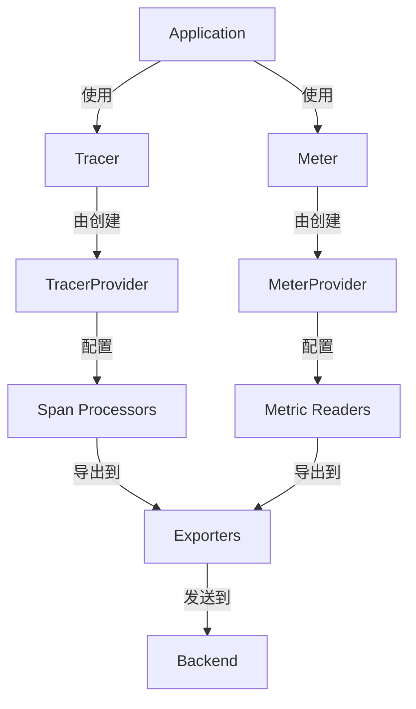

[[toc]]
***

:::note 参考资料
- [OpenTelemetry Go 官方文档](https://opentelemetry.io/docs/languages/go/)
- [OpenTelemetry Go Contrib](https://github.com/open-telemetry/opentelemetry-go-contrib)
- [Gin OTel Instrumentation](https://pkg.go.dev/go.opentelemetry.io/contrib/instrumentation/github.com/gin-gonic/gin/otelgin)
- [Echo OTel Instrumentation](https://pkg.go.dev/go.opentelemetry.io/contrib/instrumentation/github.com/labstack/echo/otelecho)
:::

## 一、OpenTelemetry 核心组件概述

### 1.1 核心组件架构

OpenTelemetry 在 Go 中的核心组件可以分为以下几个层次：

```
应用层 (Application Layer)
    ↓
API 层 (API Layer) - 定义接口
    ↓
SDK 层 (SDK Layer) - 提供实现
    ↓
Exporters 层 (Exporters Layer) - 数据导出
```

:::info 核心组件说明

**TracerProvider**：负责创建 Tracer 实例，管理 Span 的生命周期
**MeterProvider**：负责创建 Meter 实例，管理 Metric 的采集和导出
**Tracer**：用于创建 Span，记录追踪信息
**Meter**：用于创建各种类型的 Instrument（Counter、Gauge、Histogram 等）

:::

### 1.2 组件关系图



## 二、TracerProvider 和 MeterProvider 的管理

### 2.1 初始化模式

#### 2.1.1 标准初始化流程

在工业级应用中，推荐使用统一的初始化函数来管理 OpenTelemetry 组件：

```go
package telemetry

import (
    "context"
    "errors"
    "time"

    "go.opentelemetry.io/otel"
    "go.opentelemetry.io/otel/exporters/otlp/otlptrace"
    "go.opentelemetry.io/otel/exporters/otlp/otlptrace/otlptracegrpc"
    "go.opentelemetry.io/otel/exporters/otlp/otlpmetric/otlpmetricgrpc"
    "go.opentelemetry.io/otel/propagation"
    "go.opentelemetry.io/otel/sdk/metric"
    "go.opentelemetry.io/otel/sdk/resource"
    sdktrace "go.opentelemetry.io/otel/sdk/trace"
    semconv "go.opentelemetry.io/otel/semconv/v1.26.0"
)

type Config struct {
    ServiceName    string
    ServiceVersion string
    Environment    string
    OTLPEndpoint   string
    SampleRate     float64
}

func InitOTelSDK(ctx context.Context, cfg Config) (func(context.Context) error, error) {
    var shutdownFuncs []func(context.Context) error
    
    shutdown := func(ctx context.Context) error {
        var err error
        for _, fn := range shutdownFuncs {
            err = errors.Join(err, fn(ctx))
        }
        shutdownFuncs = nil
        return err
    }
    
    handleErr := func(inErr error) {
        shutdownFuncs = append(shutdownFuncs, func(ctx context.Context) error {
            return inErr
        })
    }
    
    res, err := resource.New(ctx,
        resource.WithAttributes(
            semconv.ServiceName(cfg.ServiceName),
            semconv.ServiceVersion(cfg.ServiceVersion),
            semconv.DeploymentEnvironment(cfg.Environment),
        ),
    )
    if err != nil {
        return shutdown, err
    }
    
    tracerProvider, err := initTracerProvider(ctx, res, cfg)
    if err != nil {
        handleErr(err)
        return shutdown, err
    }
    shutdownFuncs = append(shutdownFuncs, tracerProvider.Shutdown)
    
    meterProvider, err := initMeterProvider(ctx, res, cfg)
    if err != nil {
        handleErr(err)
        return shutdown, err
    }
    shutdownFuncs = append(shutdownFuncs, meterProvider.Shutdown)
    
    prop := propagation.NewCompositeTextMapPropagator(
        propagation.TraceContext{},
        propagation.Baggage{},
    )
    otel.SetTextMapPropagator(prop)
    
    return shutdown, nil
}

func initTracerProvider(ctx context.Context, res *resource.Resource, cfg Config) (*sdktrace.TracerProvider, error) {
    traceExporter, err := otlptrace.New(ctx,
        otlptracegrpc.NewClient(
            otlptracegrpc.WithEndpoint(cfg.OTLPEndpoint),
            otlptracegrpc.WithInsecure(),
        ),
    )
    if err != nil {
        return nil, err
    }
    
    tracerProvider := sdktrace.NewTracerProvider(
        sdktrace.WithBatcher(traceExporter),
        sdktrace.WithResource(res),
        sdktrace.WithSampler(sdktrace.TraceIDRatioBased(cfg.SampleRate)),
    )
    
    otel.SetTracerProvider(tracerProvider)
    return tracerProvider, nil
}

func initMeterProvider(ctx context.Context, res *resource.Resource, cfg Config) (*metric.MeterProvider, error) {
    metricExporter, err := otlpmetricgrpc.New(ctx,
        otlpmetricgrpc.WithEndpoint(cfg.OTLPEndpoint),
        otlpmetricgrpc.WithInsecure(),
    )
    if err != nil {
        return nil, err
    }
    
    meterProvider := metric.NewMeterProvider(
        metric.WithResource(res),
        metric.WithReader(metric.NewPeriodicReader(
            metricExporter,
            metric.WithInterval(5*time.Second),
        )),
    )
    
    otel.SetMeterProvider(meterProvider)
    return meterProvider, nil
}
```

:::tip 初始化最佳实践

1. **统一初始化**：使用一个函数完成所有组件的初始化
2. **资源管理**：返回 shutdown 函数，确保资源正确释放
3. **错误处理**：使用 handleErr 模式处理初始化错误
4. **配置集中**：使用 Config 结构体集中管理配置

:::

### 2.2 Provider 生命周期管理

#### 2.2.1 应用启动时初始化

```go
package main

import (
    "context"
    "log"
    "os"
    "os/signal"
    "syscall"
    
    "yourproject/telemetry"
)

func main() {
    ctx := context.Background()
    
    cfg := telemetry.Config{
        ServiceName:    "my-service",
        ServiceVersion: "1.0.0",
        Environment:    "production",
        OTLPEndpoint:   "localhost:4317",
        SampleRate:     0.1,
    }
    
    shutdown, err := telemetry.InitOTelSDK(ctx, cfg)
    if err != nil {
        log.Fatalf("Failed to initialize OpenTelemetry: %v", err)
    }
    defer func() {
        if err := shutdown(context.Background()); err != nil {
            log.Printf("Failed to shutdown OpenTelemetry: %v", err)
        }
    }()
    
    app := NewApplication()
    app.Run()
}
```

#### 2.2.2 优雅关闭

```go
func (a *Application) Shutdown() error {
    ctx, cancel := context.WithTimeout(context.Background(), 30*time.Second)
    defer cancel()
    
    var wg sync.WaitGroup
    errChan := make(chan error, 1)
    
    wg.Add(1)
    go func() {
        defer wg.Done()
        if err := a.shutdownOTel(ctx); err != nil {
            select {
            case errChan <- err:
            default:
            }
        }
    }()
    
    wg.Wait()
    
    select {
    case err := <-errChan:
        return err
    default:
        return nil
    }
}

func (a *Application) shutdownOTel(ctx context.Context) error {
    if a.otelShutdown != nil {
        return a.otelShutdown(ctx)
    }
    return nil
}
```

### 2.3 Tracer 和 Meter 的获取方式

#### 2.3.1 全局获取方式

```go
var tracer = otel.Tracer("my-service")
var meter = otel.Meter("my-service")

func handleRequest(ctx context.Context) error {
    ctx, span := tracer.Start(ctx, "handleRequest")
    defer span.End()
    
    counter := meter.Int64Counter("requests.total")
    counter.Add(ctx, 1)
    
    return nil
}
```

#### 2.3.2 依赖注入方式

```go
type Service struct {
    tracer trace.Tracer
    meter  metric.Meter
}

func NewService(tp trace.TracerProvider, mp metric.MeterProvider) *Service {
    return &Service{
        tracer: tp.Tracer("service"),
        meter:  mp.Meter("service"),
    }
}

func (s *Service) Handle(ctx context.Context) error {
    ctx, span := s.tracer.Start(ctx, "Handle")
    defer span.End()
    
    counter := s.meter.Int64Counter("operations")
    counter.Add(ctx, 1)
    
    return nil
}
```

:::warning 获取方式选择

**全局获取**：适合简单应用，代码简洁
**依赖注入**：适合复杂应用，便于测试和模块化

:::

## 三、主流 Go 框架的 OTel 集成

### 3.1 Gin 框架集成

#### 3.1.1 基础集成

```go
import (
    "github.com/gin-gonic/gin"
    "go.opentelemetry.io/contrib/instrumentation/github.com/gin-gonic/gin/otelgin"
)

func setupGin() *gin.Engine {
    r := gin.Default()
    
    r.Use(otelgin.Middleware("my-service"))
    
    r.GET("/users", getUsers)
    return r
}

func getUsers(c *gin.Context) {
    tracer := otel.Tracer("user-service")
    ctx, span := tracer.Start(c.Request.Context(), "getUsers")
    defer span.End()
    
    span.SetAttributes(
        attribute.String("user.id", "123"),
        attribute.String("user.name", "John"),
    )
    
    c.JSON(200, gin.H{"message": "success"})
}
```

#### 3.1.2 高级配置

```go
func setupGinWithConfig() *gin.Engine {
    r := gin.Default()
    
    opts := []otelgin.Option{
        otelgin.WithTracerProvider(otel.GetTracerProvider()),
        otelgin.WithMeterProvider(otel.GetMeterProvider()),
        otelgin.WithPropagators(otel.GetTextMapPropagator()),
        otelgin.WithSpanNameFormatter(func(operation string, r *http.Request) string {
            return fmt.Sprintf("%s %s", r.Method, r.URL.Path)
        }),
        otelgin.WithGinMetricAttributeFn(func(c *gin.Context) []attribute.KeyValue {
            return []attribute.KeyValue{
                attribute.String("gin.user_id", c.GetString("user_id")),
                attribute.String("gin.role", c.GetString("role")),
            }
        }),
        otelgin.WithFilter(func(r *http.Request) bool {
            return !strings.HasPrefix(r.URL.Path, "/health")
        }),
    }
    
    r.Use(otelgin.Middleware("my-service", opts...))
    
    return r
}
```

### 3.2 Echo 框架集成

#### 3.2.1 基础集成

```go
import (
    "github.com/labstack/echo/v4"
    "github.com/labstack/echo/v4/middleware"
    "go.opentelemetry.io/contrib/instrumentation/github.com/labstack/echo/otelecho"
)

func setupEcho() *echo.Echo {
    e := echo.New()
    
    e.Use(otelecho.Middleware("my-service"))
    
    e.GET("/users", getUsers)
    return e
}

func getUsers(c echo.Context) error {
    tracer := otel.Tracer("user-service")
    ctx, span := tracer.Start(c.Request().Context(), "getUsers")
    defer span.End()
    
    span.SetAttributes(
        attribute.String("user.id", "123"),
        attribute.String("user.name", "John"),
    )
    
    return c.JSON(200, map[string]string{"message": "success"})
}
```

#### 3.2.2 高级配置

```go
func setupEchoWithConfig() *echo.Echo {
    e := echo.New()
    
    opts := []otelecho.Option{
        otelecho.WithTracerProvider(otel.GetTracerProvider()),
        otelecho.WithMeterProvider(otel.GetMeterProvider()),
        otelecho.WithPropagators(otel.GetTextMapPropagator()),
        otelecho.WithEchoMetricAttributeFn(func(c echo.Context) []attribute.KeyValue {
            return []attribute.KeyValue{
                attribute.String("echo.user_id", c.Get("user_id").(string)),
                attribute.String("echo.role", c.Get("role").(string)),
            }
        }),
        otelecho.WithSkipper(func(c echo.Context) bool {
            return c.Request().URL.Path == "/health"
        }),
        otelecho.WithOnError(func(err error, c echo.Context) {
            span := trace.SpanFromContext(c.Request().Context())
            span.RecordError(err)
            span.SetStatus(codes.Error, err.Error())
        }),
    }
    
    e.Use(otelecho.Middleware("my-service", opts...))
    
    return e
}
```

### 3.3 gRPC 框架集成

#### 3.3.1 服务端集成

```go
import (
    "google.golang.org/grpc"
    "google.golang.org/grpc/stats/opentelemetry"
)

func setupGRPCServer() *grpc.Server {
    opts := []grpc.ServerOption{
        grpc.StatsHandler(otelgrpc.NewServerHandler()),
    }
    
    s := grpc.NewServer(opts...)
    
    pb.RegisterUserServiceServer(s, &userService{})
    
    return s
}

type userService struct {
    pb.UnimplementedUserServiceServer
}

func (s *userService) GetUser(ctx context.Context, req *pb.GetUserRequest) (*pb.GetUserResponse, error) {
    tracer := otel.Tracer("user-service")
    ctx, span := tracer.Start(ctx, "GetUser")
    defer span.End()
    
    span.SetAttributes(
        attribute.String("user.id", req.UserId),
        attribute.String("operation", "get_user"),
    )
    
    return &pb.GetUserResponse{User: &pb.User{Id: req.UserId, Name: "John"}}, nil
}
```

#### 3.3.2 客户端集成

```go
func setupGRPCClient(conn *grpc.ClientConn) pb.UserServiceClient {
    opts := []grpc.DialOption{
        grpc.WithStatsHandler(otelgrpc.NewClientHandler()),
    }
    
    conn, err := grpc.Dial("localhost:50051", opts...)
    if err != nil {
        log.Fatalf("Failed to connect: %v", err)
    }
    
    return pb.NewUserServiceClient(conn)
}

func callUserService(ctx context.Context, client pb.UserServiceClient) error {
    tracer := otel.Tracer("user-service")
    ctx, span := tracer.Start(ctx, "callGetUser")
    defer span.End()
    
    resp, err := client.GetUser(ctx, &pb.GetUserRequest{UserId: "123"})
    if err != nil {
        span.RecordError(err)
        span.SetStatus(codes.Error, err.Error())
        return err
    }
    
    span.SetAttributes(
        attribute.String("response.user_id", resp.User.Id),
        attribute.String("response.user_name", resp.User.Name),
    )
    
    return nil
}
```

#### 3.3.3 高级配置

```go
func setupGRPCServerWithConfig() *grpc.Server {
    opts := []opentelemetry.Option{
        opentelemetry.WithTracerProvider(otel.GetTracerProvider()),
        opentelemetry.WithMeterProvider(otel.GetMeterProvider()),
        opentelemetry.WithPropagators(otel.GetTextMapPropagator()),
        opentelemetry.WithMethodFilter(func(method string) bool {
            return !strings.Contains(method, "Health")
        }),
    }
    
    grpcOpts := []grpc.ServerOption{
        grpc.StatsHandler(opentelemetry.NewServerHandler(opts...)),
    }
    
    s := grpc.NewServer(grpcOpts...)
    
    return s
}
```

### 3.4 标准库 net/http 集成

```go
import (
    "net/http"
    "go.opentelemetry.io/contrib/instrumentation/net/http/otelhttp"
)

func setupHTTPServer() *http.ServeMux {
    mux := http.NewServeMux()
    
    handler := http.HandlerFunc(func(w http.ResponseWriter, r *http.Request) {
        tracer := otel.Tracer("my-service")
        ctx, span := tracer.Start(r.Context(), "handleRequest")
        defer span.End()
        
        span.SetAttributes(
            attribute.String("http.method", r.Method),
            attribute.String("http.path", r.URL.Path),
        )
        
        w.Write([]byte("Hello, World!"))
    })
    
    instrumentedHandler := otelhttp.NewHandler(handler, "my-handler")
    mux.Handle("/", instrumentedHandler)
    
    return mux
}
```

## 四、统一管理模式与最佳实践

### 4.1 统一管理器设计

#### 4.1.1 管理器接口定义

```go
package telemetry

import (
    "context"
    "go.opentelemetry.io/otel/metric"
    "go.opentelemetry.io/otel/trace"
)

type Manager interface {
    Tracer(name string, opts ...trace.TracerOption) trace.Tracer
    Meter(name string, opts ...metric.MeterOption) metric.Meter
    Shutdown(ctx context.Context) error
}

type defaultManager struct {
    tracerProvider trace.TracerProvider
    meterProvider  metric.MeterProvider
    shutdown        func(context.Context) error
}

func NewManager(ctx context.Context, cfg Config) (Manager, error) {
    shutdown, err := InitOTelSDK(ctx, cfg)
    if err != nil {
        return nil, err
    }
    
    return &defaultManager{
        tracerProvider: otel.GetTracerProvider(),
        meterProvider:  otel.GetMeterProvider(),
        shutdown:        shutdown,
    }, nil
}

func (m *defaultManager) Tracer(name string, opts ...trace.TracerOption) trace.Tracer {
    return m.tracerProvider.Tracer(name, opts...)
}

func (m *defaultManager) Meter(name string, opts ...metric.MeterOption) metric.Meter {
    return m.meterProvider.Meter(name, opts...)
}

func (m *defaultManager) Shutdown(ctx context.Context) error {
    return m.shutdown(ctx)
}
```

#### 4.1.2 使用管理器

```go
package main

import (
    "yourproject/telemetry"
)

var telemetryManager telemetry.Manager

func main() {
    ctx := context.Background()
    
    cfg := telemetry.Config{
        ServiceName:    "my-service",
        ServiceVersion: "1.0.0",
        Environment:    "production",
        OTLPEndpoint:   "localhost:4317",
        SampleRate:     0.1,
    }
    
    var err error
    telemetryManager, err = telemetry.NewManager(ctx, cfg)
    if err != nil {
        log.Fatalf("Failed to initialize telemetry: %v", err)
    }
    defer telemetryManager.Shutdown(context.Background())
    
    app := NewApplication(telemetryManager)
    app.Run()
}

type Application struct {
    telemetry telemetry.Manager
}

func NewApplication(tm telemetry.Manager) *Application {
    return &Application{telemetry: tm}
}

func (a *Application) Run() {
    tracer := a.telemetry.Tracer("app")
    meter := a.telemetry.Meter("app")
    
    ctx := context.Background()
    ctx, span := tracer.Start(ctx, "Run")
    defer span.End()
    
    counter := meter.Int64Counter("app.runs")
    counter.Add(ctx, 1)
}
```

### 4.2 配置管理最佳实践

#### 4.2.1 环境变量配置

```go
type Config struct {
    ServiceName    string
    ServiceVersion string
    Environment    string
    OTLPEndpoint   string
    SampleRate     float64
}

func LoadConfigFromEnv() Config {
    return Config{
        ServiceName:    getEnv("OTEL_SERVICE_NAME", "unknown-service"),
        ServiceVersion: getEnv("OTEL_SERVICE_VERSION", "1.0.0"),
        Environment:    getEnv("OTEL_ENVIRONMENT", "production"),
        OTLPEndpoint:   getEnv("OTEL_EXPORTER_OTLP_ENDPOINT", "localhost:4317"),
        SampleRate:     getEnvAsFloat("OTEL_TRACES_SAMPLER", 0.1),
    }
}

func getEnv(key, defaultValue string) string {
    if value := os.Getenv(key); value != "" {
        return value
    }
    return defaultValue
}

func getEnvAsFloat(key string, defaultValue float64) float64 {
    if value := os.Getenv(key); value != "" {
        if f, err := strconv.ParseFloat(value, 64); err == nil {
            return f
        }
    }
    return defaultValue
}
```

#### 4.2.2 配置文件支持

```go
type ConfigFile struct {
    Telemetry struct {
        ServiceName    string  `yaml:"service_name"`
        ServiceVersion string  `yaml:"service_version"`
        Environment    string  `yaml:"environment"`
        OTLPEndpoint   string  `yaml:"otlp_endpoint"`
        SampleRate     float64 `yaml:"sample_rate"`
    } `yaml:"telemetry"`
}

func LoadConfigFromFile(path string) (Config, error) {
    data, err := os.ReadFile(path)
    if err != nil {
        return Config{}, err
    }
    
    var cfg ConfigFile
    if err := yaml.Unmarshal(data, &cfg); err != nil {
        return Config{}, err
    }
    
    return Config{
        ServiceName:    cfg.Telemetry.ServiceName,
        ServiceVersion: cfg.Telemetry.ServiceVersion,
        Environment:    cfg.Telemetry.Environment,
        OTLPEndpoint:   cfg.Telemetry.OTLPEndpoint,
        SampleRate:     cfg.Telemetry.SampleRate,
    }, nil
}
```

### 4.3 性能优化策略

#### 4.3.1 批量处理配置

```go
func initTracerProvider(ctx context.Context, res *resource.Resource, cfg Config) (*sdktrace.TracerProvider, error) {
    traceExporter, err := otlptrace.New(ctx,
        otlptracegrpc.NewClient(
            otlptracegrpc.WithEndpoint(cfg.OTLPEndpoint),
            otlptracegrpc.WithInsecure(),
            otlptracegrpc.WithMaxAttempts(3),
            otlptracegrpc.WithBackoff(func() sdktrace.BackoffConfig {
                return sdktrace.BackoffConfig{
                    InitialInterval: 5 * time.Second,
                    MaxInterval:     30 * time.Second,
                    MaxElapsedTime:  5 * time.Minute,
                }
            }),
        ),
    )
    if err != nil {
        return nil, err
    }
    
    batcher := sdktrace.NewBatchSpanProcessor(
        traceExporter,
        sdktrace.WithBatchTimeout(5*time.Second),
        sdktrace.WithMaxQueueSize(2048),
        sdktrace.WithMaxExportBatchSize(512),
    )
    
    tracerProvider := sdktrace.NewTracerProvider(
        sdktrace.WithSpanProcessor(batcher),
        sdktrace.WithResource(res),
        sdktrace.WithSampler(sdktrace.TraceIDRatioBased(cfg.SampleRate)),
    )
    
    return tracerProvider, nil
}
```

#### 4.3.2 指标采集优化

```go
func initMeterProvider(ctx context.Context, res *resource.Resource, cfg Config) (*metric.MeterProvider, error) {
    metricExporter, err := otlpmetricgrpc.New(ctx,
        otlpmetricgrpc.WithEndpoint(cfg.OTLPEndpoint),
        otlpmetricgrpc.WithInsecure(),
        otlpmetricgrpc.WithTemporalitySelector(func(metric.InstrumentKind) metric.Temporality {
            return metric.CumulativeTemporality
        }),
    )
    if err != nil {
        return nil, err
    }
    
    reader := metric.NewPeriodicReader(
        metricExporter,
        metric.WithInterval(10*time.Second),
        metric.WithTimeout(5*time.Second),
    )
    
    meterProvider := metric.NewMeterProvider(
        metric.WithResource(res),
        metric.WithReader(reader),
    )
    
    return meterProvider, nil
}
```

:::tip 性能优化建议

1. **批量处理**：使用 BatchSpanProcessor 减少网络开销
2. **合理采样**：根据流量调整采样率，避免数据过载
3. **异步导出**：使用 PeriodicReader 异步导出指标
4. **队列管理**：合理配置队列大小，避免内存溢出

:::

## 五、生产环境配置建议

### 5.1 多环境配置

#### 5.1.1 环境区分

```go
type Environment string

const (
    Development Environment = "development"
    Staging     Environment = "staging"
    Production  Environment = "production"
)

func GetConfigForEnvironment(env Environment) Config {
    switch env {
    case Development:
        return Config{
            ServiceName:    "my-service-dev",
            ServiceVersion: "1.0.0",
            Environment:    string(Development),
            OTLPEndpoint:   "localhost:4317",
            SampleRate:     1.0,
        }
    case Staging:
        return Config{
            ServiceName:    "my-service-staging",
            ServiceVersion: "1.0.0",
            Environment:    string(Staging),
            OTLPEndpoint:   "staging-collector:4317",
            SampleRate:     0.5,
        }
    case Production:
        return Config{
            ServiceName:    "my-service",
            ServiceVersion: "1.0.0",
            Environment:    string(Production),
            OTLPEndpoint:   "prod-collector:4317",
            SampleRate:     0.1,
        }
    default:
        return Config{}
    }
}
```

#### 5.1.2 动态配置

```go
type DynamicConfig struct {
    mu            sync.RWMutex
    currentConfig Config
    watchers      []func(Config)
}

func NewDynamicConfig(initial Config) *DynamicConfig {
    return &DynamicConfig{
        currentConfig: initial,
        watchers:      make([]func(Config), 0),
    }
}

func (dc *DynamicConfig) Update(newConfig Config) {
    dc.mu.Lock()
    defer dc.mu.Unlock()
    
    dc.currentConfig = newConfig
    
    for _, watcher := range dc.watchers {
        go watcher(newConfig)
    }
}

func (dc *DynamicConfig) Get() Config {
    dc.mu.RLock()
    defer dc.mu.RUnlock()
    return dc.currentConfig
}

func (dc *DynamicConfig) Watch(watcher func(Config)) {
    dc.mu.Lock()
    defer dc.mu.Unlock()
    dc.watchers = append(dc.watchers, watcher)
}
```

### 5.2 错误处理与重试

#### 5.2.1 导出器错误处理

```go
func initTracerProvider(ctx context.Context, res *resource.Resource, cfg Config) (*sdktrace.TracerProvider, error) {
    traceExporter, err := otlptrace.New(ctx,
        otlptracegrpc.NewClient(
            otlptracegrpc.WithEndpoint(cfg.OTLPEndpoint),
            otlptracegrpc.WithInsecure(),
            otlptracegrpc.WithMaxAttempts(5),
            otlptracegrpc.WithBackoff(func() sdktrace.BackoffConfig {
                return sdktrace.BackoffConfig{
                    InitialInterval: 1 * time.Second,
                    MaxInterval:     30 * time.Second,
                    MaxElapsedTime:   5 * time.Minute,
                }
            }),
        ),
    )
    if err != nil {
        return nil, fmt.Errorf("failed to create trace exporter: %w", err)
    }
    
    errorHandler := func(err error) {
        log.Printf("Trace export error: %v", err)
    }
    
    batcher := sdktrace.NewBatchSpanProcessor(
        traceExporter,
        sdktrace.WithExportErrorHandler(errorHandler),
    )
    
    tracerProvider := sdktrace.NewTracerProvider(
        sdktrace.WithSpanProcessor(batcher),
        sdktrace.WithResource(res),
        sdktrace.WithSampler(sdktrace.TraceIDRatioBased(cfg.SampleRate)),
    )
    
    return tracerProvider, nil
}
```

#### 5.2.2 健康检查集成

```go
type HealthChecker struct {
    tracerProvider *sdktrace.TracerProvider
    meterProvider  *metric.MeterProvider
}

func NewHealthChecker(tp *sdktrace.TracerProvider, mp *metric.MeterProvider) *HealthChecker {
    return &HealthChecker{
        tracerProvider: tp,
        meterProvider:  mp,
    }
}

func (hc *HealthChecker) Check(ctx context.Context) error {
    if hc.tracerProvider == nil || hc.meterProvider == nil {
        return errors.New("telemetry providers not initialized")
    }
    
    tracer := hc.tracerProvider.Tracer("health-check")
    _, span := tracer.Start(ctx, "health-check")
    defer span.End()
    
    meter := hc.meterProvider.Meter("health-check")
    counter := meter.Int64Counter("health.checks")
    counter.Add(ctx, 1)
    
    return nil
}
```

### 5.3 监控与告警

#### 5.3.1 内部监控指标

```go
type TelemetryMonitor struct {
    exportErrors     metric.Int64Counter
    exportSuccesses  metric.Int64Counter
    spanDropped      metric.Int64Counter
    metricDropped    metric.Int64Counter
}

func NewTelemetryMonitor(meter metric.Meter) (*TelemetryMonitor, error) {
    exportErrors, err := meter.Int64Counter(
        "otel.export.errors",
        metric.WithDescription("Number of export errors"),
    )
    if err != nil {
        return nil, err
    }
    
    exportSuccesses, err := meter.Int64Counter(
        "otel.export.successes",
        metric.WithDescription("Number of successful exports"),
    )
    if err != nil {
        return nil, err
    }
    
    spanDropped, err := meter.Int64Counter(
        "otel.span.dropped",
        metric.WithDescription("Number of dropped spans"),
    )
    if err != nil {
        return nil, err
    }
    
    metricDropped, err := meter.Int64Counter(
        "otel.metric.dropped",
        metric.WithDescription("Number of dropped metrics"),
    )
    if err != nil {
        return nil, err
    }
    
    return &TelemetryMonitor{
        exportErrors:     exportErrors,
        exportSuccesses:  exportSuccesses,
        spanDropped:      spanDropped,
        metricDropped:    metricDropped,
    }, nil
}

func (tm *TelemetryMonitor) RecordExportError(ctx context.Context) {
    tm.exportErrors.Add(ctx, 1)
}

func (tm *TelemetryMonitor) RecordExportSuccess(ctx context.Context) {
    tm.exportSuccesses.Add(ctx, 1)
}
```

#### 5.3.2 告警规则

```yaml
groups:
  - name: opentelemetry_alerts
    rules:
      - alert: HighExportErrorRate
        expr: rate(otel_export_errors_total[5m]) > 0.1
        for: 5m
        labels:
          severity: warning
        annotations:
          summary: "High OpenTelemetry export error rate"
          description: "Export error rate is {{ $value }} errors/sec"
      
      - alert: SpanDropping
        expr: rate(otel_span_dropped_total[5m]) > 0
        for: 5m
        labels:
          severity: critical
        annotations:
          summary: "Spans are being dropped"
          description: "Span drop rate is {{ $value }} spans/sec"
```

## 六、常见问题与解决方案

### 6.1 初始化问题

#### 问题 1：Provider 未正确设置

```go
func (m *defaultManager) Tracer(name string, opts ...trace.TracerOption) trace.Tracer {
    if m.tracerProvider == nil {
        log.Printf("Warning: TracerProvider is nil, using global provider")
        return otel.Tracer(name, opts...)
    }
    return m.tracerProvider.Tracer(name, opts...)
}
```

#### 问题 2：Shutdown 未调用

```go
func (a *Application) Run() error {
    ctx, cancel := context.WithCancel(context.Background())
    defer cancel()
    
    sigChan := make(chan os.Signal, 1)
    signal.Notify(sigChan, syscall.SIGINT, syscall.SIGTERM)
    
    errChan := make(chan error, 1)
    go func() {
        errChan <- a.startServer(ctx)
    }()
    
    select {
    case err := <-errChan:
        return err
    case sig := <-sigChan:
        log.Printf("Received signal: %v", sig)
        cancel()
        
        shutdownCtx, shutdownCancel := context.WithTimeout(context.Background(), 30*time.Second)
        defer shutdownCancel()
        
        if err := a.telemetry.Shutdown(shutdownCtx); err != nil {
            log.Printf("Failed to shutdown telemetry: %v", err)
        }
        
        return nil
    }
}
```

### 6.2 性能问题

#### 问题 1：高延迟影响业务

```go
func initTracerProvider(ctx context.Context, res *resource.Resource, cfg Config) (*sdktrace.TracerProvider, error) {
    traceExporter, err := otlptrace.New(ctx,
        otlptracegrpc.NewClient(
            otlptracegrpc.WithEndpoint(cfg.OTLPEndpoint),
            otlptracegrpc.WithInsecure(),
            otlptracegrpc.WithTimeout(2*time.Second),
        ),
    )
    if err != nil {
        return nil, err
    }
    
    batcher := sdktrace.NewBatchSpanProcessor(
        traceExporter,
        sdktrace.WithBatchTimeout(10*time.Second),
        sdktrace.WithMaxQueueSize(4096),
        sdktrace.WithMaxExportBatchSize(1024),
    )
    
    tracerProvider := sdktrace.NewTracerProvider(
        sdktrace.WithSpanProcessor(batcher),
        sdktrace.WithResource(res),
        sdktrace.WithSampler(sdktrace.TraceIDRatioBased(cfg.SampleRate)),
    )
    
    return tracerProvider, nil
}
```

#### 问题 2：内存占用过高

```go
func initMeterProvider(ctx context.Context, res *resource.Resource, cfg Config) (*metric.MeterProvider, error) {
    metricExporter, err := otlpmetricgrpc.New(ctx,
        otlpmetricgrpc.WithEndpoint(cfg.OTLPEndpoint),
        otlpmetricgrpc.WithInsecure(),
    )
    if err != nil {
        return nil, err
    }
    
    reader := metric.NewPeriodicReader(
        metricExporter,
        metric.WithInterval(30*time.Second),
        metric.WithTimeout(10*time.Second),
    )
    
    meterProvider := metric.NewMeterProvider(
        metric.WithResource(res),
        metric.WithReader(reader),
        metric.WithView(
            view.New(
                view.MatchInstrumentName("*"),
                view.WithAttributeKeys([]attribute.Key{}),
            ),
        ),
    )
    
    return meterProvider, nil
}
```

### 6.3 集成问题

#### 问题 1：Context 传播中断

```go
func (s *Service) HandleRequest(ctx context.Context) error {
    ctx, span := s.tracer.Start(ctx, "HandleRequest")
    defer span.End()
    
    childCtx := context.WithValue(ctx, "user_id", "123")
    
    if err := s.callExternalService(childCtx); err != nil {
        span.RecordError(err)
        return err
    }
    
    return nil
}

func (s *Service) callExternalService(ctx context.Context) error {
    ctx, span := s.tracer.Start(ctx, "callExternalService")
    defer span.End()
    
    return nil
}
```

#### 问题 2：Metric 属性过多

```go
func (s *Service) RecordMetric(ctx context.Context, userID, action string, duration time.Duration) {
    histogram := s.meter.Int64Histogram("operation.duration")
    
    attrs := []attribute.KeyValue{
        attribute.String("action", action),
    }
    
    if userID != "" {
        attrs = append(attrs, attribute.String("user.id", userID))
    }
    
    histogram.Record(ctx, duration.Milliseconds(), metric.WithAttributes(attrs...))
}
```

:::warning 常见陷阱

1. **忘记调用 Shutdown**：导致资源泄漏
2. **Context 传播错误**：导致链路中断
3. **Metric 属性过多**：导致基数爆炸
4. **采样率设置不当**：影响数据质量或性能

:::

## 七、总结与建议

### 7.1 核心要点

1. **统一初始化**：使用统一的初始化函数管理所有 OTel 组件
2. **依赖注入**：通过依赖注入方式使用 Tracer 和 Meter
3. **资源管理**：确保正确调用 Shutdown 释放资源
4. **性能优化**：合理配置批量处理和采样策略
5. **错误处理**：完善错误处理和重试机制
6. **监控告警**：建立内部监控和告警机制

### 7.2 最佳实践清单

- [x] 使用 Config 结构体集中管理配置
- [x] 返回 shutdown 函数确保资源释放
- [x] 使用依赖注入而非全局变量
- [x] 合理设置采样率平衡性能和数据质量
- [x] 配置批量处理减少网络开销
- [x] 实现健康检查监控组件状态
- [x] 建立内部监控指标
- [x] 配置告警规则及时发现异常
- [x] 多环境配置支持不同部署场景
- [x] 完善错误处理和重试机制

### 7.3 参考资源

- [OpenTelemetry Go 官方文档](https://opentelemetry.io/docs/languages/go/)
- [OpenTelemetry Go Contrib](https://github.com/open-telemetry/opentelemetry-go-contrib)
- [OpenTelemetry 规范](https://opentelemetry.io/docs/reference/specification/)
- [Go Tracing 最佳实践](https://opentelemetry.io/docs/instrumentation/go/manual/)

***

## 附录：完整示例代码

### A.1 完整的初始化示例

```go
package telemetry

import (
    "context"
    "errors"
    "fmt"
    "time"

    "go.opentelemetry.io/otel"
    "go.opentelemetry.io/otel/exporters/otlp/otlptrace"
    "go.opentelemetry.io/otel/exporters/otlp/otlptrace/otlptracegrpc"
    "go.opentelemetry.io/otel/exporters/otlp/otlpmetric/otlpmetricgrpc"
    "go.opentelemetry.io/otel/propagation"
    "go.opentelemetry.io/otel/sdk/metric"
    "go.opentelemetry.io/otel/sdk/resource"
    sdktrace "go.opentelemetry.io/otel/sdk/trace"
    semconv "go.opentelemetry.io/otel/semconv/v1.26.0"
)

type Config struct {
    ServiceName    string
    ServiceVersion string
    Environment    string
    OTLPEndpoint   string
    SampleRate     float64
    TraceTimeout   time.Duration
    MetricInterval time.Duration
}

func DefaultConfig() Config {
    return Config{
        ServiceName:    "unknown-service",
        ServiceVersion: "1.0.0",
        Environment:    "production",
        OTLPEndpoint:   "localhost:4317",
        SampleRate:     0.1,
        TraceTimeout:   5 * time.Second,
        MetricInterval: 10 * time.Second,
    }
}

func InitOTelSDK(ctx context.Context, cfg Config) (func(context.Context) error, error) {
    var shutdownFuncs []func(context.Context) error
    
    shutdown := func(ctx context.Context) error {
        var err error
        for _, fn := range shutdownFuncs {
            err = errors.Join(err, fn(ctx))
        }
        shutdownFuncs = nil
        return err
    }
    
    handleErr := func(inErr error) {
        shutdownFuncs = append(shutdownFuncs, func(ctx context.Context) error {
            return inErr
        })
    }
    
    res, err := resource.New(ctx,
        resource.WithAttributes(
            semconv.ServiceName(cfg.ServiceName),
            semconv.ServiceVersion(cfg.ServiceVersion),
            semconv.DeploymentEnvironment(cfg.Environment),
        ),
    )
    if err != nil {
        return shutdown, fmt.Errorf("failed to create resource: %w", err)
    }
    
    tracerProvider, err := initTracerProvider(ctx, res, cfg)
    if err != nil {
        handleErr(err)
        return shutdown, fmt.Errorf("failed to initialize tracer provider: %w", err)
    }
    shutdownFuncs = append(shutdownFuncs, tracerProvider.Shutdown)
    
    meterProvider, err := initMeterProvider(ctx, res, cfg)
    if err != nil {
        handleErr(err)
        return shutdown, fmt.Errorf("failed to initialize meter provider: %w", err)
    }
    shutdownFuncs = append(shutdownFuncs, meterProvider.Shutdown)
    
    prop := propagation.NewCompositeTextMapPropagator(
        propagation.TraceContext{},
        propagation.Baggage{},
    )
    otel.SetTextMapPropagator(prop)
    
    return shutdown, nil
}

func initTracerProvider(ctx context.Context, res *resource.Resource, cfg Config) (*sdktrace.TracerProvider, error) {
    traceExporter, err := otlptrace.New(ctx,
        otlptracegrpc.NewClient(
            otlptracegrpc.WithEndpoint(cfg.OTLPEndpoint),
            otlptracegrpc.WithInsecure(),
            otlptracegrpc.WithTimeout(cfg.TraceTimeout),
            otlptracegrpc.WithMaxAttempts(3),
            otlptracegrpc.WithBackoff(func() sdktrace.BackoffConfig {
                return sdktrace.BackoffConfig{
                    InitialInterval: 1 * time.Second,
                    MaxInterval:     30 * time.Second,
                    MaxElapsedTime:  5 * time.Minute,
                }
            }),
        ),
    )
    if err != nil {
        return nil, fmt.Errorf("failed to create trace exporter: %w", err)
    }
    
    batcher := sdktrace.NewBatchSpanProcessor(
        traceExporter,
        sdktrace.WithBatchTimeout(5*time.Second),
        sdktrace.WithMaxQueueSize(2048),
        sdktrace.WithMaxExportBatchSize(512),
        sdktrace.WithExportErrorHandler(func(err error) {
            fmt.Printf("Trace export error: %v\n", err)
        }),
    )
    
    tracerProvider := sdktrace.NewTracerProvider(
        sdktrace.WithSpanProcessor(batcher),
        sdktrace.WithResource(res),
        sdktrace.WithSampler(sdktrace.TraceIDRatioBased(cfg.SampleRate)),
    )
    
    otel.SetTracerProvider(tracerProvider)
    return tracerProvider, nil
}

func initMeterProvider(ctx context.Context, res *resource.Resource, cfg Config) (*metric.MeterProvider, error) {
    metricExporter, err := otlpmetricgrpc.New(ctx,
        otlpmetricgrpc.WithEndpoint(cfg.OTLPEndpoint),
        otlpmetricgrpc.WithInsecure(),
        otlpmetricgrpc.WithTimeout(cfg.TraceTimeout),
    )
    if err != nil {
        return nil, fmt.Errorf("failed to create metric exporter: %w", err)
    }
    
    reader := metric.NewPeriodicReader(
        metricExporter,
        metric.WithInterval(cfg.MetricInterval),
        metric.WithTimeout(5*time.Second),
    )
    
    meterProvider := metric.NewMeterProvider(
        metric.WithResource(res),
        metric.WithReader(reader),
    )
    
    otel.SetMeterProvider(meterProvider)
    return meterProvider, nil
}
```

### A.2 完整的应用示例

```go
package main

import (
    "context"
    "log"
    "net/http"
    "os"
    "os/signal"
    "sync"
    "syscall"
    "time"

    "github.com/gin-gonic/gin"
    "go.opentelemetry.io/otel"
    "go.opentelemetry.io/otel/attribute"
    "go.opentelemetry.io/otel/metric"

    "yourproject/telemetry"
)

type Application struct {
    telemetry telemetry.Manager
    server    *http.Server
}

func NewApplication(tm telemetry.Manager) *Application {
    return &Application{
        telemetry: tm,
    }
}

func (a *Application) Run() error {
    router := a.setupRouter()
    
    a.server = &http.Server{
        Addr:         ":8080",
        Handler:      router,
        ReadTimeout:  10 * time.Second,
        WriteTimeout: 10 * time.Second,
    }
    
    errChan := make(chan error, 1)
    go func() {
        log.Println("Starting server on :8080")
        errChan <- a.server.ListenAndServe()
    }()
    
    sigChan := make(chan os.Signal, 1)
    signal.Notify(sigChan, syscall.SIGINT, syscall.SIGTERM)
    
    select {
    case err := <-errChan:
        return err
    case sig := <-sigChan:
        log.Printf("Received signal: %v", sig)
        return a.Shutdown()
    }
}

func (a *Application) setupRouter() *gin.Engine {
    r := gin.Default()
    
    r.Use(a.telemetryMiddleware())
    
    r.GET("/users", a.getUsers)
    r.POST("/users", a.createUser)
    
    return r
}

func (a *Application) telemetryMiddleware() gin.HandlerFunc {
    tracer := a.telemetry.Tracer("app")
    meter := a.telemetry.Meter("app")
    
    requestCounter, err := meter.Int64Counter(
        "http.requests",
        metric.WithDescription("Number of HTTP requests"),
    )
    if err != nil {
        log.Printf("Failed to create request counter: %v", err)
    }
    
    return func(c *gin.Context) {
        ctx, span := tracer.Start(c.Request.Context(), "http.request")
        defer span.End()
        
        start := time.Now()
        
        c.Request = c.Request.WithContext(ctx)
        c.Next()
        
        duration := time.Since(start)
        
        span.SetAttributes(
            attribute.String("http.method", c.Request.Method),
            attribute.String("http.path", c.Request.URL.Path),
            attribute.Int("http.status", c.Writer.Status()),
            attribute.Int64("http.duration_ms", duration.Milliseconds()),
        )
        
        if requestCounter != nil {
            requestCounter.Add(ctx, 1, metric.WithAttributes(
                attribute.String("http.method", c.Request.Method),
                attribute.String("http.path", c.Request.URL.Path),
                attribute.Int("http.status", c.Writer.Status()),
            ))
        }
    }
}

func (a *Application) getUsers(c *gin.Context) {
    tracer := a.telemetry.Tracer("app")
    ctx, span := tracer.Start(c.Request.Context(), "getUsers")
    defer span.End()
    
    span.SetAttributes(
        attribute.String("operation", "get_users"),
    )
    
    c.JSON(200, gin.H{
        "users": []string{"Alice", "Bob", "Charlie"},
    })
}

func (a *Application) createUser(c *gin.Context) {
    tracer := a.telemetry.Tracer("app")
    ctx, span := tracer.Start(c.Request.Context(), "createUser")
    defer span.End()
    
    span.SetAttributes(
        attribute.String("operation", "create_user"),
    )
    
    var user struct {
        Name string `json:"name"`
    }
    
    if err := c.ShouldBindJSON(&user); err != nil {
        span.RecordError(err)
        c.JSON(400, gin.H{"error": err.Error()})
        return
    }
    
    c.JSON(201, gin.H{
        "id":   "123",
        "name": user.Name,
    })
}

func (a *Application) Shutdown() error {
    ctx, cancel := context.WithTimeout(context.Background(), 30*time.Second)
    defer cancel()
    
    var wg sync.WaitGroup
    errChan := make(chan error, 1)
    
    if a.server != nil {
        wg.Add(1)
        go func() {
            defer wg.Done()
            log.Println("Shutting down server...")
            if err := a.server.Shutdown(ctx); err != nil {
                errChan <- err
            }
        }()
    }
    
    wg.Add(1)
    go func() {
        defer wg.Done()
        log.Println("Shutting down telemetry...")
        if err := a.telemetry.Shutdown(ctx); err != nil {
            errChan <- err
        }
    }()
    
    wg.Wait()
    
    select {
    case err := <-errChan:
        return err
    default:
        return nil
    }
}

func main() {
    ctx := context.Background()
    
    cfg := telemetry.DefaultConfig()
    cfg.ServiceName = "my-service"
    cfg.ServiceVersion = "1.0.0"
    cfg.Environment = "production"
    cfg.OTLPEndpoint = "localhost:4317"
    cfg.SampleRate = 0.1
    
    tm, err := telemetry.NewManager(ctx, cfg)
    if err != nil {
        log.Fatalf("Failed to initialize telemetry: %v", err)
    }
    defer tm.Shutdown(context.Background())
    
    app := NewApplication(tm)
    if err := app.Run(); err != nil {
        log.Fatalf("Application error: %v", err)
    }
}
```

***

# 页面底部