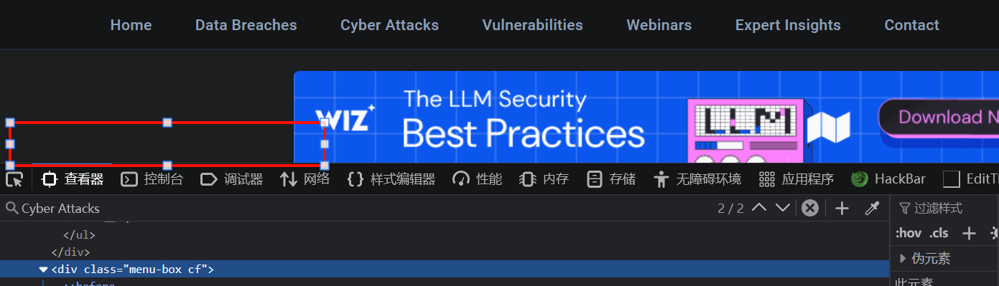
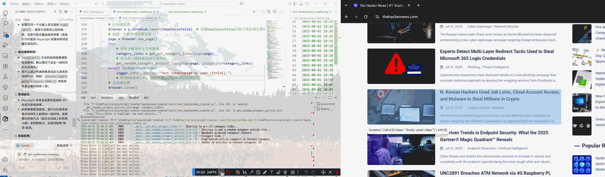

[[toc]]
## 参考资料
- [Medium - 为什么Python开发人员都在使用Playwright](https://python.plainenglish.io/why-every-serious-python-developer-is-quietly-switching-to-playwright-5932370409ae?source=home_for_you---------0-98--------------------445556fd_0398_44ac_a2f3_ff1840b852ba-------15-------)
- [Playwright文档 - LocatorsAPI文档](https://playwright.dev/python/docs/locators)
# 循序渐进
## 尝试爬取`HackerNews`网站
### 检查爬虫协议
HackerNews的爬虫协议如下：
```Plain
User-agent: *
Disallow:

Sitemap: https://thehackernews.com/sitemap.xml
Sitemap: https://thehackernews.com/sitemap-pages.xml
Sitemap: https://thehackernews.com/news-sitemap.xml
Sitemap: https://thehackernews.com/downloads/label-sitemap.php
Sitemap: https://thehackernews.com/expert-insights/sitemap.xml
Sitemap: https://thehackernews.com/videos/sitemap.xml
```
**规则解读**
1. **User-agent:**
    - **含义:** User-agent 指的是爬虫的身份标识。* 是一个通配符，意思是“这条规则适用于所有爬虫”。
    - **对爬虫的意义:** 这意味着无论 Playwright 脚本如何伪装自己（或者不伪装），接下来的规则都对脚本生效。
2. **Disallow:**
    - **含义:** Disallow 用来指定“禁止爬取”的目录或文件。
    - **对爬虫的意义:** 这是最关键的一条规则。因为 Disallow: 后面是 **空的**，这意味着该网站**没有明确禁止爬虫爬取任何页面的内容**。从 robots.txt 协议的角度来看，这是一个非常友好和宽松的设置。
3. **Sitemap: ... (多条)**
    - **含义:** Sitemap 指令为爬虫提供了网站的“站点地图”的链接。站点地图是一个 XML 文件，里面列出了网站上所有希望被搜索引擎收录的重要页面链接。
    - **对爬虫的意义:** 这对爬虫来说是一个巨大的福利！网站不仅不禁止我们爬取，还主动把“网站内容地图”交给了我们。咱甚至可以不用去一页一页点击“下一页”来发现所有文章，而是直接访问这些 sitemap 文件，从中批量获取所有新闻文章、标签页等的 URL 列表。这是一种更高效、更受网站欢迎的爬取方式。

但是站点地图毕竟只是服务于搜索引擎，帮助搜索引擎发现网站的热点文章的；站点地图通常会有一个大小限制（可能是`50MB`），这就限制了站点地图所能记录的URL数量——要真正爬取文章，最终还是要模拟用户操作来加载文章页面或是进行分页查询操作
### 熟悉网站脉络
#### 定位站点板块元素
对于HackerNews站点`https://thehackernews.com/`，通过控制台可以查找到不同板块对应的元素路径：`/html/body/nav/div[2]/ul`

整个导航栏的代码如下：
```html

<ul class="cf menu-ul">
<li class="show-menu"><a href="/" itemprop="url">Home</a></li>
<li class="eight_plus"><a href="/search/label/data%20breach">Data Breaches</a></li>
<li class="show-menu"><a href="/search/label/Cyber%20Attack">Cyber Attacks</a></li>
<li class="show-menu"><a href="/search/label/Vulnerability">Vulnerabilities</a></li>
<li class="eight_plus"><a href="/p/upcoming-hacker-news-webinars.html">Webinars</a></li>
<li class="show-menu"><a href="https://thehackernews.com/expert-insights/" rel="noopener" target="_blank">Expert Insights</a></li>
<li class="show-menu"><a href="/p/submit-news.html">Contact</a></li>
</ul>
<div class="button menu-more">
<a class="btn-open" href="javascript:void(0)"><i class="icon-font icon-menu"></i></a></div>
<div class="search-here"><i class="icon-font icon-search"></i></div>
```

各个板块的URL可以通过`li`横向列表的class名称来构造，也可以直接采集`li`元素内部的超链接的值来确定

板块的URL构造是有规律的：`https://thehackernews.com/search/label/{板块名称}`

接下来需要获取板块元素

注意到板块元素所在的`menu-box cf`类在页面中一共有四个，如果使用`get_by_role`的话可能会定位不准。Playwright提供了使用`XPath` 定位元素的方法，直接使用`page`实例的`locator`方法即可：
```Python
# 下面是官方示例
page.locator("css=button").click()
page.locator("xpath=//button").click()

page.locator("button").click()
page.locator("//button").click()
```
获取到`Locator`定位符（`/html/body/nav/div[2]/ul`）后，可以使用`expect`模块的`to_be_visible`检查该元素是否可见：
```Python
# 获取页面板块
def test_page_sections(page: Page):
    page.goto(url)
    # 板块横栏所在的XPath为 /html/body/nav/div[2]
    locator = page.locator("xpath=/html/body/nav/div[2]/ul")
    # 断言该板块可见
    expect(locator).to_be_visible()
    # 检查板块中是否有Cyber Attacks的文本
    expect(locator).to_contain_text("Cyber Attacks")
```
为了判断获得的Locator中是否就是我们需要的板块，可以使用`to_contain_text`进一步检查元素中的标志性文本
这里的无序列表`ul`内部是一个`li`列表，Playwright使用`Locator`实例的`click`方法来获取`li`列表中的元素，定位则使用`get_by_xxx`API

因为可以先对`ul`表格使用`all_inner_texts`获取站点横向导航栏的所有文本，所以接下来直接使用`get_by_text`方法获取每个导航按键的定位符，接着获取相对URL路径
示例代码如下：
```Python
def test_get_all_forums_attr(page: Page):
    logger.info("Starting to get all forums attributes...")
    page.goto(url)
    # 定位导航栏元素
    locator = page.locator(navigation_bar_xpath)
    # 获取所有板块的文本
    forums = locator.all_inner_texts()[0].strip().splitlines()
    # 遍历所有文本, 依次取出每一个li元素
    for forum in forums:
        # 打印每个板块的文本
        logger.info(f"Forum text: {forum}")
        # 获取每个板块的href属性
        forum_locator = locator.get_by_text(forum)
        href = forum_locator.get_attribute("href")
        logger.info(f"Forum href: {href}")
```
（上面通过loguru的日志控制器绕过了Pytest无法捕获输出的问题）

完整的上下文代码如下：
```Python
def get_all_category_links(page: Page):
    logger.info("Starting to get all category links...")
    page.goto(url)
    # 定位导航栏元素
    locator = page.locator(navigation_bar_xpath)
    # 获取li列表中的所有a元素
    # 这里的locator('a')会返回所有li元素下的a标签
    categorys = locator.locator('a')
    # 遍历所有文本, 依次取出每一个li元素
    text_with_link = {
        # 获取每个a元素的文本内容和href属性
        category_elem.text_content(): category_elem.get_attribute("href") 
        for category_elem in categorys.all()
        
    }
    return text_with_link

if __name__ == '__main__':
    # 启动playwright上下文管理器
    with sync_playwright() as p:
        # 启动浏览器
        browser = p.chromium.launch(headless=True)
        # 创建一个新的浏览器页面
        page = browser.new_page()
        # 获取分板块的文本和链接
        category_links = get_all_category_links(page)
        for category, link in category_links.items():
            print(f"Category: {category}, Link: {link}")
        # 关闭浏览器
        browser.close()
```
#### 定位各板块文章
以下是一篇文章的URL链接：
```plain
https://thehackernews.com/2025/02/threat-actors-exploit-clickfix-to.html
```
显然，文章URL格式是这样的：
```plain
https://thehackernews.com/年份/月份/文章标题(空格换成连字符).html
```


从文章标题所在的元素向上分析，注意到板块的`label-name`内嵌文本也是有格式的：
```
Category — {刚刚获得的category名称中的某个}
```
因此，这里也可以用`get_by_text`来定位`label-name`元素

注意到文章的结构信息会存储在名为`body-post clear`的视窗类中：
```html
<a class="story-link" href="https://thehackernews.com/2025/06/weekly-recap-airline-hacks-citrix-0-day.html">
<div class="clear home-post-box cf">
<div class="home-img clear">
<div class="img-ratio"></div>
<noscript></noscript>
</div>
<div class="clear home-right">
<h2 class="home-title">⚡ Weekly Recap: Airline Hacks, Citrix 0-Day, Outlook Malware, Banking Trojans and more</h2>
<div class="item-label">
<span class="h-datetime"><i class="icon-font icon-calendar"></i>Jun 30, 2025</span>
<span class="h-tags">Cybersecurity / Hacking News</span>
</div>
<div class="home-desc"> Ever wonder what happens when attackers don't break the rules—they just follow them better than we do? When systems work exactly as they're built to, but that "by design" behavior quietly opens the door to risk?  This week brings stories that make you stop and rethink what's truly under control. It's not always about a broken firewall or missed patch—it's about the small choices, default settings, and shortcuts that feel harmless until they're not.  The real surprise? Sometimes the threat doesn't come from outside—it's baked right into how things are set up. Dive in to see what's quietly shaping today's security challenges.  ⚡ Threat of the Week  FBI Warns of Scattered Spider's on Airlines  — The U.S. Federal Bureau of Investigation (FBI) has warned of a new set of attacks mounted by the notorious cybercrime group Scattered Spider targeting the airline sector using sophisticated social engineering techniques to obtain initial access. Cybersecurity vendors Palo Alto Networks Unit 4...</div>
</div>
</div>
</a>
```
上面是一个示例

爬取目标是`body-post clear`视窗类下的第一个元素`<a>`超链接属性和`clear home-right`二级标题类的文本；文章列表元素所对应的视窗类的CSS选择器为`div.body-post:nth-child({索引})` 
（索引从0开始）

实际测试时发现总是对不准文章列表，因此接下来使用`.highlight()`方法来高亮显示选择器所定位到的元素。`locator.highlight()` 会在匹配到的所有元素周围画上一个显眼的红色方框。
亦或是使用`.pause`方法来进入`playwright inspector`交互模式，输入CSS选择器测试元素定位，找到需要的元素后点击`Resume`按键重置设置并退出交互
测试时发现无论是CSS选择器还是浏览器自动给出的XPath，都无法准确定位到文章列表

……因此，还是需要自己了解XPath的构造：
##### XPath初探
:::tip
**XPath** 的全称是 **XML Path Language**（XML路径语言），它是一种专门用来在树状结构文档（如 XML 和 HTML）中查找和导航节点的强大语言。可以把它想象成给网页元素下达的“寻路指令”。
:::
以`//div[@id='navigation']`为例进行各部分分解：

| 部分            | 符号              | 含义                                                |
| :------------ | :-------------- | :------------------------------------------------ |
| **选择任意位置的节点** | `//`            | 这告诉 XPath 引擎：“从文档的任何位置开始搜索”，而不是必须从根节点开始。这是最常用的开头。 |
| **节点类型（标签名）** | `div`           | 这指定了你要查找的元素的标签名是 `<div>`。                         |
| **条件谓语（过滤器）** | `[...]`         | 方括号用来定义一个或多个筛选条件。它表示：“只选择满足方括号内条件的`div`”。         |
| **选择属性**      | `@`             | "at"符号 `@` 是一个特殊字符，表示你要选择的是一个**属性（attribute）**。   |
| **属性名**       | `id`            | 这指定了你要筛选的属性名称是 `id`。                              |
| **属性值**       | `='navigation'` | 这指定了 `id` 属性的值必须**等于**字符串 `'navigation'`。         |
（即**在整个HTML文档中，找到所有` <div> `元素，并从中筛选出那个 id 属性值恰好为 'navigation' 的元素**）
```html
<!DOCTYPE html>
<html lang="en">
<head>
    <title>My Website</title>
</head>
<body>

    <header>
        <h1>Welcome to My Page</h1>
        <!-- 
            这个 XPath 会在这里找到匹配项。
            它是一个 <div> 标签，并且它的 id 属性是 'navigation'。
        -->
        <div id="navigation">
            <ul>
                <li><a href="/home">Home</a></li>
                <li><a href="/about">About</a></li>
                <li><a href="/contact">Contact</a></li>
            </ul>
        </div>
    </header>

    <main>
        <h2>Main Content</h2>
        <p>This is the main content of the page.</p>
        <!-- 
            这个 div 不会被选中，因为它没有 id="navigation" 属性。
            这展示了 XPath 过滤器的作用。
        -->
        <div class="sidebar">
            <p>This is a sidebar.</p>
        </div>
    </main>

</body>
</html>
```
`//tag[@attribute='value'] `是 XPath 中最常用、最基础也是最有用的模式。
根据这个规律进行举一反三：
- **定位一个 class 为 login-button 的按钮：**
    - XPath: `//button[@class='login-button']`
    - HTML: <button class="login-button">Log In</button>
- **定位一个 name 为 username 的输入框：**
    - XPath: `//input[@name='username']`
    - HTML: <input type="text" name="username" placeholder="Enter username">
- **定位一个 data-testid 为 main-logo 的图片：**
    - XPath: `//img[@data-testid='main-logo']`
    - HTML: 

折腾了一番后，也算是定位到文章列表了

接下来使用`.nth`API依次获取文章列表中的一个元素，索引从`0`开始

现在回归主线，尝试获取文章超链接`story-link`、文章标题`home-title`、文章标签`item-label`和文章描述`home-desc`
这里就不从根节点往下寻找了，直接进入子`div`视窗内部提取
##### XPath寻路规则
就着这个机会，我们来深入了解一下**XPath的寻路规则**（下面把文案交给Gemini）：
**XPath的寻路规则**主要由四个核心部分组成：**路径、节点、谓语（筛选条件）和运算符**：
1. **核心路径规则 (怎么走？)**
2. **节点类型 (找什么？)**
	路径最终要找到的是“节点”。最常见的节点就是**元素节点**（如 div, p, a 等标签）。
3. **筛选器：谓语 (找哪一个？)**
	1. 按**索引**筛选
		**注意：XPath 的索引是从 `1` 开始的，不是从 `0` 开始！**
		（Playwright的nth索引倒是从0开始的）
		*   `[1]`：选取第一个。
		*   `[last()]`：选取最后一个。
		**示例：**
		`//div/a[1]` —— 查找所有 `div` 下的**第一个** `a` 标签。
		`//ul/li[last()]` —— 查找所有 `ul` 下的**最后一个** `li` 标签。
	2. 按**属性**筛选
		这是最常用的筛选方式，基本格式是 `[@属性名='属性值']`。
		*   `[@id='main']`：选择 `id` 属性为 `main` 的元素。
		*   `[@class='item']`：选择 `class` 属性为 `item` 的元素。
			**进阶技巧：模糊匹配 `contains()`**
			有时候 `class` 属性包含多个值（如 `class="btn btn-primary"`），用等于号 `=` 无法匹配。这时 `contains()` 就派上用场了。
			*   `[contains(@class, 'btn-primary')]`：选择 `class` 属性中**包含** `btn-primary` 这个文本的元素。
			**示例：**
			`//button[contains(@class, 'login-button')]` —— 查找 `class` 包含 `login-button` 的按钮。
	3. 按**文本内容**筛选
		这也是 XPath 的一个独门绝技，CSS 选择器很难做到。
		*   `[text()='登录']`：选择**文本内容完全等于**“登录”的元素。
		*   `[contains(text(), '登录')]`：选择**文本内容包含**“登录”的元素。
		**示例：**
		`//button[contains(text(), '提交')]` —— 查找所有文本里带有“提交”二字的按钮。
4. **组合与逻辑：运算符**
	你可以在一个谓语 `[]` 中使用逻辑运算符来组合多个条件。
	*   `and`：与（两个条件都必须满足）
	*   `or`：或（满足一个条件即可）
	**示例：**
		`//input[@type='submit' and @name='login']` —— 查找 `type` 属性是 `submit` **并且** `name` 属性是 `login` 的 `input` 元素。
:::tip
下面是 XPath 的路径构造基础，规定了如何在 HTML 的“树状结构”中移动。

| 符号 | 名称 | 规则解释 | 示例 |
| :--- | :--- | :--- | :--- |
| `//` | **全局搜索 (双斜杠)** | 从整个文档的任意位置开始，查找所有匹配的元素，无论它藏得多深。**这是最常用、最方便的开头方式。** | `//div` (查找页面上所有的 `<div>` 元素) |
| `/` | **直接子节点 (单斜杠)** | 只查找当前节点的**直接下一级**（亲儿子）的元素。通常用于描述从根节点开始的绝对路径。 | `/html/body/div` (查找 `<body>` 标签下第一层的 `<div>`) |
| `.` | **当前节点 (点)** | 代表当前节点本身。 | `./a` (查找当前节点下的 `<a>` 标签) |
| `..` | **父节点 (双点)** | 选择当前节点的**上一级**（父亲）节点。 | `//a/..` (先找到所有 `<a>` 标签，再选择它们的父元素) |
| `*` | **通配符 (星号)** | 匹配任意的元素节点。 | `//div/*` (查找所有 `<div>` 标签下的所有直接子元素) |
| `@` | **属性 (at符号)** | 用来选取元素的**属性**，必须跟在元素后面，写在筛选条件 `[]` 内部。 | `//a/@href` (选取所有 `<a>` 标签的 `href` 属性值) |
:::
:::tip
路径最终要找到的是“节点”。最常见的节点就是**元素节点**（如 `div`, `p`, `a` 等标签）。
:::
:::important
**筛选器/谓语**是 XPath 最强大的部分。当你通过路径找到了**一批**元素后，可以用中括号 `[]` 里的“谓语”来对它们进行精确筛选。
:::

假设我们有以下 HTML 代码，目标是找到“苹果”这个商品的“加入购物车”按钮。
```html
<div class="products">
    <div class="item">
        <h2>香蕉</h2>
        <p>价格：¥5</p>
        <button class="add-to-cart">加入购物车</button>
    </div>
    <div class="item" id="fruit-123">
        <h2>苹果</h2>
        <p>价格：¥8</p>
        <button class="add-to-cart primary">加入购物车</button>
    </div>
</div>
```
**我们的思路（路径规则）：**
1.  **第一步：** 先找到那个包含“苹果”文本的 `div`。
    *   XPath: `//div[contains(h2/text(), '苹果')]`
    *   **规则解读：** 全局搜索 `//div`，筛选条件是 `[]`：它的直接子节点 `h2` 的文本 `text()` 中，要包含 `contains()` “苹果”两个字。
2.  **第二步：** 在这个找到的 `div` 里面，再去找那个按钮。
    *   XPath: `//div[contains(h2/text(), '苹果')]//button`
    *   **规则解读：** 在上一步的基础上，继续在它的所有后代 `//` 中寻找 `button` 元素。

##### 最终代码整理

折腾了好一会后总算是做出来了，期间发现某些文章大抵是没有h-tags的原因，卡了很久

这个就没有`h-tags`

最后整合一下代码：
```Python
def get_single_page_category_article_list(page: Page, category_name: str, category_link: str, table: tablib.Dataset):
    """
    获取单个板块的文章列表
    :param page: Playwright页面对象
    :param category_link: 板块链接
    :param table: tablib数据集对象
    """
    logger.info(f"Getting article list for category link: {category_link}")
    # 导航到该板块链接 (相对路径)
    if category_link != '/':
        # 如果链接是相对路径, 则需要将其转换为绝对路径
        category_link = urllib.parse.urljoin(url, category_link)
        # 使用page.goto方法导航到该链接
        page.goto(category_link)
    # 尝试定位到文章视窗
    article_viewport = page.locator(r'//div[@class="body-post clear"]')
    
    # 因为playwright内部仍然是异步的, 所以下面要重写tqdm的使用方式
    with tqdm(total=article_viewport.count(), desc=f"Processing articles in {category_name}") as pbar:
        for link_idx in range(article_viewport.count()):
            # 获取每个文章的标题和链接
            # 依次高亮每个子元素
            curr_article = article_viewport.nth(link_idx)
            curr_article.highlight()
            logger.info(f"Highlighted article {link_idx + 1} in {category_name} category.")
            # 获取文章链接、标题、标签和描述(节选一部分打印出来)
            # 不从根节点开始寻找, 而是从article_viewport开始寻找
            # 使用//查找当前位置下的所有节点
            article_link = curr_article.locator('xpath=./a[@class="story-link"]').get_attribute('href')
            # 把上面的东西原样拿下来
            article_title = curr_article.locator('xpath=//h2[@class="home-title"]').inner_text()
            article_label = curr_article.locator('xpath=//div[@class="item-label"]')
            article_datetime = article_label.locator('xpath=./span[@class="h-datetime"]').inner_text() if article_label else "N/A"
            # 使用.count判断要不要执行
            if article_label.count() > 0:
                try:
                    article_tags = article_label.locator('xpath=./span[@class="h-tags"]').inner_text(timeout=3000)
                except Exception as e:
                    tqdm.write(f"Error getting article tags: {e}") 
                    # 使用tqdm.write而不是logger.error, 避免干扰进度条显示
                    article_tags = "N/A"
            else:
                article_tags = "不存在标签"
            # 最后是描述
            article_desc = curr_article.locator('xpath=//div[@class="home-desc"]').inner_text()[:50]  # 截取前50个字符
            table.append([
                category_name,
                article_link,
                article_title,
                article_datetime,
                article_tags,
                article_desc
            ])
            pbar.update(1) # 更新进度条

if __name__ == '__main__':
    # 启动playwright上下文管理器
    with sync_playwright() as p:
        # 启动浏览器
        browser = p.chromium.launch(headless=False)  # 设置headless=False以便可视化浏览器操作
        # 创建一个新的浏览器页面
        page = browser.new_page()
        try:
            # 获取分板块的文本和链接
            category_links = get_all_category_links(page)
            category_links.pop('Webinars', None)  # 移除Webinars板块, 因为它没有文章列表
            # 高亮显示随机板块的文章列表
            table = tablib.Dataset()
            table.headers = ['Category', 'Link', 'Title', 'Date', 'Label', 'Description']
            for category_name, category_link in category_links.items():
                logger.info(f"Processing category: {category_name} with link: {category_link}")
                # 获取单个板块的文章列表
                get_single_page_category_article_list(page, category_name, category_link, table)
            output_xlsx = table.export('xlsx')
            # 使用pendulum获取当前时间
            current_time = pendulum.now().format('YYYYMMDD_HHmmss')
            # 保存为xlsx文件
            with open(f'hackernews_articles_{current_time}.xlsx', 'wb') as f:
                f.write(output_xlsx)
            
            
        except KeyboardInterrupt:
            logger.info("Test interrupted by user (Ctrl+C).")
            # 捕获Ctrl+C中断, 以便在测试过程中可以手动停止
            browser.close()
            
        # 关闭浏览器
        browser.close()
```

使用`tablib[all]`导出表格以便后续debug和测试
#### 尝试更好地定位文章列表

之前的版本主要使用XPath，鲁棒性并不好，并且也无法使用`to_be_visible`方法检查获得的*抽象列表容器*是否可用。现在决定尝试更有可读性的CSS选择器

多次测试发现，在CSS选择器模式下，无论是`locator.count()`还是`len(locator.all())`，都只会返回`1`（即 *列表中的第一条文章* ），但是使用`nth(index)`时又能遍历出文章来——这是因为前者（`locator.count()`和`len(locator.all())`）都是**即时进行的**，不会先检查元素的`to_be_visible`属性，而求值的时候DOM树中可能还只有一个*子级视窗* （即文章列表中的第一条文章），而`nth`只管返回元素的定位符，后续执行动作，比如测试样例中的`inner_text`时，会先检查元素*是否可见*，然后才执行动作——即（`locator.count()`和`len(locator.all())`）是**即时的，不等待的**，而`nth()`是**惰性的，原子的**


最终我们得到如上的结果：
```Python
def test_locate_posts_list_by_CSS(page: Page):
    page.goto(url)
    posts_list = page.locator('.blog-posts')
    posts = posts_list.locator('.body-post')
    logger.info(f"posts_list count before: {posts.count()}")
    # 用.last作为标志确保文章列表全部加载完成
    expect(posts.last).to_be_visible()
    logger.info(f"posts_list count after: {posts.count()}")
```

……愣是实装不了一点，网络状况不好的话是真的坐牢


### 尝试交互操作
#### 文章翻页

`Playwright`提供的事件API


翻页当然是要找到按键的啦
尝试了好几次定位都手搓不出来，于是使用`page.pause`进入交互式inspector模式


```Python
get_by_role('link', {
	'name': 'Next Page \xEB\x07'
})
```

```Python
get_by_role('link', {
	'name': '\xEB\x06 Prev Page'
})
```

使用`get_by_role`的话会被一个Unicode字符卡到，看不出来是什么东西，还是得用回XPath


注意到翻页时page实例需要一定时间来解析DOM，所以这里使用了`to_be_visible`来等待按钮加载（解析）出来
##### 翻页时`page`实例发生了什么
:::tip
以下由Gemini生成
:::
1. **发令枪响 (.click()):** 当你的脚本执行 page.locator("a.next-page").click() 时，它就像扣动了发令枪。Playwright 向浏览器发送了“点击”这个命令。
2. **脚本的冲刺:** 对于你的脚本来说，这个命令一旦发出，它的任务就完成了。它会**立即**冲向下一行代码（比如 page.locator(".new-page-element")），这就像一个百米冲刺选手，瞬间就到达了终点。
3. **浏览器的马拉松:** 而浏览器在收到“点击”命令后，才刚刚开始它的“马拉松”。它需要：
    - 向服务器发送网络请求。
    - 等待服务器响应。
    - 下载新的 HTML、CSS、JavaScript。
    - 解析 DOM 树，渲染页面。
    - 执行 JavaScript 以显示最终内容。
    - 这个过程可能需要几百毫秒甚至几秒钟。

**结果就是：** 你的“百米冲刺”脚本在浏览器“马拉松”的第一步还没跑完时，就已经到达终点开始找东西了。此时它看到的，自然还是旧页面的 DOM 结构，因此理所当然地找不到新页面的元素，最终因超时而抛出异常。
**请务必纠正一个观念：** page 实例**并没停在上一页**。它是一个指向浏览器标签页的**动态引用**。问题不在于 page 对象本身，而在于你的**脚本执行时机**太早了。
###### 如何解决翻页或页面重新加载时的竞争冲突
**因此**不能让脚本跑完就完事，必须命令它等待一个明确的“比赛结束”信号。Playwright 提供了多种“等待裁判”的方式，优雅程度和适用场景各不相同。

**方案一：等待特定网络状态（最常用、最推荐）**
这是最稳健的方法。在点击后，明确告诉 Playwright 等待页面加载到某个特定状态。
*   **`page.wait_for_load_state('networkidle')`**
    *   **含义：** 等待，直到网络在 500ms 内几乎没有新的请求。这通常意味着页面主体和相关的动态内容（AJAX 请求）都已加载完毕。
    *   **适用场景：** 几乎适用于所有标准的页面跳转。
* 
```python
# 1. 定位到翻页按钮
next_button = page.locator("a.next-page")

# 2. 点击它
next_button.click()

# 3. 【关键】等待页面网络空闲，这标志着新页面已加载完成
print("Clicked 'Next', waiting for the new page to become idle...")
page.wait_for_load_state('networkidle')

# 4. 现在，你可以100%确定脚本正处于新页面，安全地定位新元素
print("New page is ready. Finding new elements...")
new_elements = page.locator(".new-page-element").all()
```


**方案二：等待特定 URL 变化（非常可靠）**

如果翻页会导致 URL 变化（例如，从 `?page=1` 变成 `?page=2`），这是一个极佳的等待信号。

*   **`page.wait_for_url()`**
    *   **含义：** 等待，直到页面的 URL 匹配你提供的模式。
* 

```python
next_button.click()

# 【关键】等待 URL 中出现 "?page=2"
print("Waiting for URL to contain '?page=2'...")
page.wait_for_url("**/some/path?page=2") # 使用 glob 模式 ** 来匹配任意域名和路径

# URL 已经变了，说明新页面至少已经开始加载
# 在这里可以安全地继续操作
```

**方案三：等待新页面的特定元素出现（最灵活）**

有时候你只想等一个关键元素出现，而不想等整个页面加载完。

*   **`expect(locator).to_be_visible()`**
    *   **含义：** 使用断言 API，它内置了等待机制。它会不断尝试，直到某个只在新页面存在的元素变得可见为止。
* 
```python
next_button.click()

# 【关键】等待一个只可能在第二页出现的元素，比如“第2页”这个高亮的页码
print("Waiting for the 'Page 2' indicator to be visible...")
# 假设第二页的页码元素是 <span class="page-item active">2</span>
active_page_indicator = page.locator(".page-item.active", has_text="2")
expect(active_page_indicator).to_be_visible()

# 这个元素都出现了，说明我们肯定在第二页了
```

**方案四：强制等待固定时间（绝对不推荐用于正式代码！）**
*   **`page.wait_for_timeout()`**
    *   **含义：** 让脚本“死等”一个固定的毫秒数。
    *   **为什么不推荐：** 这是非常脆弱的“硬编码”。如果网络好，你会浪费时间；如果网络差，你的等待时间又不够，脚本依然会失败。**此方法只应用于临时调试！**

###### 总结与最佳实践

| 方法 | 优点 | 缺点 | 推荐度 |
| :--- | :--- | :--- | :--- |
| **`wait_for_load_state('networkidle')`** | 通用性强，可靠 | 对某些持续有后台活动的“重”页面可能等待略久 | ⭐⭐⭐⭐⭐ **（首选）** |
| **`wait_for_url()`** | 精确，速度快 | 仅适用于 URL 会变化的场景 | ⭐⭐⭐⭐⭐ **（当URL变化时）** |
| **`expect(locator).to_be_visible()`** | 目标明确，非常灵活，代码可读性好 | 需要你找到一个新页面的“独有”元素 | ⭐⭐⭐⭐⭐ **（推荐）** |
| **`wait_for_timeout()`** | 简单粗暴 | **脆弱，不可靠，影响性能** | ⭐☆☆☆☆ **（仅限调试）** |
#### 回归正题（代码整理）
总之后面是用了`expect(button_locator)to_be_visible`来确保按键被加载出来
```Python
def real_test_link_button_exists(page: Page):
    # 导航到url
    page.goto(url)
    # 先定位Newer Posts按钮并高亮
    try:
        link_button = page.locator('xpath=//span[@id="blog-pager-older-link"]')
        while True:
            logger.debug("Try to highlight Newer Posts button.")
            # 这里的class名称有点反直觉
            # 下一页里的是更老的文章
            
            # 注意到来到第二页后定位会失效
            # 因为page实例还没有解析好新一页的DOM树 # 要给page实例一点时间
            
            if link_button.count() > 0:
                # 先用断言确保按钮加载出来
                expect(link_button).to_be_visible()
                # expect会不断尝试直到按钮元素加载出来
                link_button.first.highlight()
                # 按下按键
                input("Newer Posts button found. clicking it by pressing enter...")
                link_button.first.click()
                logger.debug("Newer Posts button clicked.")
                # 显式刷新page
                page.reload()
                continue

            elif link_button.count() == 0:
                logger.warning("No Newer Posts button found.")
                # 使用.pause进入inspector交互模式
                page.pause()
                logger.debug("Exitted from inspector mode")
                break
    except Exception as e:
        logger.error(f"Error highlighting Newer Posts button: {e}")
    input("Press Enter to exit...")

```

原本的代码里是定位到了按钮的父级容器上：
```html
<span id="blog-pager-older-link">
<a class="blog-pager-older-link-mobile" href="https://thehackernews.com/search?updated-max=2025-07-25T19:45:00%2B05:30&amp;max-results=12&amp;start=24&amp;by-date=false" id="Blog1_blog-pager-older-link" title="Older Posts"> Next Page <i class="icon-font icon-right-open"></i></a>
</span>
```
鲁棒性不太好，可以使用`get_by_text`定位含有`Next Page`文本的元素，这样也能找出来，还更有可读性：
```python
link_button = page.get_by_text('Next Page')
```
### 测试不同页面的翻页
把前面的板块定位整合进来，让我们测试一下这套定位逻辑能不能在其他页面使用
### 整合代码


测试完成，目前只有PDF模式可用
## 尝试爬取ExploitDB网站
### 首先尝试爬取主站
定位页面主panel不是难事，问题在于如何从表格行中简单高效地提取出文本和超链接——直接对表格行使用`inner_text`快但是不细致，不能提取出URL，而使用`nth`配合`expect`遍历元素又有些复杂
决定再次使用XPath尝试定位

### 花絮

奇异搞笑的单数行双数行……

花絮，定位表格行


定位到哪了？

Xpath定位表格行
```xpath
//tr[@class="odd" or @class="even"]
```

花絮，再定位到表格行使用`td`标签定位表格中的元素
测试发现死活取不出超链接

***
# 页面尾部