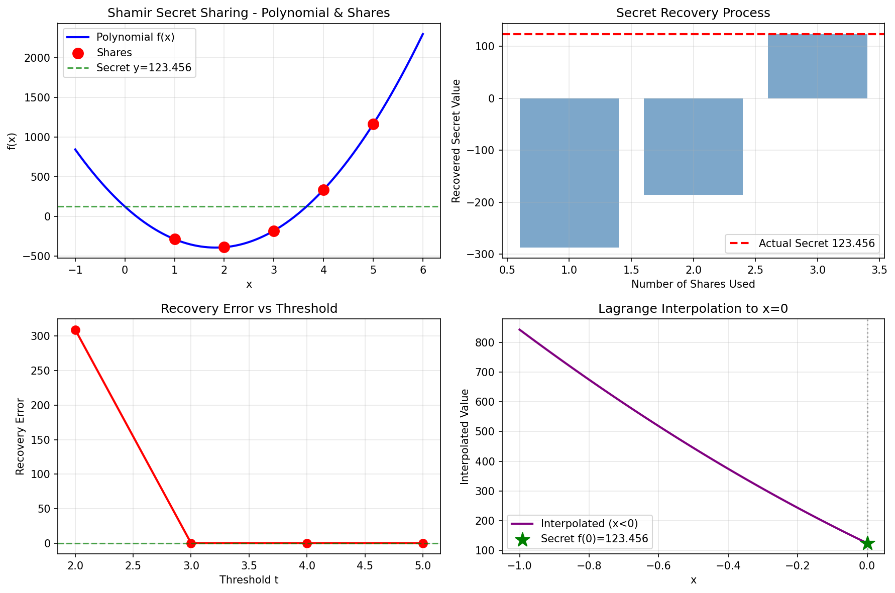
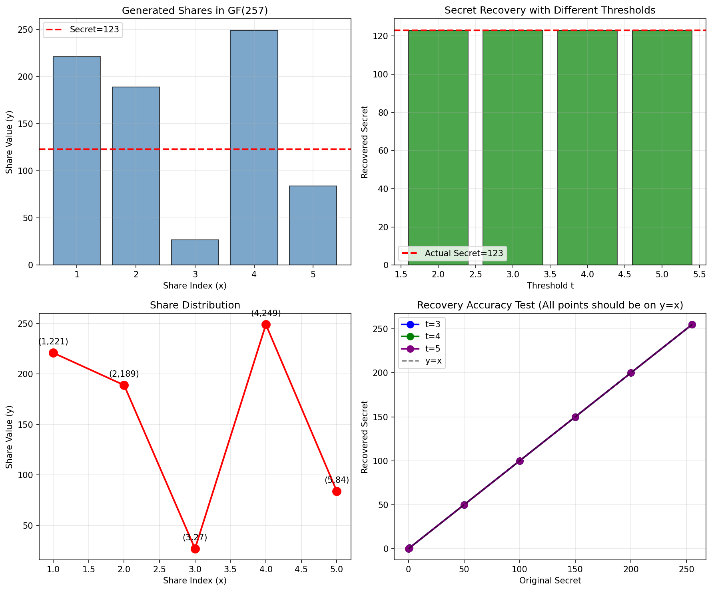
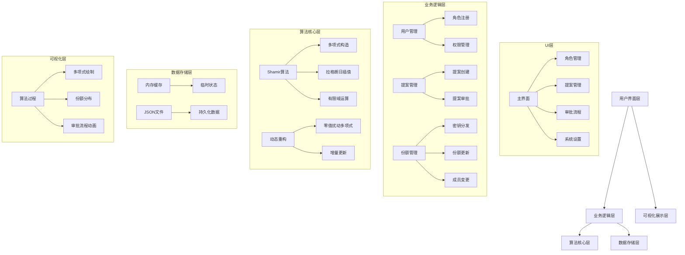

## AI SOLO
### 第一阶段
#### 计划编写

```Markdown
- **文件操作目录仅限于exploration下，即只能做技术验证，严禁修改业务代码**
    
- **每完成一步都要进行git cli提交，在提交消息中需要包含 “[Trae]编辑" 文本**
    

1. 联网搜索, 理解Shamir秘密分享算法的原理、计算过程、逆运算；完成之后撰写Markdown文档记录你的理解
    
2. （在第一步的基础上）使用uv包管理器创建Python项目，使用Python语言（以及必要的第三方库）实现实数域上的Shamir秘密分享算法，校验计算结果（允许存在不多于1%的误差），并使用plt进行可视化绘图，导出图片到 exploration/output中
    
    完成之后撰写Markdown文档详细记录开发过程
    
3. （在第二步的基础上）使用uv创建新的Python项目，实现伽罗瓦域上支持任意实数p（最低为255）的Shamir秘密分享算法，校验计算结果（不容许出现误差），并使用plt进行可视化绘图，导出图片到 exploration/output中
    
    完成之后撰写Markdown文档详细记录开发过程
    
4. （第三步的基础上）在exploration目录下创建Go空项目，自行联网搜索寻找工程实现，（可以依赖第三方库，只要记得go get即可）开发支持任意实数p的伽罗瓦域Shamir秘密分享算法套具，自行创建单元测试和性能基准测试
    
    完成之后撰写Markdown文档详细记录开发过程
```
#### 第二步导出的测试图像

#### Python 伽罗瓦域SSS算法实现


### 第二阶段
#### 计划编写

```Markdown
- **文件操作目录仅限于exploration下，即只能做技术验证，严禁修改业务代码**
    
- **每完成一步都要进行git cli提交，在提交消息中需要包含 “[Trae]编辑" 文本 ； 每完成一步都要撰写一个新的Markdown文档记录开发过程**
    

1. 【测试加压】添加更多针对`shamir-go`的基准测试和单元测试，测试如下内容：
    
    1. 在超大p（至少为16384）下的性能表现，测试当前实现在GC出现卡顿（1秒1次）之前的表现
        
    2. 当采样点出现偏离时，还原结果能否出现误差（出现误差就说明算法实现符合预期），并计算误差值与采样点误差的关系，尝试从数学角度证明误差的可观测性
        
2. 【技术验证】回到Python 伽罗瓦域算法实现项目那边，联网搜索并实现SSS算法的特性（包括加法同态）；需要导出plt可视化绘图，并给出这些特性的应用情景
```
#### 同态特性

### 第三阶段
#### 架构演示



#### Toolkit迁移


#### AI自主规划任务边界


### 第四阶段：sRGB图像输入支持


***
# 页面底部