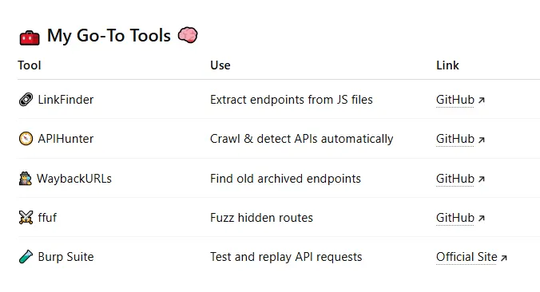

:::important
**原标题**：[# Hidden API Endpoints: The Hacker’s Secret Weapon 🔍](https://infosecwriteups.com/hidden-api-endpoints-the-hackers-secret-weapon-a9ee297a29c2)
**原作者**：[Vipul Sonule](https://medium.com/@vipulsonule71?source=post_page---byline--a9ee297a29c2---------------------------------------)

原文仅限**Medium会员**阅读；免费链接[点击这里](https://thehackerslog.substack.com/p/hidden-api-endpoints-the-hackers)查看
:::
[[toc]]
## 👋 原作者的自我介绍
我是一位网络安全爱好者，也是[**The Hacker’s Log**](https://thehackerslog.com/)网站的写手。我常常在这个网站上分析大黑阔是如何思考、寻找和挖掘漏洞（当然，不干坏事的那种😎）的。

在今天的*深度潜航* 中，我将探讨最强大也最被低估的黑阔秘密——**不为人知的API端点**。

顺便，你可以点击这里查看详细的、实用的、可以保存下来的[**黑阔信息收集指南**](https://thehackerslog.gumroad.com/l/hackersreconguide)
## 🧩 哪些是被藏起来的API端点呢？
网站大多基于API端点搭建——正是这些看不见的程序将你的点击与数据库联系了起来。
然而，并非所有端点都是看不见的的，它们只不过是**被藏起来**或**未被归档**而已，比如：
- `/api/v2/internal/users`
- `/api/admin/deleteUser`
- `/api/dev/test_endpoint`
这便是开发者们用来调试、测试和启动环境的**内部路径**。你通常不会在地址栏里看到它们，但只要你敲对了门，它们也会响应你的请求🚪
也正是如此，这些神必API端点才会成为**漏洞赏金猎人**的目标
## 🧠 第一部分 黑壳的思维模式：像开发者一样思考
神必API之所以存在，是因为这是开发者的**习惯使然**
开发一款程序时，开发者会在：
- 保持**API运行**，即使只是刚刚启动服务🧱
- 忘记移除**调试或后台管理端点**
- 在移动或内部备忘录上留下**跳转目标不明的端点链接**📱
所以，不要再像个人机似的库库扫站了，要像开发者一样思考

问问你自己，如果你是写这个网站的人，你会如何给API命名
这样你才算走上了API挖掘的正道
### 🕵️ 第一步：被动资产搜集——发现线索
被动信息收集意味着不能发送进攻性请求。我是这么做的：👇
#### 🔍 爬取JS文件
开发者常常会在`.js`文件中硬编码API路径
[**LinkFinder**](https://github.com/GerbenJavado/LinkFinder)便是一款能从JS文件中提取API端点的工具
```sh
#克隆仓库并运行LinkFinder
git clone https://github.com/GerbenJavado/LinkFinder.git 
cd inkFinder
python3 linkfinder.py -i https://target.com/static/main.js -o cli
```
输出结果示例如下：
```
/api/v1/users  
/api/internal/logs  
/api/admin/backup
```
**恭喜🎉**——你无需与网站交互便可发现隐藏的API端点
#### 🕸️ 爬取已归档页面
**Wayback Machine**会备份开发者们已经忘记的旧URL站点

使用下面的组合拳：
```sh
echo "target.com" | waybackurls | grep "/api/"
```
立马找到那些消失已久的站点
```
https://target.com/api/v1/test  
https://target.com/api/dev/login
```
这些站点不一定真的都挂了🧟
### ⚙️ 第二步：主动目录扫描——尝试敲门
收集好（历史遗留）API端点后，就该检测它们是否存活了
你可以用`cURL`手动检查，也可以用`ffuf`一把梭
#### 🧑‍💻 案例一：Python脚本快速探测
```Python
import requests

BASE = "https://target.com"  
endpoints = [  
    "/api/internal/users",  
    "/api/admin/config",  
    "/api/dev/test"  
]for ep in endpoints:  
    url = BASE + ep  
    r = requests.get(url)  
    print(f"{r.status_code} - {url}")
```
如果你得到了下面的结果：
```Python
200 - https://target.com/api/admin/config
```
那就说明你成功找到了一个隐藏API端点😈
#### ⚡ 案例二：目录fuzz探测
大批量爆破隐藏API端点，我选择[**ffuf**](https://github.com/ffuf/ffuf)
```sh
ffuf -u https://target.com/api/FUZZ -w /usr/share/seclists/Discovery/Web-Content/api.txt -mc 200,301,302
```
这将爆破数百个可能的API路由，并告诉你哪些API站点是存活的
请记住——不要干得太过火，要把爆破速率调低一点❤️‍🔥
## 🧰 原作者的工具箱 🧠


## 💣 实战案例：我如何发现一个隐藏的后台管理API
在我的一次漏洞挖掘中，我注意到了一个JS文件链接：
```
/api/internal/exportData
```
我好奇地试了一下GET请求，得到了这样的响应：
```
401 Unauthorized
```
经典401未授权。然后我从正常的请求里拿了个`Authorizarion`请求头过来后，就得到了一个**仅限管理员查看**的JSON导出数据响应
这么一个小小的站点最终为我拿到了高额赏金
我学到了这么一个教训：永远不要忽略JS文件的低语
## 🧑‍⚖️ （我是认真的！）不要越界！
请永远：
- 只渗透**项目范围**内的资产
- 不要渗透**范围外**的资产
- 不要碰客户数据
- 写报告时口气要放平
渗透不是乱透——这是为了你好也是为了人家公司好🛡️
## 🧩 高级技巧：GraphQL交集注入
一些现代站点会使用GraphQL API——所以如果交集搜索打开了，也是**可以手动读出数据库内容**的

试试这个：
```sh
curl -X POST https://target.com/graphql \  
  -H "Content-Type: application/json" \  
  -d '{"query":"{ __schema { types { name fields { name } } } }"}'
```
如果你得到了全是查询语句和可变变量的响应——恭喜你，你中得*头奖* 了🎯你拿到了一整个数据库schema
## 🔍 第二部分 黑壳如何发现API站点
让我们一步一步来看
### 🔸 a. 使用浏览器的F12开发者工具
打开目标网页->*检查*->*网络控制台*->过滤`fetch/XHR`
你便会看到这样的网络请求：
```
https://target.com/api/v1/config  
https://target.com/api/private/featureflag
```
在网页里你当然是看不到这些UI的……但它们确实存在
boom💥——这样，你就找到了一个隐藏API
### 🔸 b. 使用BP+字典
使用**BP Intruder模块**或**ffuf**配合针对API的字典进行爆破

例如：
```sh
ffuf -u https://target.com/api/FUZZ -w ~/wordlists/api.txt -mc 200,403
```
试试下面这些字典：
👉 [SecLists API Endpoints](https://github.com/danielmiessler/SecLists/tree/master/Discovery/Web-Content)  
👉 [API Fuzz Wordlist (原作者的GitHub)](https://github.com/vipulsonule/api-fuzzlist)

### 🔸 c. 到JS文件里翻API
使用下面的一行流指令搜素JS文件中的API端点：
```sh
grep -oP '(https?:\/\/[^\s"']+\/api\/[^\s"']+)' *.js
```
当然，你也可以用[LinkFinder](https://github.com/GerbenJavado/LinkFinder?utm_source=chatgpt.com)或[JSParser](https://github.com/nahamsec/JSParser)来优雅地完成这一步
## 🧠 第三部分：为什么开发者要把API藏起来（以及为什么你应该关心这点）
开发者有时会把这些API路径留到生产环境里，因为：
- “我以为这些API只能被内部站点调用”
- “我们会删掉的（才怪😅）”
- “没人会发现的”
然后呢？就被黑阔**干穿了**
被藏起来的API会暴露：
- 敏感的用户数据
- 认证漏洞
- 被遗忘的管理员面板
- 云服务配置☁️
## 🚨 第四部分：实战案例：如何挖到一个价值2000刀的洞
一位研究员发现了一个API `/api/v2/users/exportAll`，可以以CSV格式**导出所有用户的邮箱**
没有认证，也没有访问频次限制
他在一个漏洞赏金平台上提交了这个漏洞——拿到了**2000美元的赏金**💰

这说明了为什么**信息搜集非常重要**——你能找到的API越多，越有可能发现漏洞
## 💡 第五部分：自动化API挖掘
接着用Python👇
```Python
import requests

base_url = "https://target.com/api/"  
endpoints = ["admin", "v1/users", "private/config", "dev/test"]for ep in endpoints:  
    url = base_url + ep  
    r = requests.get(url)  
    if r.status_code in [200, 403]:  
        print(f"[+] Found endpoint: {url} ({r.status_code})")
```
点击这里获得完整脚本->
:::tip 译者注
这里原文后面确实没东西，文本本身也不是超链接
:::

## 🚀 想要提升信息收集能力？
你想要一个完整的、称手的信息收集指南——一步一步教你使用工具、编写脚本、收集字典、提炼工作表，带你过一遍实战流程的指南——那请点击下面我的超详细信息收集指南吧：
**专为黑阔准备的详细的、实用的、可保存的指南**->
[https://thehackerslog.gumroad.com/l/hackersreconguide](https://thehackerslog.gumroad.com/l/hackersreconguide)
上面不只有手把手教程，还有靶场，以及其他我用来搜索高价值目标的东西
## 📚 （原作者的推广）相关阅读
- [黑壳如何使用AI更快地挖掘漏洞](https://infosecwriteups.com/how-hackers-use-ai-to-find-vulnerabilities-faster-248bc162c07e?source=post_page-----a9ee297a29c2---------------------------------------)
- [子域名的秘密：从子域名接管到赏金赚取](https://infosecwriteups.com/the-secret-life-of-subdomains-from-takeover-to-bounties-24498e87f6c4?source=post_page-----a9ee297a29c2---------------------------------------)
## 📌 联系黑阔博客
如果你喜欢我的博文，请加入我们目前正在壮大的黑壳社区吧！一起学习高级技巧、实战研究和信息收集挑战！

🌐 **原作者的博客网站:** [https://thehackerslog.com/](https://thehackerslog.com/)  
📰 **Substack:** [https://thehackerslog.substack.com/](https://thehackerslog.substack.com/)  
🛒 **信息收集指南:** [https://thehackerslog.gumroad.com/l/hackersreconguide](https://thehackerslog.gumroad.com/l/hackersreconguide)  
✍️ **Medium本家:** [https://medium.com/@vipulsonule71](https://medium.com/@vipulsonule71)  
🔗 **领英:** [The Hacker’s Log](https://www.linkedin.com/company/thehackerslog/)

快乐渗透——当然，也不能**干坏事**哦⚔️