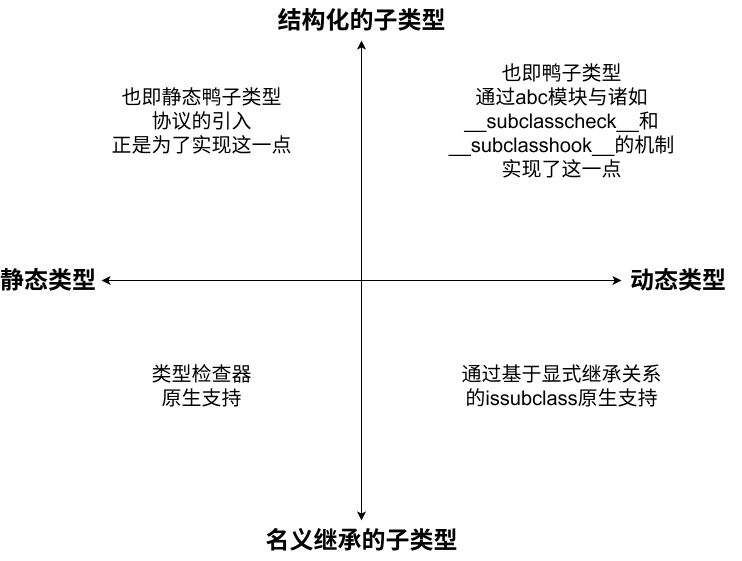

:::info
- **原作者**：**Meet Desai**
- **原作者个人主页**：[https://medium.com/@mit.desai2011?source=post_page---byline--f9c791ad84cd---------------------------------------](https://medium.com/@mit.desai2011?source=post_page---byline--f9c791ad84cd---------------------------------------)
- **原文标题**：**Abstract Base Classes (ABCs) and Protocols in python**
- **原文链接**：[https://levelup.gitconnected.com/abstract-base-classes-abcs-and-protocols-in-python-f9c791ad84cd](https://levelup.gitconnected.com/abstract-base-classes-abcs-and-protocols-in-python-f9c791ad84cd)
:::

## 附录 （译者附）
### 术语对照 （非官方）

| 原文                          | 完全译名         | 翻译时实际使用的译名 |
| --------------------------- | ------------ | ---------- |
| **Nominal Subtyping**       | 名义继承上的子类型    | **具名子类型**  |
| **Structual Subtyping**     | 运行时结构化子类型    | **逻辑子类型**  |
| **Abstract Base Classes**   | 抽象基类         | **抽象基类**   |
| **Protocols**               | 协议           | **协议**     |
| **Python Enhance Proposal** | Python特性增强提议 | **PEP**    |
| **Virtual Subclass**        | 虚拟子类         | **虚子类**    |
### 阅前须知
:::tip 译者致歉
由于译者对Python机制其实也不甚了解，因此在翻译时会使用Gemini 2.5进行术语纠正和文风润色
:::
:::tip 术语上下文须知
- 原文中的**Subtyping**有时只指代**子类型**本身，有时也表示**子类型关系**
:::
:::tip 额外内容翻译须知
- 为了统一文风，译者会对代码中的英文字符串和注释也进行翻译
:::

## 前言
### 引子
当Python需要定义 **接口契约** 和实现 **子类型检查** 时，**抽象基类**（*Abstract Base Classes* ， 简称 *ABCs*)） 和 **协议** （ *Protocals* ） 就该派上用场了。在这篇博客中，Meet Desai 将带领读者通过一步一步理解抽象基类和协议的作用与异同点，理解何为**抽象基类**和**协议**
**Abstract Base Classes (ABCs)** and **Protocols** often come up in Python when modelling _interface-like contracts_ and performing _subtype checks._ In this blog, we’ll unpack these ideas step by step to understand their roles and differences.

:::tip 抽象基类和协议出现的契机
1. **抽象基类 (Abstract Base Classes - ABCs)**
    
    - **契机：** 解决 Python 动态类型中接口定义不明确、运行时难以验证接口兼容性的问题。它旨在提供一种**运行时**机制，用于形式化接口契约，并扩展 `isinstance()` 和 `issubclass()` 的功能，使其能够识别那些符合特定接口（即使没有直接继承）的类。
        
    - **所属 PEP：** **PEP 3119** (于 `Python 3.0` 引入，对应 `abc` 模块)。
        
2. **协议 (Protocols)**
    
    - **契机：** 在类型提示（Type Hints）普及的背景下，需要一种机制来支持**静态**的结构化子类型检查（即“静态鸭子类型”）。ABCs 主要针对运行时，而 Protocols 填补了静态类型检查器识别和验证接口（基于结构而非继承）的需求。
        
    - **所属 PEP：** **PEP 544** (于 `Python 3.8` 引入，对应 `typing.Protocol`)。
:::

这篇帖子旨在帮助读者充分理解**抽象基类**和**协议**背后的核心思想——帖子不会介绍如何使用这两个模块，而是会通过提供**理解它们的前置知识**、分析**它们因何被引入Python**和简化**它们的底层运作机制**，帮助读者构建对抽象基类和协议的基础认知体系。
The focus of this post is to build a solid understanding of the key ideas behind **Abstract Base Classes** and **Protocols**. Rather than just showing how to use them, the goal is to explore the **foundations needed to understand them**, **why they were introduced**, and **how they work under the hood**.

### 帖子不会深入探讨的几点内容
为避免喧宾夺主，本贴将**不涉及**以下几点：
To keep the focus sharp, this post does **not** dive into:

- The complete set of features in the `abc` module
	`abc`模块的完整功能集合
- Every aspect of the `Protocol` class (e.g., generics, Recursive protocol, etc.)
	`Protocol`类的方方面面（比如泛型、递归协议结构等等）
- Performance considerations of using ABCs or Protocols
	抽象基类和协议在不同使用情形下的性能考量
- Guidelines or best practices for choosing between ABCs and Protocols
	关于何时使用抽象基类或协议的最佳指南
# 正文
### 初探抽象基类和协议
在我们开始探索**抽象基类**和**协议**之前，我们首先要了解一些与**类型理论**相关的基础概念——我们会探讨**名义继承子类型**和**运行时结构化子类型**的**貌合神离**，比较**静态类型检查**和**动态类型检查**的不同应用情景和局限——理解这两个理念将大大帮助我们理解抽象基类和协议的机制
Before we dive into **ABCs (Abstract Base Classes)** and **Protocols**, it’s important to understand some foundational concepts related to **type theory.** We’ll explore ideas like **nominal vs structural typing**, and **static vs dynamic checks** — all of which play a key role in how ABCs and Protocols work.
先让我们来看看Python子类型化的不同表现形式——Python子类型化在底层上固定了抽象基类和协议的行为
To begin, let’s explore the different forms of subtyping in Python, which underpin the behavior of ABCs and Protocols.

#### 何为子类型关系(Subtyping)

> 子类型关系说的就是**什么时候一个类型可以被用在其他地方** —— 特别地，如果`B`是`A`的子类型，那么`A`用的地方`B`也能用
> 
> Subtyping is about **when one type can be used in place of another** — specifically, if type `_B_` is a subtype of `_A_`, then B can be used wherever A is expected.

####  名义继承的子类型关系 VS 结构化的子类型关系

##### 具名子类型（名义继承的子类型关系, *Nomial Subtyping*）
在**具名子类型关系**中，类型通过**命名约定**联系在一起——换句话说，当且仅当`B`***显式定义***为`A`的子类型时它才是`A`的子类型（通过**继承 (Inheritance)** 或其他类似的机制实现**子类型化 (Subtyping)**）
In **nominal subtyping**, types are related **by name**. That means, a type is a subtype of another only if it is _e_**_xplicitly declared_** to be so (via inheritance or any other such mechanism).

##### 逻辑子类型（结构化的子类型关系, *Structual Subtyping*）
在**逻辑子类型关系**中，类型通过结构联系在一起——如果`B`类拥有和`A`类一样的字段和方法，那么`B`累就是`A`类的子类型，即使`B`***并没有显式继承***自`A`
In **structural subtyping**, types are related by structure — meaning if one type has all the fields and methods of another, it’s a subtype, **even if** it **_wasn’t explicitly_** declared.
现在看到下面的伪代码：
Consider the following language agnostic example

```Python
class Animal:  
    def speak(self):   
      pass  
    def walk(self):  
      pass  
  
class Dog(Animal):  
    def speak(self):  
      print("Woof Woof")  
    def walk(self):  
      print("Dogo Walking")  
  
      
class Robot:  
    def speak(self):  
      print("Beep boop")  
    def walk(self):  
      print("Robo walking")
```

> `Dog`**显式**继承自`Animal`，所以`Dog`是`Animal`的子类
> `Robot`**不是`Animal`的具名子类型**，但和`Animal`的类定义结构一致（方法名称、传参类型和返回值均一致），因此`Robot`是`Animal`的**逻辑子类型**
> 
   `Dog` is a **nominal subtype** of `Animal` because it **explicitly** declares that relationship through inheritance.  
> `Robot`, on the other hand, is **not** a nominal subtype of `Animal` since it doesn't inherit from it — but it **is** a **structural subtype**, as it provides the **same structure** (i.e., the required methods and attributes).

在理解了**具名子类型**和**逻辑子类型**的不同后，现在让我们开始了解类型检查是何时发生的（不论是运行时发生的还是静态代码分析时发生的）
Having distinguished between nominal and structural subtyping, it’s also important to consider when these checks occur — either at runtime or during static analysis.

#### 静态类型 VS 动态类型

##### 静态类型 （*Static Subtyping*）
在静态类型语言中，任何变量的类型在**运行前(编译时)** 便已确定。这意味着：
In statically typed languages, every variable’s type is known **before the program runs**. That means:

- Type checks happen **at compile time**.
	**编译时**执行类型检查
- You’ll catch type errors **early** — before they sneak into production.
	在项目进入生产环境前便可发现类型错误
- The code is usually **safer**, but often more verbose.
	代码通常**更安全**，但通常也更冗长

##### 动态类型 （*Dynamic Typing*）
在动态类型语言（就比如Python！）中，变量在**程序运行时**才能确定，这意味着：
In dynamically typed languages (like Python!), types are figured out **while the program is running**. That means:

- No need to declare types up front.
	不需要事先定义变量类型
- You get to write code **faster and more flexibly**.
	便于**敏捷开发**
- But type errors might only show up **at runtime** — sometimes in places you didn’t expect.
	但类型错误只在**运行时**才会发生 —— 有时候还会在意想不到的地方报错

#### 子类型关系的一体两面 （*Two Dimensions of Sub-typing*）
当我们说`A`是`B`的子类型时，我们通常是基于以下两个**关键思想**做出判断：
When we say `A` is a subtype of `B`, we’re really making a statement that depends on **two key dimensions**:

1. What kind of sub-typing are we talking about?  我们指代的是哪一种**子类型关系**？
    Is it **nominal** or **structura**l ? 是**具名子类型化**还是**逻辑结构上的子类型化**？
2. When is the sub-typing being enforced or checked?  程序在什么时候才检查**子类型关系**？
    At **static time** or at **runtime**? **静态代码分析时**还是**运行时**

> 一定要牢记这两个问题 —— 这有助于你理解 ”`A`是`B`的子类型“ 这句话到底是在说什么
> 
> Always keep these questions in mind — they help clarify what “`A` is a subtype of `B`” actually implies.

现在我们已经理解了**具名子类型关系和逻辑子类型关系**与**静动态类型**，让我们接下来把目光全部放到**Python** —— 这门本来是**动态类型**的，但在Python 3.5 时还为了更好的可读性、文档功能和更安全的大型开发，而加入了**类型注解**的编程语言上。
Now that we’ve unpacked the ideas of **nominal vs structural** and **static vs dynamic** typing, let’s bring it all into focus with **Python** — a **dynamically typed language**, but optionally supports static typing using **type hints** introduced in python 3.5 for better readability, documentation, and safer large-scale development.

:::tip 译者碎碎念
不难翻译但是翻译出来不可避免会很臃肿的句子……
:::
现在让我们来深入理解Python中的动态类型和静态类型吧！
Let’s understand dynamic and static typing in python in detail

### Python中的动态类型
接下来我们将探索Python动态类型的三个方面：
Let’s dive into three aspects of dynamic typing in python:

- **Dynamic nature of variables**
	**变量的动态本质**
- **Duck typing (Runtime Structural Subtyping**)
	**鸭子类型 (运行时结构化子类型关系 / 运行时逻辑子类型关系)**
- **isinstance and issubclass**
	**`isintance`和`issublcass`方法**

#### 变量的动态本质：变量没有类型
在Python中，变量和类型不是绑定在一起的。这意味着我们可以在程序中的任何一处地方任何一个时间点给一个变量赋值上任何可能的值，变量类型也会因此在运行时不断变化
In Python, variables are not bound to a specific type. This means you can assign any type of value to a variable at any point in the program, and its type can change dynamically during runtime.

```Python
x = 10          # 整型
print(type(x))  # <class 'int'>  
  
x = "Hello"     # 字符串
print(type(x))  # <class 'str'>  
  
x = [1, 2, 3]   # 列表
print(type(x))  # <class 'list'>
```
在上面的例子中：
In the above example:

- x starts as an integer, then is reassigned to a string, and finally to a list.
	`x`一开始是整型，然后被重新赋值成字符串，最后变成了一个列表
- Python doesn’t care about the type of x ahead of time; its type is determined by what value it holds at runtime.
	Python不会提前检查`x`的类型；`x`的类型取决于运行时它所引用的值的类型

#### 鸭子类型：运行时结构化子类型关系（*Runtime Structural Subtyping*）
Python的动态类型哲学与*鸭子类型* 这一概念紧密相关 —— 一个对象能否执行某项操作取决于对应的方法或属性是否可用，而与对象的实际类型或继承关系无关
Python’s dynamic nature is closely related to a concept called “duck typing.” Duck typing is a style of typing in which an object’s suitability for a particular operation is determined by the presence of certain methods or attributes, rather than by its actual type or class inheritance.
正所谓，***如果它走起来像鸭子，叫起来像鸭子，那它就是鸭子***
It’s often described with the phrase: “**If it walks like a duck and quacks like a duck, then it must be a duck**.”
鸭子类型本质上就是**运行时结构化子类型关系**。结构化子类型关系意味着如果两个类型拥有一致的结构（比如一致的属性和方法），那么这两个类型就是互相兼容的。由于Python是在运行时检查这种兼容关系的，因此这种关系也被称作**动态/运行时结构化子类型关系**
Duck typing is essentially **runtime structural subtyping**. Structural subtyping means that a type is considered compatible with another if it has the same structure (i.e., the same set of methods and attributes). Because this compatibility is checked at runtime in Python, it is **dynamic/runtime structural subtyping**
看到下面的代码：
Consider the following example

```Python
class Duck:  
    def quack(self):  
        print("Quack!")  
  
    def fly(self):  
        print("Duck flying")  
  
class ToyDuck:  
    def quack(self):  
        print("Squeak!")  
  
    def fly(self):  
        print("Toy duck cannot fly")  
  
  
class Bird:  
    def fly(self):  
        print("Bird flying")  
  
def make_it_quack(obj):  
    obj.quack()  # 我们只关心这个对象有没有`quake()`方法
  
def make_it_fly(obj):  
    obj.fly()    # 我们只关心这个对象有没有`fly()`方法
  
my_duck = Duck()  
my_toy_duck = ToyDuck()  
my_bird = Bird()  
  
make_it_quack(my_duck)  
make_it_quack(my_toy_duck)  
# make_it_quack(my_bird) # Error: 'Bird' object has no attribute 'quack'  
  
make_it_fly(my_duck)  
make_it_fly(my_toy_duck)  
make_it_fly(my_bird)
```
**代码解释如下：**
**Explanation:**

- The function `make_it_quack()`doesn’t care if the object is a `Duck`. It only cares if the object has a `quack()`method.
	`make_it_quack()`（呱呱叫）函数不在乎传入的对象是不是一只`Duck`（鸭子），只在乎这个对象有没有`quack()`方法
- Both `Duck` and `ToyDuck` have a `quack()`method, so instances of both classes can be passed to the `make_it_quack()`function without any type error.
	`Duck`（鸭子）和`ToyDuck`（玩具鸭）都拥有`quack()`方法，所以这两个类的实例都可以正常传入`make_it_quack()`函数而不会触发类型错误
- However, `my_bird`does not have the `quack()`method, so passing it to `make_it_quack()`would result in an `AttributeError` at **runtime**.
	但是`my_bird`（鸟）没有`quack()`方法，所以将它传入`make_it_quack()`方法会导致Python在**运行时**抛出`AttributeError`异常（尝试访问实例中不存在的方法）
- The `make_it_fly()`function works with any object that has a fly method.
	`make_it_fly()`函数可用于一切拥有`fly()`方法的对象
- This demonstrates that Python’s duck typing focuses on the **behaviour** of an object (whether it has the required methods) rather than **its type or inheritance.**
	这说明Python的鸭子类型机制只关心对象的**行为**（有没有需要的方法），而不关系它的**类型或继承关系**
- This is **structural subtyping** because we only care about the **structure of the object**s. 
	这便是**运行时结构化子类型关系**，我们只关心**对象的结构**
- This is **dynamic** because the check for the presence of the `quack()`method happens when the `make_it_quakc()`function is called.
	（类型检查）在这里是**动态的**，因为对对象是否拥有`quack()`方法的检查仅发生在`make_it_quack()`函数被调用时

> 尽管鸭子类型不受抽象基类或协议的影响，但它本质上仍然催生了**逻辑子类型**的概念 —— 同样的术语我们会在介绍运行时类型检查时再次用到，而这也正是**协议**试图为静态类型检查所规定的机制
> 
> Although duck typing isn’t affected by ABCs or Protocols, it naturally leads to the idea of **structural subtypin**g — the same intuition we use at runtime is what Protocols try to formalize for static type checking

#### `issubclass()`：运行时检查类型 （*Check for Subtypes at Runtime*）
Python提供了内置的`issubclass()`函数，用于在***运行时*** 检查一个类是否是另一个类的子类
Python provides the built-in **issubclass**() function to check, **_at runtime_**, whether one class is considered a subtype of another.

> 现在，`issubclass()`方法只针对**具名子类型**，或是只针对**逻辑子类型**（**运行时结构化子类型**），亦或是对两者都适用，取决于开发者是如何使用抽象基类和协议的
> 
> Now, whether issubclass() checks **only nominal subtyping** or **only structural subtyping** or **both** — the answer can vary depending on the use of Abstract Base Classes (ABCs) and Protocols.
当我们讲到抽象基类和协议时我们会再涉及这一点的
We will come back to this when we discuss ABCs and Protocols

## Python中的静态类型
Python通常被视为一门动态类型的编程语言，但它也支持由[PEP 484](https://peps.python.org/pep-0484/)引入的**类型提示**所实现的**可选静态类型**。这使得我们可以使用类型标注代码，然后用**mypy**、**pyright**乃至现代IDE进行静态类型检查——在不运行代码的前提下检查代码中的类型使用。
这使得开发者可以更好地编写工具、编制文档，以及及早发现类型错误——同时保持Python运行时的灵活特性
While Python is fundamentally a dynamically typed language, it supports **optional static typing** through **type hint**s introduced in [PEP 484](https://peps.python.org/pep-0484/). This means you can annotate your code with types, and use tools like **mypy**, **pyright**, or modern IDEs to perform static type checking — that is, checking your types without running the code.  
This enables better tooling, documentation, and early detection of certain bugs — all while keeping Python’s flexibility at runtime.

```Python
def greet(name: str) -> str:  
    return "Hello, " + name  
  
greet("Alice")   # ✅ OK  
greet(42)        # ❌ mypy: 传递给"greet"函数的第一个参数拥有不匹配的类型"整型"，而函数希望获得"字符串
```

### 在静态类型检查中什么样的子类型才是合法的？ （*What Does It Mean to Be a Subtype during static type checking?*）
当我们给一个函数标注它希望接受的特定类型的参数 —— 比如说`Animal` —— mypy这样的静态类型检查器便会通过任何它认为是`Animal`子类的参数
When we annotate a function to expect a certain type — say, `Animal`— a static type checker like mypy will accept any argument that it considers a subtype of `Animal`

```Python
def make_it_speak(a: Animal): ...
```

> **What _counts_ as a subtype of Animal?** **问题来了，是什么*决定* 了一个类应该是`Animal`的子类型？**
> 
> 类型检查器是只接受显式继承自`Animal`的子类型（所谓的**具名子类型**）呢，还是说匹配`Animal`结构的类型（所谓的**逻辑子类型**）也可以呢？答案取决于`Animal`是如何定义的 —— 取决于`Animal`是一个抽象基类，一个协议，还是一个常规类……
> Will the type checker only accept classes that explicitly inherit from `Animal`(i.e., **nominal subtypes**)? Or will it also accept types that simply match its structure (i.e., **structural subtypes**)?  
> The answer depends on how Animal is defined — whether it’s an Abstract Base Class (ABC), a Protocol, or a regular class..

当我们谈到抽象基类和协议时我们会回来回答这个问题
We will answer this when we discuss ABCs and Protocol

## 书接上文：两种子类型关系的不同 （*Recap: The Two Subtyping Questions*）

> 我们已经介绍了通过`issubclass()`进行的**运行时子类型关系检查**和通过**类型提示与静态类型检查器**进行的**静态子类型关系检查**。就这两种情形而言，我们已经回答了第二个问题——（Python）会在什么时候检查和加强子类型关系——**运行时**固化子类型关系，**静态分析时**则通过类型检查器配合**类型提示**检查子类型关系；但第一个问题——**具名子类型与逻辑子类型，哪一个才应该是正统子类型？**——这个问题仍然没有得到回答
> 
> We’ve now discussed **runtime subtyping** via `issubclass()`and **static subtyping** through **type hints and static type checkers**. So in both cases, we have answered the second question about when the subtype is being checked or enforced. In case of subclass it is at **runtime** and in case of **type hints**, it is at static time by type checker. But the first questions remains  
> **What does it actually mean to be a subtype? Is it just nominal or structural, or both?**

### 旁敲侧击：探讨 类 如何调用元类型的方法（*A Quick Detour: Understanding How Classes Use Metaclass Methods*）
在我们闷头跳进抽象基类的深渊，探索它们是如何hook进Python的子类型关系检查前，我们有必要先理解Python对象模型中一个精妙的思想：
Before we jump into ABCs and how they hook into Python’s subtype checks, it’s important to understand one subtle but powerful idea in Python’s object model:
在Python中，任何东西都是一个实例 —— class自己也不例外
In Python, everything is an instance of something — even classes themselves

- A regular object (like c = Circle()) is an instance of a class `Circle`.
	对象（比如`c = Circle()`）是类（`Circle`）的实例
- A class itself (like Circle) is an instance of a metaclass.m1
	类本身（比如`Circle`）则是`metaclass.m1`的实例
一般来说，所有类都是内置`type`元类的实例。但也可以通过自定义自己的元类来管理类的行为
By default, all classes are instances of the built-in `type` metaclass. But you can customize behaviour by defining your own metaclass.
实例可以访问类中定义的属性和方法，而**类**也可以访问定义在其**元类**中的方法——因为类就是其元类的一个***实例***
Just like how an instance of a class can access methods and attributes defined in its class, a **class** can access methods defined in its **metaclass**.  
Why? — Because a class is itself an **_instance_** of a metaclass.
*记住：类也是对象 —— 是元类决定了它们的行为*
_Remember: Classes are objects too — and they get their behaviour from their metaclass!_

```Python
# 定义一个拥有新行为的元类
class ShapeMeta(type):  
    def describe(cls):  
        print(f"{cls.__name__} is a shape.")  
  
# 使用上面的元类定义一个类
class Circle(metaclass=ShapeMeta):  
    def area(self, radius):  
        return 3.14 * radius * radius  
  
# Circle实例调用成员方法
c = Circle()  
print(c.area(5))  # 输出：78.5  
  
# Circle类调用元类所定义的类方法
Circle.describe()  # 输出: Circle is a shape.
```

> **备注**：你不需要先搞懂元类才能使用抽象基类 —— 但对元类有大致的理解后，我们得以更容易理解抽象基类背后的内部机制
> 
> **Note**: You don’t need to master metaclasses to work with ABCs —  
> But keeping this mental model in mind will make the internals much easier to follow as we dive deeper.

现在我们已经看到了类自己就是元类的实例这一点 —— 以及元类是如何控制类的行为的 —— 现在我们将深入`abc`模块
Now that we’ve seen how classes themselves are instances of metaclasses — and how metaclasses can control class-level behaviour —we’re ready to take a deep dive into the `abc` module

## `abc`模块引入了什么
`abc`模块 （*抽象基类*， *Abstract Base Classes*）为执行**运行时子类型检查**和定义**规范的接口契约**奠定了基础。它通过下面两点添加了这两项重要功能：
Python’s `abc` module (_Abstract Base Classes_) provides a foundation for performing **runtime subtype checks** and defining **formal interface contracts**. It introduces these two key capabilities via:

1. **The** `**ABC**` **base class (via the** `**ABCMeta**` **metaclass)**   **`ABC`抽象基类 (通过`ABCMeta`元类)**
	通过`issubclass()`和`isinstance()`提供了更灵活的子类型关系检查——背后是`__subclasscheck__`、`__instancecheck__`和由`ABCMata`定义的`register`、`Object`定义的`__subclasshook__`的功劳——我们将在下面的章节中探索这些方法
    This powers more flexible subtype checks using `issubclass()` and `isinstance()`. Behind the scenes, this involves methods like `__subclasscheck__`, `__instancecheck__`, and `register` defined in `ABCMeta` and `__subclasshook__` defined in `Object` — which we will explore in the next section.
2. **The** `**@abstractmethod**` **and** `**@abstractproperty**` **decorators**   **`@abstractmethod`和`@abstractproperty`装饰器**
	用于定义子类所*必须* 实现的方法和属性，完善接口契约的定义
    These let you define methods and properties that _must_ be implemented by subclasses, helping define interface-like contracts.

> 简而言之：
> Put simply:
> 首先是关于*运行时检查`A`是`B`的子类的*
> First part is about _checking if a class_ `_A_` _is a subclass of class_ `_B_` _at run time_
> 然后是关于*完善子类所必须实现的方法和属性的*
> The other is about _enforcing what methods and properties a subclass must implement_.

在我们深入抽象基类元类（*ABCMeta*）前，先来看看我们该如何定义一个抽象基类
Before we deep dive into ABCMeta, let’s look at how we can define an Abstract Base Class in python

### 加入抽象基类
在Python中有两种办法定义一个抽象基类：
In Python, you can define an abstract base class (ABC) in two ways:

- Using `ABCMeta` directly as the metaclass
	直接把`ABCMeta`当元类使用
	```Python
	from abc import ABCMeta  
	  
	class MyBase(metaclass=ABCMeta):  
	    pass
	```

- Using the `ABC` helper class, which is the more common and convenient approach.
	使用`ABC`辅助类，这也是最常用最方便的方式
	
	```Python
	from abc import ABC  
	  
	class MyBase(ABC):  
	    pass
	```

> 从底层代码上看，`ABC`实际上是以`ABCMeta`为元类的一个扁平的装饰器（*Wrapper*）。所以当你从`ABC`继承定义一个类时，你实际上是*想让自己的类使用抽象基类的机制*。`ABC`在`abc`模块里就是这么定义的
> 
> Under the hood, `ABC` is just a thin wrapper that sets `ABCMeta` as its metaclass. So when you inherit from `ABC`, you're really saying, _"make my class use the ABC machinery." This is how_ `_ABC_` _is defined in abc module._

```Python
class ABC(metaclass=ABCMeta):  
    """Helper class that provides a standard way to create an ABC using  
    inheritance.  
    """  
    pass
```

#### 考虑`ABCMeta`的运行时子类型关系检查 （*Runtime Subtype Checks with ABCMeta*）

#####  `issubclass()`的行为如何影响`abc`模块的实现和引入（*How issubclass() behaviour evolved with the introduction of abc module*）
在引入`abc`模块之前，Python的`issubclass(A,B)`严格依赖于**名义继承**的子类型关系——即只当`A`显式继承自`B`（直接或间接）时函数才返回`True`
Before the introduction of the `abc` module, Python’s `issubclass(A,B)`strictly relied on **nominal** subtyping — it returned True only if class `A` explicitly inherited from class `B`(directly or indirectly).
但随着`abc`模块的迈进，`issubclass()`的行为也灵活起来。现在调用`issucblass(A,B)`时，Python会首先检查`B`的元类（不是非得是`ABCMeta`）是否定义了一个名为`__subclasscheck__`的方法，如果确实有这个方法，Python会转而根据这个方法判断`B`的子类型关系 —— 允许类自定义运行时子类型关系；如果没有这个方法，Python才会回到原本的具名子类型关系检查。下面是一段简化了逻辑的代码：
But with the advent of the abc module, this behavior became more flexible. Now, when you call `issubclass(A,B)`, Python checks if B’s metaclass (not necessarily `ABCMeta`)defines a special method called `__subclasscheck__`. If it does, Python delegates the decision to that method — allowing classes to customize how subtyping relationships are determined at runtime. If no such method exists, Python falls back to the original nominal check. The below code example makes it clear.

```Python
class BaseAllMeta(type):  
    def __subclasscheck__(self, subclass):  
        return True  
  
class BaseNoneMeta(type):  
    def __subclasscheck__(self, subclass):  
        return False  
  
class BaseAll(metaclass=BaseAllMeta):  
    pass  
  
class BaseNone(metaclass=BaseNoneMeta):  
    pass  
  
class A:  
    pass  
  
class B(BaseNone):  
    pass  
  
print(issubclass(A, BaseAll))   # ✅ True — calls BaseAll.__subclasscheck__(A)  
print(issubclass(B, BaseNone))  # ❌ False — calls BaseNone.__subclasscheck__(B)
```

> 注意 `issubclass(A, BaseAll)`永远都会返回`True`，即使`A`**并非继承自**`BaseAll`，而`issubclass(B, BaseNone)`永远都会返回`False`，即使`B`确实**继承自**`BaseNone`，`__subclasscheck__`魔术方法在这里覆盖了`issubclass`的原始行为
> 
> Notice `issubclass(A, BaseAll)`returns **True** even though it is **not inherited** from BaseAll and `issubclass(B, BaseNone)` returns **False** even though B **inherits** from `BaseNone` , showing how `__subclasscheck__` overrides the default behaviour of `issubclass`
> 
> 注意：`BaseAll`并没有直接定义`__cubclasscheck__`，覆盖`issubclass`行为的实际上是它的**元类**。`BaseAll.__subclasscheck__(A)`能用是因为`BaseAllMeta`定义了方法，而`BaseAll`调用了这一方法，就像实例会从它的类中寻找方法一样（`BaseAll`事实上就是`BaseAllMeta`的一个实例）
> 
> Note: Even though `BaseAll` doesn’t define `__subclasscheck__` directly, its **metaclass** does. So `BaseAll.__subclasscheck__(A)` works because `BaseAll` delegates that method call to `BaseAllMeta`, just like how instances defer method lookups to their class (`BaseAll` is actually an instance of `BaseAllMeta` ).

这就是为什么我们要在探索考虑抽象基类时的子类型关系检查时，先来讲一下元类的原因——以便我们对`issubclass()`在抽象基类情形下的行为有一个正确的理解
This is precisely why we took that earlier detour into metaclasses — to build the right mental model for understanding what happens when Python calls `issubclass()` with ABCs.

> **Similarity Between isinstance and issubclass** **`isinstance`和`issubclass`的相似性**
> 就像当`B`的元类也定义了`__subclasscheck__`时调用`issubclass(A, B)`实际上是在调用`B.__subclasscheck__(A)`一样，调用`isinstance(obj, cls)`也相当于是在调用`cls.__instancecheck__(obj)`，如果`cls`的元类也定义了一个`__instancecheck__`方法
> Just as `issubclass(A, B)` defers to `B.__subclasscheck__(A)` when `B` ‘s metaclass has a custom `__subclasscheck__`, the function `isinstance(obj, cls)` similarly calls `cls.__instancecheck__(obj)` when `cls` ‘s metaclass defines a custom `__instancecheck__` method.
> 
> 既然`issubclass`和`__subclasscheck__`的行为互为镜像，那么我将跳过对`instance`和`__instancecheck__`的深入研究，毕竟它们概念上来说是一致的
> Since this behaviour mirrors that of `issubclass` and `__subclasscheck__`, I’ll skip further details on `isinstance` and `__instancecheck__`, as the concepts are fundamentally the same.

就先前的章节来看，你可能会想在自己的元类中编写客制化的`__subclasscheck__`行为，修改运行时子类型关系检查，然后应用到你自己的类上。然而，`ABCMeta`就已经有一个高度灵活的`__subclasscheck__`的实现了，使得开发者以更可控的方法自定义子类型关系检查方式。下一章节我们将深入探讨**抽象元类的`__subclasscheck__`**
Building on the previous section, you might consider defining a custom metaclass with your own implementation of `__subclasscheck__`to modify subtype checking at runtime, and then apply that metaclass to all your classes. However, `ABCMeta` already offers a highly flexible implementation of `__subbclasscheck__`, giving developers the ability to customize the subtype checking behavior in a more controlled manner. The next sections discuss **ABCMeta’s __subclasscheck__** in greater detail.

##### `ABCMeta.__subclasscheck__`是如何工作的 （*How `ABCMeta.__subclasscheck__` Works*）
让我们观察一下`ABCMeta.__subclasscheck__`的实际实现。下面一个简化的版本（已经去除内部的缓存逻辑）：
Let’s have a closer look at the actual implementation of `ABCMeta.__subclasscheck__`. Here's a simplified version (excluding the internal caching logic):

```Python
def __subclasscheck__(cls, subclass):  
    """Override for issubclass(subclass, cls)."""  
  
    # Step 1: 注入cls类的__subclasshook__
    ok = cls.__subclasshook__(subclass)  
    if ok is not NotImplemented:  
        assert isinstance(ok, bool)  
        return ok  
  
    # Step 2: 检查直接继承关系（名义继承上的子类型关系）
    if cls in getattr(subclass, '__mro__', ()):  
        return True  
  
    # Step 3: 检查子类是否已被注册 （虚子类）
    for rcls in cls._abc_registry:  
        if issubclass(subclass, rcls):  
            return True  
  
    # Step 4: 遍历cls的子类，检查subclass是否是这些子类的子类
    for scls in cls.__subclasses__():  
        if issubclass(subclass, scls):  
            return True  
  
    return False
```
让我们一步一步往下看
Let’s break it down step by step:

###### 1. 注入`__subclasshook__`
首先检查`cls.__subclasshook__`，这一方法可以覆盖原始的子类型关系检查行为。如果方法返回任意布尔值，那么`__subclasscheck__`方法便会直接使用这个布尔值，而如果方法返回`NotImplemented`，那么`__subclasscheck__`将进入后面的检查
The first check delegates to `cls.__subclasshook__`, if the ABC has defined one. This allows any custom subtyping logic to override everything else. If it returns `True` or `False`, that result is used. If it returns `NotImplemented`, the check proceeds.

>我们将在后面的章节探索这一**强大**的机制
  We’ll explore this **powerful** mechanism in detail in the next section.

###### 2. 检查直接继承关系（名义继承上的子类型关系） （*Direct Subclass Check (Nominal Subtyping)*）
如果类的`__subclasshook`并没有被实现，Python接下来将检查指定的`cls`是否出现在`subclass`的`__mro__`（方法解析顺序，*method resolution order*）返回列表中。这便是**名义继承子类型关系检查的通常实现**：检查`subclass`是否直接或间接继承自`cls`
If the hook doesn’t decide the result (returns `NotImplemented`), Python falls back to checking if `cls` appears in the `__mro__` (method resolution order) of the `subclass`. This is the **usual nominal subtyping** mechanism: it checks whether the `subclass` inherits from `cls`, directly or indirectly.

> 在抽象基类加入Python前，这便是`issubclass()`的原始行为
> This is the traditional behavior of `issubclass()` before ABCs came into the picture.

###### 3. 通过类的`register()`方法检查虚拟子类型关系 （*Virtual Subclass Check via `register()`*）
这一步将检查`SomeClass`是否被显式注册为`cls`的一个虚子类（*Virtual Subclass*）。如果`SomeClass`已经使用`cls.register(SomeClass)`进行了注册，那么根本上来说，`SomeClass`类将被视为`cls`的一个子类，尽管`SomeClass`不直接继承自`cls`
If `SomeClass` was previously registered with `cls` using `cls.register(SomeClass)`, this step checks whether `SomeClass` has been explicitly registered as a virtual subclass of `cls`. In essence, the class `SomeClass` is treated as a subclass of `cls` because it has been manually registered, even if it doesn't directly inherit from `cls`.

> 和`__subclasshook__`差不多，`register()`方法也可用于在不修改类定义的前提下自定义子类型关系检查行为 —— 我们将在后面的章节中详细讨论这一点
> Like `__subclasshook__`, the `register()` method is another key way to customize subclass behaviour without changing class definitions — and we’ll discuss it thoroughly in the next section.

###### 4. 递归检查`cls`的子类 （*Recursive Subclass Exploration*）
如果前面的检查都失败了，ABCMeta将使用`cls.__subclasses()__`遍历`cls`的所有子类，然后递归对每一个子类都应用`issubclass()`检查
If none of the previous checks succeed, ABCMeta explores all direct subclasses of `cls` using `cls.__subclasses__()`, and recursively applies `issubclass()` to them.
等会儿？第二步不是已经检查了子类的联系了吗
But wait — doesn’t step 2 already check for subclass relationships?
你说得对，但是第二步只检查了标准的方法解析顺序（`__mro__`），它检查的是显式继承自抽象基类的子类，而**第四步则检查的是间接或运行时动态定义的子类型继承关系** —— 特别地，这触及了`register()`和自定义`__subclasshook__()`逻辑 —— 稍后会在子类章节中的讲到这一点
Yes, but only through the standard method resolution order (`__mro__`). Step 2 will catch any class that **nominally** inherits from the ABC, directly or indirectly. However, **step 4 exists to catch indirect or dynamically declared subclassing** — particularly those involving `register()` or custom `__subclasshook__()` logic — deep in the subclass tree.
看到下面的例子
Consider this example:

```Python
from abc import ABC  
  
class Base(ABC): pass  
  
class Mid: pass  
Base.register(Mid)  
  
class Leaf(Mid): pass  
  
issubclass(Leaf, Base)  # True
```
`issubclass`做了下面这些事情
Here’s how it plays out:

- Step 2 fails: `Base` is not in `Leaf.__mro__`
	第二步不行：`Base`并非显式继承自`Leaf`，所以`Leaf.__mro__`里找不到`Base`
- Step 3 fails because `Leaf` is not directly registered with `Base` via register
	第三步也没成：因为`Leaf`并没有被注册为`Base`的子类
- Step 4 succeeds: it inspects the subclasses of `Base`, finds `Mid`, then calls `issubclass(Leaf, Mid)` — which returns `True`, satisfying the virtual subclass relationship.
	第四步返回了`True`：函数在`Base`的子类里找到了`Mid`，然后调用对`Mid`调用`issubclass(Leaf, Mid)` —— 得到了`True`，因为`Leaf`是`Mid`的虚拟子类，进而是`Base`的子类
最后一步十分有益于理解**非继承，但通过显式注册或`__subclasshook__`实现的子类型关系**这一现象背后的脉络 —— 虽说现象背后的联系不那么明显
This final step is crucial for capturing relationships that emerge **not through inheritance, but through explicit registration or via __subclasshook __** — even if they’re several levels deep.
它确保了Python的子类型关系检查既能做到前向兼容又可向后拓展，即便是在复杂或新式继承层级中也可以正常进行
It ensures that Python’s subtype checks remain consistent and flexible, even across complex or non-traditional hierarchies.

> **注意**：现在来看这个例子可能还是有些难懂，但别担心 —— 一旦你理解了后面的`register()`章节，再回过头来重新阅读这一章节，你将收获颇丰
> 
> **Note:** If this example feels a bit subtle right now, don’t worry — once you’ve read the next section on `register()`, come back and reread this step. It’ll click into place.

### 加入`register()`：手动声明子类型关系 （*Manually Declaring Subtypes*）
在前面的章节中，我们看到`__subclasscheck__`涉及通过`cls._abc_registry`检查**已注册的虚子类**（**第三步**）这一步骤，这里便是`register()`方法大显身手的地方
In the previous section, we saw that `__subclasscheck__` includes a specific step (**Step-3**) where it looks for **registered virtual subclasses** via the `_abc_registry`. That’s exactly where the `register()` method comes in.
`ABCMeta`定义的`register()`方法显式定义一个给定的类应该被视为一个抽象基类的子类——**而不需要(实际的)继承关系**
The `register()` method, defined in `ABCMeta`, allows you to **explicitly declare** that a given class should be treated as a virtual subclass of an ABC — **without requiring inheritance**.

```Python
from abc import ABC  
  
class MyABC(ABC):  
    pass  
  
class UnrelatedClass:  
    pass  
  
MyABC.register(UnrelatedClass)  
  
print(issubclass(UnrelatedClass, MyABC))  # True
```
在进行了虚子类注册后，即使`UnrelatedClass`**并非继承自**`MyABC`，`issubclass()`还是返回了`True`。这是因为`register()`更新了注册列表，而这就是`__subclasscheck__`在子类型关系检查中要检查的其中一个因素
Even though `UnrelatedClass` does **not** inherit from `MyABC`, `issubclass()` returns `True` after registration. This is because `register()` directly updates the registry that `__subclasscheck__` consults during subtype checks.
当我们使用无法直接继承的**第三方代码或内置类型**开发时这个特性（虚子类注册）会特别有用。如果一个类拥有你喜欢的接口，你可以使用`register()`把它注册进你自己的类型继承层级中，干净又卫生
This feature is particularly useful when working with **third-party code or built-in types** that you can’t subclass directly. If such a class conforms to the interface you care about, `register()` allows you to integrate it into your type hierarchy cleanly and explicitly.
现在你已经知道了`__subclasscheck__`是如何处理子类型关系的了，当你调用：
By now, you already know how `__subclasscheck__` processes subtype relationships. When you call,

```Python
MyABC.register(UnrelatedClass)
```
你是在将`UnrelatedClass`加入`MyABC`内部的`_abc_registry`中，之后调用`issubclass(UnrelatedClass, MyABC)`时，`__subclasscheck__`的第三步会发现`UnrelatedClass`被注册为了`MyABC`的虚子类，于是返回`True`
you’re adding `UnrelatedClass` to `MyABC`’s internal `_abc_registry`. Later, during a call to `issubclass(UnrelatedClass, MyABC)`, step 3 of `__subclasscheck__` kicks in — and returns `True` because the class was previously registered.

> `register()`方法是定义在`ABCMeta`中的，意味着**任何元类是`ABCMeta`或继承自它的类**都可以访问`register()`方法
> 
> The `register()` method is defined in `ABCMeta`, which means it's available on **any class whose metaclass is (or derived from)**`**ABCMeta**`

### 使用`__subclasshook__`自定义子类型检查逻辑 （*Customizing Subtype Logic with `__subclasshook__`*）
在我们探索`__subclasscheck__`时，我们看到函数第一步会通过调用`B`类的`__subclasshook__()`方法检查`A`类是否显式继承自`B`类（`B`类是任一元类是`ABCMeta`或继承自它的类）
In our deep dive into `__subclasscheck__`, we saw that the **first step** in determining whether a class `A` is a subclass of a class `B` (where class `B` is any class whose metaclass is/derived from `ABCMeta` ) is to call class `B`'s `__subclasshook__()` method.
Python在这里提供了一个强大的拓展：`__subclasshook__()`方法允许我们自定义哪些类型可以是我们的抽象基类的子类型，完全独立于具名子类型继承行为
This is where Python gives you a powerful extension point: the `__subclasshook__()` **class** method lets you override and define what _subtyping_ means for your abstract base class, entirely independent of nominal inheritance.
让我们看看是什么让`__subclasshook__`如此特别：
Let’s walk through what makes `__subclasshook__` special:

1. **是抽象基类（*ABC*）而不是元类定义了它**
	不像定义在`ABCMeta`中的`register()`，`__subclasshook__()`是需要你在你自己的抽象基类中显式重载的 —— 和其他方法一样。下面是一个最简单的例子：
	Unlike `register()` (which is defined in `ABCMeta`), the `__subclasshook__()` method is defined in your ABC class — just like any other method. Here's a minimal example:
	
	```Python
	from abc import ABC  
	  
	class MyABC(ABC):  
	    @classmethod  
	    def __subclasshook__(cls, subclass):  
	        if hasattr(subclass, 'quack'):  
	            return True  
	        return NotImplemented
	```
	在这个例子中，任何拥有`quack`方法的类都将视为`MyABC`的子类，即使这些类并没有直接继承自`MyABC`
	In this case, any class that has a `quack` method will be treated as a subclass of `MyABC`, even if it doesn’t inherit from it directly.
2. **`__subclasshook__`方法必须返回`True`、`False`或`NotImplemented`

- 如果方法返回`Bool`类型的值（`True`或`False`），那么`issubclass`就返回方法的原始值
- 如果方法返回`NotImplemented`类，那么`issubclass`就退出`__subclasshook__`方法，继续之后的子类型关系检查流程
该方法默认返回`NotImplemented`，如果你没有在你自己的抽象基类中重载该方法，那么它就永远都返回`NotImplemented`，而`issubclass`会继续之后的子类型关系检查流程（方法解析顺序、注册列表、递归子类）
If you don’t define a `__subclasshook__()` method in your ABC, the default implementation from `object` is used, which always returns `NotImplemented`.

This means: **if you don’t override** `**__subclasshook__**`**, nothing changes** — `issubclass()` just uses the standard checks (MRO, registry, etc.).
3. **它是对运行时结构化子类型关系检查行为的钩取**
`register()`允许我们*手动* 声明子类型关系，但`__subclasshook__()`允许我们在类结构上接管**运行时子类型关系检查**
While `register()` allows you to _manually_ declare subtyping relationships, `__subclasshook__()` enables **automatic runtime checks** based on class structure.
当你需要你的抽象基类匹配任何拥有特定接口的类（甭管继承关系怎么样）时这一点会特别有用。例如：
This is particularly useful when you want your ABC to match any class that _conforms_ to a specific interface, regardless of its ancestry. For example:

```Python
class Duck:  
    def quack(self): print("Quack!")  
  
class MyABC(ABC):  
    @classmethod  
    def __subclasshook__(cls, subclass):  
        if hasattr(subclass, 'quack'):  
            return True  
        return NotImplemented  
  
print(issubclass(Duck, MyABC))  # 返回True，尽管Duck并非继承自MyABC
```
虽然`Duck`并没有继承自`MyABC`，但`Duck`也有一个`quack`方法，所以它是`MyABC`的子类。这便是**运行时结构化子类型关系**——和“鸭子类型”一脉相承，但正式地整合到了Python的类型系统中
Even though `Duck` doesn’t inherit from `MyABC`, it’s considered a subclass because it provides the expected method. This is **runtime structural subtyping** in action — similar in spirit to "duck typing," but now integrated into Python’s formal type system.

**总结**

- `__subclasshook__` gives you a flexible mechanism to define what it means to be a subclass — **_dynamically_** and **_structurally_**.
	`__subclasshook__`允许我们***结构化地***、***动态地***、灵活地定义哪些类可以是需要的子类型
- It lives in the ABC, not the metaclass.
	它由抽象基类（ABC），而非抽象基类元类定义
- It should return `True`, `False`, or `NotImplemented`.
	它应该返回`True`、`False`或`NotImplemented`
- It plays a central role in the first step of `__subclasscheck__`.
	它在`__subclasscheck__`检查行为的第一步中起着骨干作用
- If omitted, the default `object.__subclasshook__` is used, and Python proceeds with nominal or registered subclass checks.
	如果开发者没有重载它，那么Python会调用默认的`__subclasshook__`，然后执行之后的子类型关系检查
这一颇具巧思的机制使得我们的抽象类健壮而符合直觉，允许抽象类在不爆改继承关系的情况下接受任何看起来没问题的类型作为其子类
This mechanism — used thoughtfully — can make your abstract base classes both powerful and intuitive, allowing them to accept any object that “looks right” without enforcing a rigid inheritance hierarchy

#### 回顾：`issubclass`到底检查了什么
在先前的章节中，我们抛出了一个涉及底层原理的问题：
In an earlier section, we posed a foundational question:

> ***`issubclass(A, B)`到底在运行时检查了哪一种子类型关系——具名子类型、逻辑子类型还是两者都有？***
> 
> **_When you write_** `**_issubclass(A, B)_**`**_, what kind of subtyping is actually being checked at runtime — nominal, structural, or both?_**

现在我们已经探索了`__subclasscheck__()`、`register()`和`__subclasshook__()`，接下来终于可以肯定地回答之前的问题了：
Now that we’ve explored `__subclasscheck__()`, `register()`, and `__subclasshook__()`, we can finally answer that with clarity:
`issubclass()`默认**只检查具名子类型关系**——也就是看`A`类是否直接或间接继承自`B`类
By default, `**issubclass()**` **checks for nominal subtyping only** — that is, whether class `A` inherits (directly or indirectly) from class `B`.
然而，当我们使用基于`ABCMeta`的抽象基类时，Python会给更灵活的行为开后门：
However, when you use abstract base classes (`ABC`) — which rely on `ABCMeta` — Python opens the door to much more flexible behaviour:

- `**register()**` allows you to _manually_ declare a class as a virtual subclass of an ABC, even if it doesn't inherit from it. This is _explicit_ virtual subtyping.
	`register()`允许我们*手动* 将一个类声明为一个抽象基类的虚子类，即便没有继承自该抽象基类。这是一种*显式* 的虚拟子类型关系
- `**__subclasshook__()**` enables _implicit_ structural subtyping at runtime, based on your own logic — often relying on interface conformance (e.g., "does it have method X?").
	`__subclasshook__()`使得自定义运行时*隐式* 的结构化子类型关系成为可能——拥有特定接口或属性的类将被视为子类
上面两项机制都是**传统具名子类型关系模型的拓展**，且允许`issubclass`有效地检查这两项新的子类型关系，既能检查具名子类型关系，亦可兼容结构化子类型关系，当然，取决于具体的抽象基类是如何书写的
Both of these mechanisms **extend the traditional nominal model** and effectively allow `issubclass()` to behave as a hybrid — checking for nominal _and_ structural subtyping, depending on how the ABC is designed.
*重点来了*：
_But here’s the crucial point:_

> ***所有这些动态行为，包括`register()`和`__subclasshook__()`，都是通过`__subclasscheck__`方法实现的，并且仅在运行时才会执行***
> **_All of this dynamic behaviour — including_** `**_register()_**` **_and_** `**___subclasshook__()_**` **_— is implemented via the_** `**___subclasscheck__()_**` **_method_**_, and therefore happens strictly at_ **_runtime_**_.  
> *这意味着：*
> *`mypy`、`pyright`和`pytype`等静态类型检查工具无法适配这些功能，`register()`和`__subclasshook__()`只影响运行时语义，而无法在类型注解或静态分析层面重新定义子类型关系*
> 
> _This means:  
> These features **do not influence static type checkers** like `mypy`, `pyright`, or `pytype`. From a typing perspective, using `register()` or `__subclasshook__()` only affects runtime semantics — they do **not** redefine what it means for a class to be a subclass in type annotations or static analysis.

现在我们已经知道了Python是如何通过`issubclass()`执行动态类型检查的，现在让我们转变视角，看看`@abstractmethod`装饰器如何在类型定义周期强化***接口契约***的
Now that we’ve explored how Python performs dynamic type checks using `issubclass()`, let's shift focus to how it enforces **_interface-like contracts_** at class definition time using the `@abstractmethod` decorator.

### 使用`@abstractmethod`装饰器强化接口契约 （*Enforcing Interface-like Contracts via `@abstractmethod` decorator*）
在很多面向对象的编程语言中，接口都是具体的类所必须维护的一个正式规范——要求子类必须实现***某个或多个***方法，但不会具体到要求*如何实现*。**Python并没有类似于Java或C#的接口**，但它允许使用`@abstractmethod`和`abc`实现类似的功能
In many object-oriented languages, interfaces serve as formal contracts that concrete classes must adhere to — specifying **_what_** methods a subclass must implement, without dictating _how_ they do so. **Python doesn’t have interfaces in the Java or C# sense**, but it provides something functionally similar using `@abstractmethod` decorator and the `abc` module.
`@abstractmethod`装饰器允许我们在Python定义类似的契约，继承自该抽象基类（`abc`）的子类必须实现被装饰器装饰的方法才可以进行实例化
The `@abstractmethod` decorator allows you to define such contracts in Python. When used inside a class whose metaclass is (or derived from) `ABCMeta`, it marks a method as _abstract_ — meaning that subclasses are required to override it to become instantiable.
下面是这一契约所强化的点：
Here’s how the contract is enforced:

- If a subclass **does not override all abstract methods**, trying to instantiate it will raise a `TypeError`.
	**未重载所有抽象方法**的子类若尝试创建实例则会抛出`TypeError`
- If a subclass **overrides only some** of the abstract methods, it remains abstract itself — and still cannot be instantiated.
	**只重载了部分**抽象方法的子类仍然是抽象类，不可创建实例
- Only when **all abstract methods are implemented**, the subclass becomes a concrete class and can be instantiated normally.
	**完全重载所有抽象方法**的子类才可以正常创建实例
这项机制确保了子类肯定会实现关键方法，以便强化结构化子类型约定——即使Python仍然是一门动态类型语言
This mechanism ensures that key methods are always defined in subclasses, enforcing a form of structural discipline — even though Python remains a dynamically typed language.
简单来说：`@abstractmethod`不只是要求“你应该实现这个方法”，还**确保了在运行时你必须这么做**
In short: `@abstractmethod` doesn’t just document that “you should implement this”; it **guarantees at runtime that you must**.
下面是一段示例代码：
Here is a code example

```Python
from abc import ABC, abstractmethod  
  
class Animal(ABC):  
    @abstractmethod  
    def speak(self):  
        pass  
  
    @abstractmethod  
    def move(self):  
        pass  
  
class Dog(Animal):  
    def speak(self):  
        return "Woof!"  
  
    def move(self):  
        return "Runs"  
  
class Cat(Animal):  
    def speak(self):  
        return "Meow"  
        # 注意: Move()方法没有被实现
  
# ✅ Dog类实现了Animal基类的所有方法, 所以可以实例化
dog = Dog()    
print(dog.speak())  # Woof!  
  
# ❌ Cat类少实现了一个方法，所以无法实例化
cat = Cat()  # TypeError: 无法创建带有抽象方法Move()的类Cat的实例
```

#### `@abstractmethod`的注意事项 （*Important Considerations While Using `@abstractmethod`*）
`@abstractmethod`装饰器固然是Python中一个用于强化接口契约的强力工具，但使用它也意味着开发者需要牢记并遵守一些重要约束
The `@abstractmethod` decorator is a powerful tool for enforcing interface-like contracts in Python, but it comes with some important constraints and caveats that developers should keep in mind.

##### 1. 只可以在抽象基类内使用该装饰器
你应该仅在元类是`ABCMeta`或继承自它的类的代码体中使用`@abstractmethod`装饰器（就是说开发规范上只能在抽象基类中使用这一装饰器）。在类的作用域之外或在常规类中使用这个装饰器不会产生效果——它会化为堆栈中的匆匆过客，对接口契约强化起不到一点作用
You should only use `@abstractmethod` inside the body of a class whose metaclass is (or metaclass is derived from)`ABCMeta`. Defining it outside a class or inside a regular (non-ABC) class has **no effect** — it silently fails to enforce any abstraction.

```Python
from abc import ABC, abstractmethod  
  
class Animal:  
    @abstractmethod  # ❌ Animal不是继承自ABC的类，所以这里的装饰器不会发挥作用
    def speak(self):  
        pass  
  
class Dog(Animal):  
    def bark(self):  
        print('Woof')  
  
dog = Dog()  # ✅ 不会报错, 因为speak并没有被强化为必须实现的抽象方法
dog.bark()
```

##### 2. 抽象方法可被实现
抽象方法也可以拥有方法体。子类可以使用`super()`方法调用其抽象基类父类的方法，当然，也还是要显式重载方法的
An abstract method can include a method body. This allows subclasses to call it using `super()` while still requiring them to override the method explicitly.

```Python
from abc import ABC, abstractmethod  
  
class Base(ABC):  
    @abstractmethod  
    def process(self):  
        print("Base logic")  
  
class Derived(Base):  
    def process(self):  
        super().process()  
        print("Custom logic")  
  
d = Derived()  
d.process()  
# Output:  
# Base logic  
# Custom logic
```

##### 3. 只影响具有继承关系的子类
只有继承自抽象基类的子类才需要实现抽象方法
Only subclasses that inherit from the abstract base class are required to implement abstract methods.
如果是通过`register()`声明得到的虚子类，那么无需实现抽象方法——意味着注册关系是可选的，基于信任的，无法强制要求虚子类必须实现抽象方法
If you declare a virtual subclass using `register()`, abstract methods are **not** enforced — meaning registration is opt-in and based on trust.

```Python
from abc import ABC, abstractmethod  
  
class Animal(ABC):  
    @abstractmethod  
    def speak(self):  
        pass  
  
class Robot:  
    pass  
  
# Register Robot as a virtual subclass of Animal  
Animal.register(Robot)  
  
r = Robot()  # ✅ No error — even though `speak()` is not implemented  
print(isinstance(r, Animal))  # ✅ True — because Robot was registered
```

##### 4. 存在主义的子类型检查，而非基于签名
一般来说，继承自某个抽象基类的子类必须*重载* 所有被`@abstractmethod`所装饰的方法才可以创建实例。然而，Python的手段其实是**非常仁慈(*lenient*)的**
When a subclass inherits from an abstract base class, it must _override_ all `@abstractmethod`s to become instantiable. However, Python’s enforcement is **extremely lenient**:

- It doesn’t check whether the overriding attribute is a method.
	它不会检查重载的属性是否是一个方法
- It doesn’t validate the method’s signature (name, arguments, return type).
	它亦不会校验方法的签名(函数名称、函数传参列表和返回值类型)
- It doesn’t even require the method to be callable.
	它更不会检查方法到底能不能被调用
Python只检查子类所定义的*东东* 和其抽象基类的那个东东是不是同一个名称——而不管这个东东到底是没什么
The check only verifies that the subclass defines _something_ with the same name — regardless of what it actually is.

```Python
from abc import ABC, abstractmethod  
  
class Animal(ABC):  
    @abstractmethod  
    def speak(self, volume):  
        pass  
  
class Dog(Animal):  
    def speak(self):  # 函数签名不匹配——缺失volume参数
        return "Woof"  
  
class Cat(Animal):  
    speak = "Meow"  # 甚至都不是一个方法——只是一个字符串
  
# Runtime results  
print(Dog().speak())     # 能跑，打印"Woof"，尽管签名不匹配
print(Cat().speak)       # 能跑, 打印"Meow"，尽管属性不可被执行
```
上面的代码不会抛出错误，而类似`mypy`的静态类型检查器也不会报告问题。如果你想要`mypy`报错，你向下面这样给抽象方法加上类型提示
The above code works without any errors, and even a static type checker like mypy won’t report any issues. If you want mypy to report issues, you will have to add type hints in the `@abstractmethod`, as shown below.

```Python
from abc import ABC, abstractmethod  
  
class Animal(ABC):  
    @abstractmethod  
    def speak(self, volume: int) -> str:  
        pass  
  
class Dog(Animal):  
    def speak(self) -> str:  # 缺少传参 "Volume"
        return "Woof"  
  
class Cat(Animal):  
    speak: str = "Meow"  # 无法被调用
  
  
# 运行时结果
print(Dog().speak())     # 能跑，打印"woof"，尽管签名不匹配 
print(Cat().speak)       # 能跑，打印"Meow"，但speak是无法被调用的
```

> 如果一个子类没有实现所有抽象方法就尝试实例化，Python会在运行时抛出`TypeError`——`mypy`这样的工具也会报告一样的错误
> If a subclass doesn’t implement all `@abstractmethod`s, Python raises a `TypeError` at runtime — and tools like `mypy` will also report this.  
> 然而，如果子类中拥有与抽象方法同名的属性或其他签名匹配/不匹配的方法，那么Python会允许这个子类创建实例，而`mypy`能不能发现错误则取决于有没有给抽象方法添加类型注解
> However, if a subclass provides a method with a mismatched signature or a non-callable in place of an abstract method, Python will still allow instantiation. Whether `mypy` catches this depends on whether type annotations are provided for the methods.

现在，我们已经知道了抽象基类（ABCs）能做什么和不能做什么，接下来让我们把目光转向协议，看看它是如何给抽象基类在静态类型检查上的大坑擦屁股的
So far, we’ve seen what ABCs can (and can’t) do. Let’s now turn to Protocols, which fill in the static typing gaps ABCs leave behind.

## 从抽象基类到协议：拥抱静态结构化子类型关系

### 协议引入的契机是什么？（*Why Were Protocols Introduced?*）
在`abc`模块加入前，`issubclass(A, B)`只检查`A`是否是`B`的**具名子类型**，即`A`是否显式继承自`B`。`abc`模块通过引入`ABCMeta`和`__subclasshook__`方法拓展了`issubclass()`的行为，允许**运行时**检查**逻辑子类型关系**
As discussed earlier, before the introduction of the `abc` module, `issubclass(A, B)` only checked whether `A` was a **nominal subtype** of `B`—i.e., whether it explicitly inherited from `B`. The `abc` module extended this by introducing `ABCMeta` and the `__subclasshook__` method, allowing **structural subtyping** checks **at runtime**.

> 然而，这一逻辑关系检查只发生在**运行时**，对`mypy`这样的静态类型检查器**不起作用**
> However, this structural check via `__subclasshook__` only happens at **runtime**. It has **no effect on static type checkers** like `mypy`.

下面是一个例子：
Here’s an example:

```Python
from abc import ABC, abstractmethod  
  
class Animal(ABC):  
    @abstractmethod  
    def speak(self) -> None:  
        pass  
  
    @classmethod  
    def __subclasshook__(cls, subclass):  
        if hasattr(subclass, "speak") and callable(subclass.speak):  
            return True  
        return NotImplemented  
  
class Dog:  
    def speak(self) -> None:  
        print("Woof!")  
  
# 运行时子类型关系检查通过 
print(issubclass(Dog, Animal))  #True  
  
# mypy会发现这里的静态类型继承一次银行
def make_it_speak(animal: Animal):  
    animal.speak()  
  
make_it_speak(Dog())  # mypy: "Dog"类型的传参无法兼容
```
因此，静态代码分析阶段的mypy不会知道`Dog`在运行时能够成为`Animal`的逻辑子类型，**我们还是没法在静态代码分析阶段享受逻辑子类型关系关系检查的便利**。于是，**协议**应运而生。协议的加入使得**静态代码分析阶段的逻辑子类型关系**（也即所谓的**静态鸭子类型**）不再是痴人说梦
So mypy does not recognise `Dog` as a structural subtype of `Animal` at static time.  
So **we still don’t have a way to check for structural subtyping at static time**. This is exactly the gap that **Protocols** were designed to fill i.e. Protocols were introduced to support **structural subtyping at static time** also known as **static duck typing**.

### 定义一个协议类 （*Defining a Protocol Class*）
通过继承`typing.Protocol`可定义一个协议类。这使得我们可以先定义一系列某个类型所必须实现的方法和属性，之后`mypy`之类的工具便可以在静态分析阶段兼容结构化子类型关系
In Python, you can define a Protocol by subclassing from `typing.Protocol`. This allows you to describe a set of methods and properties that a type must implement in order to be considered structurally compatible at static time.

> *如果一个类定义了某个协议所要求的所有方法和属性，以及**适配的类型**，就可以说这个类**实现了该协议**
> _A class is said to_ **_implement_** _a Protocol if it defines all the methods and attributes specified by that Protocol,_ **_with compatible types_**_._
> *换句话说，如果`A`类实现了`B`协议所要求的所有方法和属性，那么`A`就是`B`在静态分析阶段的**逻辑子类**
> _In other words, if class_ `_A_` _implements all methods and attributes required by Protocol_ `_B_`_, then_ `_A_` _is a_ **_structural subtype_** _of_ `_B_` _at static time._

让我们从一个最基本的，只有一些方法的协议开始
Let’s start with the most basic form: a Protocol with just methods.

#### 1. 定义一个只有少数几个方法的协议

```Python
from typing import Protocol  
  
class Animal(Protocol):  
    def speak(self) -> None:  
        ...  
  
class Dog:  
    def speak(self) -> None:  
        print("Woof!")  
  
def make_it_speak(animal: Animal):  
    animal.speak()  
  
make_it_speak(Dog())  # mypy运行良好
```
`Dog`实现了所有要求的方法，虽然并不继承自`Animal`，但仍然被是为了实现`Animal`协议。换句话说，`Dog`是`Animal`的静态**逻辑子类型**，而类似`mypy`的类型检查器也能识别出这一点。这便是卓有效果的结构化子类型关系——也即**静态鸭子类型**
Even though `Dog` does **not** inherit from `Animal`, it is still considered to implement the `Animal` Protocol, because it provides all required methods. In other words, `Dog` is a static **structural subtype** of `Animal`, and type checkers like `mypy` will recognise that. This is structural subtyping in action—also known as **static duck typing**.

#### 2. 定义拥有方法和属性的协议

```Python
from typing import Protocol  
  
class Pet(Protocol):  
    name: str  
  
    def speak(self) -> None:  
        ...  
  
class Cat:  
    def __init__(self, name: str):  
        self.name = name  
  
    def speak(self) -> None:  
        print("Meow!")  
  
def introduce(pet: Pet):  
    print(f"This is {pet.name}.")  
    pet.speak()  
  
introduce(Cat("Whiskers"))  # ✅ Cat实现了Pet协议
```
同样地，`Cat`也没有继承自`Pet`，但实现了所要求的所有方法和属性，因此被静态类型检查器视为有效的`Pet`（子类）
Again, `Cat` doesn’t inherit from `Pet`, but it implements all required methods and attributes, so it is considered a valid `Pet` by static type checkers.

> **注意:** 对于被视为某个协议的逻辑子类的类，静态类型检查器（比如`mypy`）不只会检查所需的方法和属性*是否存在* ，也会确保方法的**签名是否匹配**，包括参数类型、返回值和方法类型
> 
> **Note:** For a class to be considered a structural subtype of a Protocol, static type checkers like `mypy` don't just check for the _existence_ of methods or attributes—they also ensure that the **signatures match**, including parameter types, return types, and method kinds.

一旦我们知道了如何定义协议，以及它们如何促成**静态逻辑子类型**，下面两个问题便会自然浮现出来：
Once we’ve seen how Protocols are defined and how they enable **structural subtyping at static time**, two natural questions emerge

1. ==Can Protocols be used with nominal typing?==
	==协议可以配合具名子类型工作吗==
也就是说，如果一个类**显式继承自**一个协议，那么会发生什么呢？静态类型检查器的行为会有不同吗？Python的运行时类型检查呢？——会与常规的类继承关系有所不同吗？
That is, what happens if a class **explicitly subclasses** a Protocol? Do static type checkers treat it differently? What about Python’s runtime behaviour — is it any different from regular class inheritance?

2. ==What about runtime support for structural subtyping with Protocols?==
	==协议对应的运行时逻辑子类型关系支持是什么？==
我们已经知道了协议可以丰富*静态鸭子类型* 的功能，但我们也可以将它用于**运行时鸭子类型**吗？换句话说，我们可以使用`issubclass()`或`isinstance()`检查一个类是否遵守了某个协议吗？
We’ve seen how Protocols enable _static duck typing_. But can we use them for **runtime duck typing** as well? In other words, can we check whether a class conforms to a Protocol using `issubclass()` or `isinstance()`?
在我们回答两个问题其一之前，我们首先需要知道一个关键事实：
在**运行时**，`Protocal`类亦是`ABCMeta`的实例，和抽象基类类似。此外，抽象基类可使用的运行时行为和机制，比如`@abstractmethod`和`__subclasshook__`，也同样适用于协议。
在下一章节当我们谈到与具名子类型相关联的协议时我们再来讨论`@abstractmethod`，然后当我们谈到逻辑子类型相关的协议的运行时支持时，我们将会探讨`__subclasshook__`
Before we answer either of these two questions, it’s important to understand a key fact:  
At **runtime**, a `Protocol` class is an instance of `ABCMeta`, just like an abstract base class (ABC).  
Hence, the runtime behaviors and mechanisms available to ABCs — such as `@abstractmethod` and `__subclasshook__` — are also available to Protocols.  
We will discuss `@abstractmethod` in next section where we discuss nominal subtyping with Protocol. Later we shall discuss `__subclasshook__` when we discuss runtime support for structure subtyping with Protocols.

### 协议可以和具名子类型一起使用吗？（*Can Protocols Be Used with Nominal Typing?*）
是的。为了显式声明一个类实现了给定协议，协议类可以像一般的基类一样被子类继承。不过，显式的子类型关系是给人看的，诸如`mypy`的静态类型检查器的校验兼容性并不包括这一点——其兼容性依赖于逻辑子类型关系，可以自动检查类型关系
Yes. To explicitly declare that a class implements a given protocol, the protocol class can be used as a regular base class. However, explicit subclassing is **not required** for static type checkers like `mypy` to validate compatibility — they rely on structural subtyping and can infer the relationship automatically.

### 协议成员的默认实现呢？（*What About Default Implementations of Protocol Members?*）
继承语义没有变化：
The semantics of inheritance remain unchanged.

- If a class **explicitly subclasses** a protocol, it can **inherit and use default implementations** of protocol members defined in the base protocol.
	**显式继承自**协议的类会正常**继承其协议父类的成员属性的默认实现**
- If the class only **implicitly conforms** to the protocol (i.e., no explicit subclassing), it **must reimplement all protocol members** — including any that have default implementations in the protocol — to satisfy structural subtyping at static time. Default implementations are not inherited in this case.
	如果该类只是**隐式遵从**了契约（也即没有显式继承），那么它就**必须重新实现协议的所有成员属性**——包括协议中已有默认实现的成员——以便在静态分析阶段满足结构化子类型关系。在这一情形下，子类不会从协议中继承默认实现

### 协议类的`@abstractmethod`能正常使用吗？（*What About `@abstractmethod` in Protocol Classes?*）
Python保留了`@abstractmetho`的语义，让它用起来和抽象基类差不多
The semantics of `@abstractmethod` are preserved, just like in ABCs.

- If a class **explicitly subclasses** a protocol, it becomes a nominal subtype and must implement all abstract methods **before it can be instantiated** — otherwise, Python will raise a `TypeError` at runtime.
	如果一个类**显式继承自**一个协议，那么它也会是一个具名子类，也必须实现所有抽象方法才能可**实例化**，否则Python也会在运行时抛出`TypeErro`错误
- If a class **does not** explicitly subclass a protocol, it must implement **all protocol members** — both abstract and non-abstract — to be considered a valid structural subtype by static type checkers.
	如果一个类**不**显式继承自一个协议，那么它就必须实现**协议的所有成员**，不管抽象还是不抽象，这样才能被静态类型检查器视作有效的逻辑子类型

```Python
from typing import Protocol  
from abc import abstractmethod  
  
class PColor(Protocol):  
    @abstractmethod  
    def draw(self, i: int) -> str:  
        ...  
  
    def complex_method(self) -> str:  
        print("Inside PColor's Complex Method")  
        return "PColor's complex method"  
  
# ✅ 显式继承自协议，因此可以访问draw方法的默认实现
class PColorExplicitImpl(PColor):  
    def draw(self, i: int) -> str:  
        print("Inside PColorExplicitImpl's draw")  
        super().complex_method()  # ✅ 能用，因为它是显式的子类
        return "PColorExplicitImpl's Draw Method"  
  
    # 不需要实现complex_method方法
  
  
# ✅ 结构上实现协议——必须实现所有方法
class PColorImplicitImpl:  
    def draw(self, i: int) -> str:  
        print("Inside PColorImplicitImpl's draw")  
        # super().complex_method()  # ❌ Error: 不可以这么做，因为PColor不是它的父类
        return "PColorImplicitImpl's Draw Method"  
  
    def complex_method(self) -> str:  # ✅ 必须显式实现
        print("Inside PColorImplicitImpl's Complex Method")  
        return "PColorImplicitImpl's complex method"  
  
def represent(c: PColor) -> None:  
    c.draw(10)  
    c.complex_method()  
    print("-" * 40)  
  
# ✅ 两者都在结构上满足PColor协议
explicit_color = PColorExplicitImpl()  
implicit_color = PColorImplicitImpl()  
  
represent(explicit_color)  
represent(implicit_color)
```
`PColorExplicitImpl`显式继承自`PColor`，因此：
`**PColorExplicitImpl**` explicitly subclasses `PColor`:

- Can access `complex_method()` via `super()` because it inherits from the protocol.
	可以访问父类的`complex_method()`
- Does **not** need to implement `complex_method` since it inherits the default implementation.
	不需要实现`complex_method`
而`PColorImplicitImpl`不是`PColor`的子类，因此：
`**PColorImplicitImpl**` does **not** subclass `PColor`:

- Cannot use `super()` to access `complex_method` — it's not in the class hierarchy.
	无法通过`super()`访问`complex_method`——因为`PColor`的子类依赖关系中并没有它
- Must **implement both** `draw` (abstract) and `complex_method` (non-abstract) to satisfy the protocol structurally.
	必须**实现协议的两个方法**抽象的`draw`和不抽象的`complex_method`以便在结构上满足协议

### 协议支持运行时结构化子类型关系吗？（*Can Protocols Support Runtime Structural Subtyping?*）
在先前的讨论中，`issubclass()`是**运行时**子类型关系检查的一种内置方式。当你调用`issubclass(A, B)`，如果`B`的元类定义了`__subclasscheck__`方法，那么Python会在内部调用`B.__subclasscheck__(A)`。由于协议也是`ABCMeta`的实例，并且`ABCMeta`定义了`__subclasscheck__`，因此所有的协议类都会**继承**`ABCMeta`的机制。这意味着协议也可以通过`__subclasshook__`实现自定义运行时结构化子类型关系
As discussed earlier, `issubclass()` is the built-in way to check whether one class is a subtype of another **at runtime**. When you call `issubclass(A, B)`, Python internally calls `B.__subclasscheck__(A)`, **provided that** `B`’s metaclass defines this method. Since `Protocol` is an instance of `ABCMeta`, and `ABCMeta` defines `__subclasscheck__`, all protocol classes **inherit** this mechanism. This means Protocols are technically capable of supporting runtime structural subtyping via `__subclasshook__`.
自然地，有人会想到：“为了使协议在运行时也支持结构化子类型，我应该重载`__subclasshook__`”。
Naturally, one might think: “To make structural subtyping work at runtime with Protocols, I should override __subclasshook__.”  
这理论上确实可行，但Python其实提供了`@runtime_checkable`装饰器，允许开发者更简洁地、标准地达成这一目的
While that is technically possible, Python provides a cleaner and standardized approach using the `@runtime_checkable` decorator.

> ***注意：**`isubclass(SomeClass, MyProtocol)`当且仅当使用`@runtime_checkable`装饰了`MyProtocol`后才可以正常使用。*
> *另外，`@runtime_checkable`也只是检查同名属性或方法**是否存在**，而不会校验方法**签名***
> *如果你确实有**自定义的、更细致的运行时子类型关系约束**需求，你可以在你自己的协议类中**重载**`__subclasshook__`，实现需要的逻辑*
> *`@runtime_checkable`事实上也是依赖的`__subclasshook__`，所以如果你重载了它，你的自定义关系逻辑便能被`issubclass()`调用到*
> **_Note:_** `_issubclass(SomeClass, MyProtocol)_` _will_ **_only work_** _if_ `_MyProtocol_` _is decorated with_ `_@runtime_checkable_`_.  
> However,_ `_@runtime_checkable_` _only checks for the_ **_existence_** _of attributes/methods — it does_ **_not_** _validate method_ **_signatures_**_.  
> _If you need a **custom and stricter runtime subtype check**, you can **override** `**__subclasshook__**` in your Protocol class to implement your own logic.  
> In fact, `@runtime_checkable` internally relies on `__subclasshook__`, so if you override it, your custom logic will be used during `issubclass()`checks.

```Python
from typing import Protocol, runtime_checkable  
  
class Bird(Protocol):  
    def fly(self, i: int) -> None: ...  
  
@runtime_checkable  
class Animal(Protocol):  
    def walk(self, i: int) -> None: ...  
  
class Dog:  
    def walk(self, i: int) -> None:  
        print("Walking dog")  
  
class BadDog:  
    def walk(self) -> None:  # 参数不匹配，因此函数签名不匹配
        print("BadDog walking")  
  
class Parrot:  
    def fly(self, i: int) -> None:  
        print("Parrot flying")  
  
print(issubclass(Dog, Animal))      # ✅ 方法同名，因此返回True
print(issubclass(BadDog, Animal))   # ✅ @runtime_checkable只检查是否存在同名方法和属性，因此返回True  
# print(issubclass(Parrot, Bird))   # ❌ TypeError: Bird 没有被 runtime_checkable 装饰
```

## 实战中的抽象基类和协议 （*ABCs and Protocols in Action: `collections.abc.Hashable`*）
让我们来看看抽象基类和协议被应用到Python标准库中的例子
Let’s look at an example where ABCs and Protocols are used as part of python standard library

> 如果一个模块定义了存根文件（`.pyi`），静态类型检查器（比如`mypy`）便会转而从存根文件中读取该模块的对象类型和接口，而不会使用针对静态代码分析实现的运行时结构化子类型关系检查逻辑。当然，如果模块没有定义存根文件，类型检查器便会退回去分析实际的类型定义关系。标准库和很多高热度的第三方库都会使用[typeshed](https://github.com/python/typeshed)维护存根文件
> Static type checkers like mypy use stub files (.pyi) when they are available for a module. These stubs describe the types and interfaces of the standard library and third-party packages. When stubs exist, type checkers use them instead of the actual runtime implementations for static analysis. If no stubs are defined, the type checker falls back to analyzing the actual class definitions. For the standard library and many popular third-party packages, these stubs are maintained in [typeshed](https://github.com/python/typeshed).

`collections.abc`的`Hashable`的实现大致如下：
In `collections.abc`, `Hashable` is implemented like this:

```Python
from abc import ABCMeta, abstractmethod  
  
class Hashable(metaclass=ABCMeta):  
    __slots__ = ()  
  
    @abstractmethod  
    def __hash__(self):  
        return 0  
  
    @classmethod  
    def __subclasshook__(cls, C):  
        if cls is Hashable:  
            return _check_methods(C, "__hash__")  
        return NotImplemented
```
这里，`__subclasshook__`会检查给定类是否实现了`__hash__`方法。**因此，任何实现了`__hash__`方法的类都会在运行时被视为`Hashbale`的子类**
Here, `__subclasshook__` checks if a class implements `__hash__`. **Hence, any class that implements a** `**__hash__**` **method will be considered a subclass of** `**Hashable**` **at runtime**.

```Python
class MyHashable:  
    def __hash__(self) -> int:  
        return 10  
  
print(issubclass(MyHashable, Hashable))  # True
```
然而，正如我们之前谈到的，`__subclasshook__`只在**运行时**有效，所以，理论上来说，这一行为应该不适用于**静态类型检查**
However, as discussed, `__subclasshook__` works only **at runtime**. So, theoretically, this behavior should **not** apply at **static type checking time**.  
例如，在下面的代码中，由于`MyHashable`**没有显式继承自**`Hashable`，并且`Hashble`也没有被定义为协议，所以函数应该抛出类型检查错误
For example, this function should raise a type checker error, because `MyHashable` does **not explicitly inherit** from `Hashable` and also `Hashable` is not defined as a Protocol.

```Python
def do_hashing(h: Hashable) -> None:  
    pass  
  
h = MyHashable()  
do_hashing(h)
```
**但这段代码确实能跑！凭啥？**
**But it does not raise an error! Why?  
**这是因为类型存根(typeshed所维护)针对静态类型检查定义了不同的`Hashable`版本**：
**This happens because the type stubs (in typeshed) define `Hashable` differently for static type checking:

```Python
from typing import Protocol, runtime_checkable  
from abc import ABCMeta, abstractmethod  
  
@runtime_checkable  
class Hashable(Protocol, metaclass=ABCMeta):  
    @abstractmethod  
    def __hash__(self) -> int: ...
```
现在，`Hashable`也是一个针对静态分析优化了结构化子类型关系的**协议**——所有拥有`__hash__`方法的类型现在都可被`mypy`这样的类型检查器视作`Hashable`的子类
Here, `Hashable` is a **Protocol** that uses structural subtyping for static analysis — meaning any type that has a `__hash__` method is considered `Hashable` by type checkers like `mypy`.
我们已经了解了许多知识，现在让我们总结一下对Python中的抽象基类和协议的探索。
We’ve covered a lot of ground. Let’s summarize the key takeaways from our exploration of ABCs and Protocols in Python.

# 总结
`A`是否为`B`的子类（或子类型）？从下面**两个维度**入手对于理解这个问题可谓大有裨益：
When determining whether `A` is a subclass (or subtype) of `B`, it helps to think across **two dimensions**:

- **Nominal vs Structural**
	**名义继承的子类型**与**运行时结构化的子类型**
- **Static vs Dynamic**
	**静态检查**与**动态自定义hook、check和register**

## 子类型检查 （*Subtype Checks*）

### 运行时子类型检查

- `issubclass(A, B)` is used to determine if `A` is a subclass of `B`.
	`issubclass(A, B)`用于检查`A`是否为`B`的子类
- Before the `abc` module, this check only supported **nominal subtyping** — i.e., it only worked for classes that explicitly inherited from `B`.
	在引入`abc`模块前，`issubclass()`只支持**名义继承上的子类型关系检查**——也就是说只对显式继承自`B`的类有用
- With the introduction of `abc`, runtime **structural subtyping** became possible using `__subclasscheck__` and `__subclasshook__`.
	在引入`abc`的同时，运行时**结构化逻辑子类型关系检查**也因`__subclasscheck__`和`__subclasshook__`而成为可能

### 静态（兼容结构化子类型）检查

- Static type checkers like `mypy` initially only supported **nominal subtyping**.
	静态类型检查器起初只支持**名义继承的子类型关系检查**
- With the addition of `Protocol`, static **structural subtyping** became possible — allowing type checkers to verify compatibility based on structure alone, without requiring inheritance.
	`Protocol`的引入使得静态分析器兼容**结构化子类型**成为可能——运行检查器仅根据结构识别逻辑子类型，而不需要解析继承关系
下面的图表演示了动态、静态、具名子类型和逻辑子类型四个维度上的子类型检查：
The below image describes subtype checks across static/dynamic and nominal/structural dimensions.

[原图在此](https://miro.medium.com/v2/resize:fit:948/1*HUbjRJ0J0gvK1gy6klbJZQ.png)


## 接口契约强化 （*Interface Contract Enforcement*）

### 考虑抽象基类

- You can define interface-like contracts using `@abstractmethod`.
	使用`@abstractmethod`定义接口契约
- At **runtime**, these checks are **existential** — they only ensure the method exists, not what it looks like.
	**存在主义形式**的**运行时**检查——只确保存在同名的方法，而不关心方法的具体实现
- By adding type annotations to abstract methods, you can make static checkers perform **signature-aware** checks.
	通过给抽象方法添加类型注解来明示类型检查器应当检查**方法签名**是否一致

### 考虑协议

- You can enforce contracts **structurally** — any class that implements the required methods with matching signatures is accepted, even if it doesn’t inherit from the Protocol.
	可以**结构上**强化契约的实现——任何实现了所需的方法且方法签名匹配的类都是可接受的，即使并没有继承自对应协议

```Python
from typing import Protocol  
  
class SupportsClose(Protocol):  
    def close(self): ...  
  
class File:  
    def open(self):  
        print("Opening file")  
  
def close_resource(resource: SupportsClose):  
    resource.close()  
  
close_resource(File())  # Error: File类没有实现close方法
```
在上面的例子中，`File`的实例只有在**定义了`close`方法后才可作为`close_resource`函数的参数**。这便是**协议如何间接强化契约**的，依赖对应方法是否存在以及签名是否匹配，而不依赖实际的继承关系
In the above example, an instance of `File` can only be passed to `close_resource` **if it defines a** `**close**` **method**. This illustrates how **Protocols enforce contracts indirectly** — based on the presence and signature of methods, rather than inheritance.

:::tip
我讲完了！如果你全部搞懂了，请给自己竖个大拇指。
我衷心希望这篇文章能够帮助你清晰地理解Python抽象基类和协议的基本概念。请在评论区留下你的指正、问题亦或是别样的观点——我洗耳恭听！
That’s it! If you made it all the way through, give yourself a pat on the back.  
I hope this article helped clarify some of the foundational concepts around ABCs and Protocols in Python. If you noticed any mistakes, have questions, or would like to share a different perspective, please feel free to leave a comment — I’d love to hear your thoughts!
:::

# 参考资料与拓展阅读

- [Youtube视频 Raymond Hettinger：使用Python抽象基类构建健壮的现代数据结构](https://www.youtube.com/watch?v=S_ipdVNSFlo)
- [Youtube视频 协议：类型提示的基石](https://www.youtube.com/watch?v=kDDCKwP7QgQ)
- [Youtube视频 Rogier Van der geer - Python中的协议：为什么你需要它们](https://www.youtube.com/watch?v=Lddegb2ToNY)
- [Youtube视频 Luciano Ramalho - 像Python之父一样编写类型提示](https://www.youtube.com/watch?v=0_IQoxBFepw)
- [大佬的个人博客 glyph - 接口与协议](https://glyph.twistedmatrix.com/2021/03/interfaces-and-protocols.html)
- [PEP 544 — Protocols: Structural subtyping](https://peps.python.org/pep-0544/)
- [Protocol Documentation](https://typing.python.org/en/latest/spec/protocol.html#protocols)
- [PEP 3119 — Introducing Abstract Base Classes](https://peps.python.org/pep-3119/)
