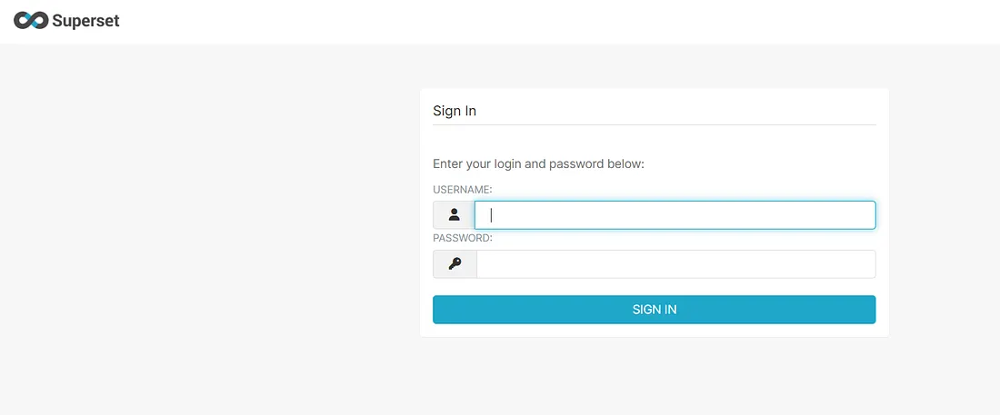

:::important
**原文为Member Only，如侵犯版权，请通过邮箱通知译者尽快删除**
- **原作者**：[TSxNINJA](https://medium.com/@tsxninja2004?source=post_page---byline--d9e2c5ef321e---------------------------------------)
- **原文标题**：[Easiest Admin Panel Takeover](https://osintteam.blog/easiest-admin-panel-takeover-d9e2c5ef321e)
- 原作者提供的**非付费阅读链接**（[点击这里](https://medium.com/@tsxninja2004/d9e2c5ef321e?sk=d186504faf4730b5b2290de66fd3c727)）
:::
[[toc]]
## 前言
生日快乐（*जय श्री राम*） 🚩黑客们！

在今天的WP中，我想分享我的挖洞生涯中最好挖到的一个管理员面板泄露漏洞——你一定不想错过这样一个故事
所以，Let's GO！

## 正文
### 🗺️ 信息收集阶段
在提交这个漏洞之前我就已经从这个站点挖到了赏金，所以这次我想试试子域名挖掘

🔮我用到了下面这些工具：
1. [**Subfinder**](https://github.com/projectdiscovery/subfinder)：一款通过被动资产扫描检索给定网站的有效子域名的子域名枚举工具，简单易用、模块化涉及，还特别优化了查询性能
	```sh
	subfinder -d example.com --all >> example.txt
	```
2. [**Aquatone**](https://github.com/michenriksen/aquatone)：一款用于可视化批量检查域名，并快速整理HTTP攻击面的工具
	```sh
	cat example.txt | aquatone
	```

在信息收集时我发现了一个重定向到登陆页面的管理员面板（*Admin Panel*），类似下面这样：

> 如果你拿到像下面这样的**Superset**子域名，记得试试弱口令：
> `superset.example.com`、`example.superset.com`、`example-superset.com`

:::info 原作者的补充
**Apache Superset**是一款用于数据分析、可视化和监控的开源商业情报平台

更多信息[点我查看](https://superset.apache.org/)
:::
:::tip 译者碎碎念
看来确实BUG一堆

:::
### 🕵️ 漏洞利用阶段 （弱口令）
当时我还是一个漏洞赏金新手，我花了两天多的时间搜索Superset（*译者注：这里应该指的是那个使用Superset的站点，而不是Superset本身*）的漏洞。我也尝试了fuzzing，尝试搜寻暴露在Github和Google上的口令，但也是无果而终

但就在我几乎放弃时，我决定试试在我这个漏洞挖掘阶段应该做的事：你应该猜到了——**默认口令尝试**
```
admin:admin
```
出人意料的是，这个口令能用，我成功进入了管理员页面

（*译者注：我在原文图像的基础上加了更多马赛克*）
### ⚡漏洞危害
通过默认口令进入管理员面板后，我拿下了这一Superset后台管理页面的所有权限，视使用这一页面的公司的不同，我可以做到下面这些事：
- 查看内部告示板和敏感商业信息
- 获取API密钥、数据库连接口令乃至是存在Superset里的账号
- 可能可以修改乃至删除监控面板/报告页面
- 作为进入内网设施的跳板
总结：**攻击者将对内部数据分析结果和敏感商业情报拥有全部读取权限**

### 🛡防御建议
- **部署完成之后必须修改默认口令**
- **启用强密码条例，并在整个后台管理页面的（维护和使用）中都贯彻这一条例**
- **通过IP白名单过滤或VPN访问限制可以访问后台页面的客户端**
- **时常使用Shodan或内部网络侦察工具探测站点暴露在互联网上的资产**
## 尾声
### 💵 结账时间
100美元，收益没有我之前挖到的高危漏洞高

### 🚀 这篇帖子对你有帮助吗？
把这篇帖子转发给你的黑壳朋友，让他们也分享一些实战漏洞赏金技巧或WP
如果你也发现了漏洞，请提交到正规的漏洞收集平台并赚取赏金🤑

**一起快乐挖洞吧！👨‍💻💥**

在领英上联系我：[LinkedIn](https://www.linkedin.com/in/tsxninja/)
在推特上关注我：[X](https://x.com/tsxninja200)
订阅我的Youtube频道获取完整POC：[Youtube频道](https://www.youtube.com/@TSNINJA20)
